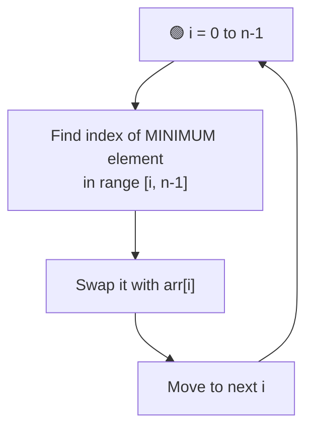
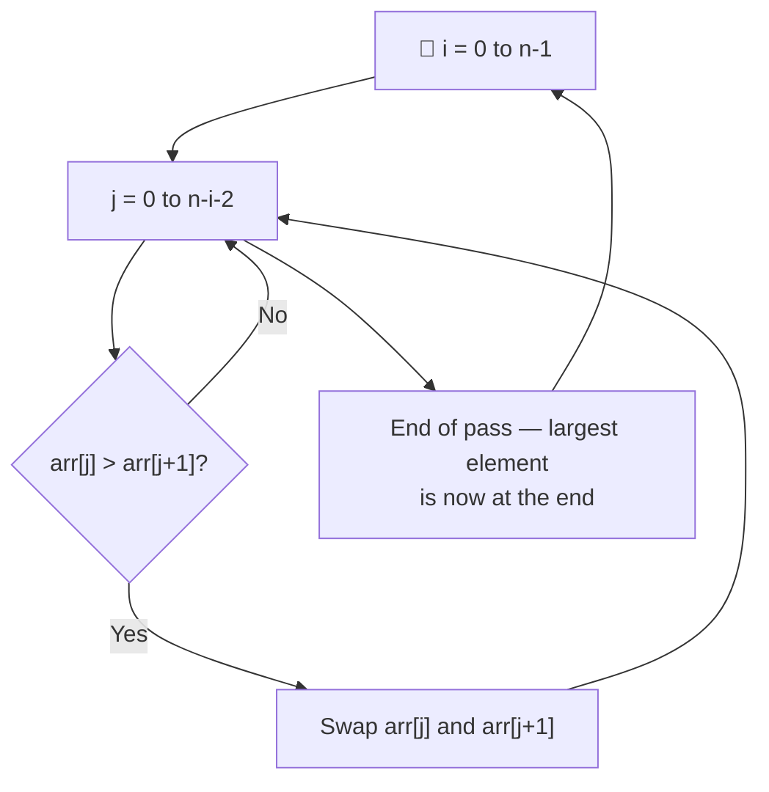
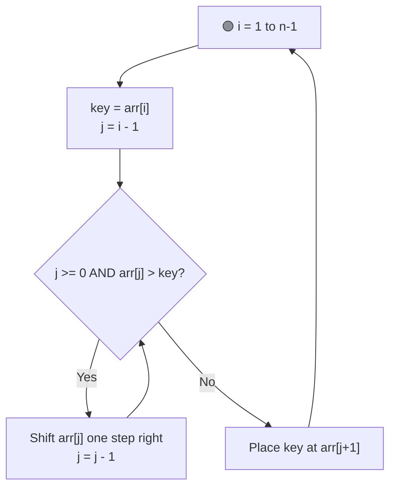

# 🔢 Selection Sort, Bubble Sort & Insertion Sort

---

## 📑 Table of Contents

- [🟢 Selection Sort](#-selection-sort)
- [🔵 Bubble Sort](#-bubble-sort)
- [🟣 Insertion Sort](#-insertion-sort)
- [⏱️ Complexity Comparison](#️-complexity-comparison)
- [🖥️ C++ Implementation](#️-c-implementation)

---

## 🟢 Selection Sort

**Idea:** Repeatedly find the **minimum element** from the unsorted part of the array and swap it to the front.

**Steps:**
1. For each position `i` from `0` to `n-1`:
   - Scan the rest of the array `[i, n-1]` and find the index of the **smallest** element.
   - Swap that smallest element into position `i`.
2. After each pass, the front portion of the array becomes **sorted and finalized**.

**Key trait:** Minimizes the number of **swaps** (only `n-1` swaps total), but still does `O(n²)` comparisons.

---

## 🔵 Bubble Sort

**Idea:** Repeatedly compare **adjacent elements** and swap them if they're in the wrong order — the largest unsorted element "bubbles up" to its correct position each pass.

**Steps:**
1. For each pass `i` from `0` to `n-1`:
   - Walk through the array comparing adjacent pairs `arr[j]` and `arr[j+1]`.
   - If `arr[j] > arr[j+1]`, swap them.
   - After each full pass, the largest remaining element is pushed to its correct final position at the end.
2. **Optimization:** If a pass completes with **no swaps**, the array is already sorted — stop early.

---

## 🟣 Insertion Sort

**Idea:** Build the sorted array **one element at a time** — take each element and insert it into its correct position among the already-sorted elements before it.

**Steps:**
1. Start from index `1` (treat index `0` as a trivially sorted array of one element).
2. Take the current element as `key`.
3. Shift all elements in the sorted left portion that are **greater than `key`** one position to the right.
4. Insert `key` into the gap created.
5. Repeat until the whole array is sorted.

**Key trait:** Very efficient for **nearly sorted** arrays — best case is `O(n)`.

---

## ⏱️ Complexity Comparison

| Algorithm | Best Case | Average Case | Worst Case | Space | Stable? |
|-----------|-----------|---------------|------------|-------|---------|
| Selection Sort | `O(n²)` | `O(n²)` | `O(n²)` | `O(1)` | ❌ No |
| Bubble Sort | `O(n)` (optimized) | `O(n²)` | `O(n²)` | `O(1)` | ✅ Yes |
| Insertion Sort | `O(n)` | `O(n²)` | `O(n²)` | `O(1)` | ✅ Yes |

> All three are **in-place** (`O(1)` extra space) and are typically used for **small or nearly-sorted datasets** since they're outperformed by `O(n log n)` algorithms (like Merge Sort or Quick Sort) on large inputs.

---

## 🖥️ C++ Implementation

See [`sorting.cpp`](./sorting.cpp)
