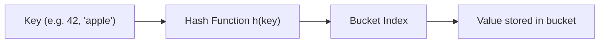
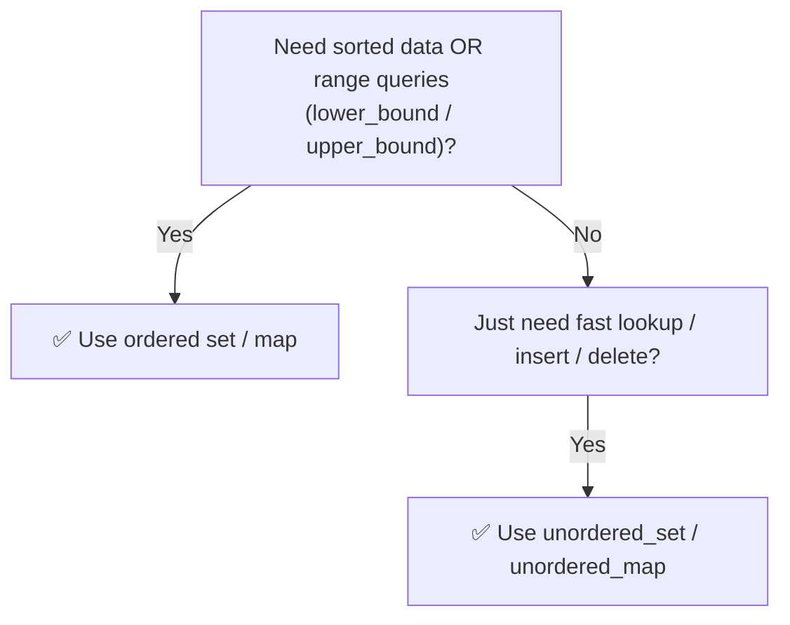

# 🔑 Hashing — Ordered vs Unordered (and the `Set`)

---

## 📑 Table of Contents

- [🧠 What is Hashing?](#-what-is-hashing)
- [📊 Ordered vs Unordered — The Real Difference](#-ordered-vs-unordered--the-real-difference)
- [📦 The `Set` — Explained in Detail](#-the-set--explained-in-detail)
- [🔵 `set` (Ordered Set)](#-set-ordered-set)
- [🟣 `unordered_set` (Hash Set)](#-unordered_set-hash-set)
- [🟢 `multiset` and `unordered_multiset`](#-multiset-and-unordered_multiset)
- [🗺️ Map vs Set — Quick Note](#️-map-vs-set--quick-note)
- [⏱️ Complexity Cheat Sheet](#️-complexity-cheat-sheet)
- [✅ Which One Should You Use?](#-which-one-should-you-use)
- [🖥️ C++ Implementation](#️-c-implementation)

---

## 🧠 What is Hashing?

**Hashing** is a technique to store and look up data using a **hash function**, which converts a key into an index (or bucket) in an underlying array. This allows **insert, delete, and search** operations to happen in **average O(1)** time — instead of scanning through the whole collection.

- If two different keys produce the **same bucket index**, it's called a **collision**. Hash tables handle this internally (commonly via chaining — storing multiple items in the same bucket as a small list).
- Because of collisions, in the **worst case** operations can degrade to `O(n)`, but on **average** they stay `O(1)`.

In C++, hashing-based containers are the **`unordered_*`** family: `unordered_set`, `unordered_map`, `unordered_multiset`, `unordered_multimap`.

---

## 📊 Ordered vs Unordered — The Real Difference

This is the most important thing to understand clearly:

| | `set` / `map` (Ordered) | `unordered_set` / `unordered_map` (Unordered) |
|---|---|---|
| **Underlying structure** | Self-balancing BST (Red-Black Tree) | Hash Table |
| **Order of elements** | Always sorted | No guaranteed order |
| **Uses hashing?** | ❌ No — uses comparisons | ✅ Yes |
| **Time complexity** | `O(log n)` for insert/find/erase | `O(1)` average, `O(n)` worst case |
| **Extra abilities** | `lower_bound`, `upper_bound`, sorted iteration | None of these — just fast lookup |

> ⚠️ **Common confusion:** People assume "ordered" containers use hashing too — they **don't**. `set`/`map` are tree-based and give you sorted order at the cost of `log n` speed. `unordered_set`/`unordered_map` are the ones that actually use **hashing**, trading away order for speed.

---

## 📦 The `Set` — Explained in Detail

A **Set** is a container that stores **only unique elements** — no duplicates allowed. If you try to insert a value that already exists, it's simply ignored.

C++ gives you two flavors:

## 🔵 `set` (Ordered Set)

- Stores unique elements in **sorted order** automatically.
- Backed by a **Red-Black Tree** (self-balancing BST).
- Every operation (`insert`, `erase`, `find`) is `O(log n)`.

**Key operations:**

| Function | What it does |
|----------|---------------|
| `insert(x)` | Adds `x` (ignored if already present) |
| `erase(x)` | Removes `x` if it exists |
| `find(x)` | Returns iterator to `x`, or `end()` if not found |
| `count(x)` | Returns `1` if present, `0` if not |
| `begin()` / `end()` | Iterate in **sorted order** |
| `lower_bound(x)` | First element **≥ x** |
| `upper_bound(x)` | First element **> x** |
| `size()` | Number of elements |

**When to use:** whenever you need elements to stay **sorted**, or you need range-based queries like "find the smallest element ≥ x".

---

## 🟣 `unordered_set` (Hash Set)

- Stores unique elements using a **hash table**.
- **No guaranteed order** — elements can come out in any sequence during iteration.
- Average `O(1)` for `insert`, `erase`, `find` — but can degrade to `O(n)` in rare worst-case collision scenarios.

**Key operations:** same function names as `set` (`insert`, `erase`, `find`, `count`, `size`) — just faster on average, and **without** `lower_bound`/`upper_bound` (since there's no order to exploit).

**When to use:** whenever you only care about **membership checks** ("does this exist?") or fast insert/delete, and you **don't care about order**.

---

## 🟢 `multiset` and `unordered_multiset`

Sometimes you need to store **duplicate values**. That's what the `multi` versions are for:

- `multiset` — sorted, allows duplicates, `O(log n)` operations.
- `unordered_multiset` — hashed, allows duplicates, average `O(1)` operations.

`erase(x)` on a multiset removes **all** occurrences of `x` by default — use `erase(find(x))` to remove just **one** occurrence.

---

## 🗺️ Map vs Set — Quick Note

A **Set** stores just **keys**. A **Map** stores **key-value pairs**. Everything above about ordered vs unordered, and the underlying tree/hash structure, applies **identically** to `map` vs `unordered_map` — the only difference is a map also holds a value attached to each key.

---

## ⏱️ Complexity Cheat Sheet

| Container | Insert | Erase | Find | Sorted? |
|-----------|--------|-------|------|---------|
| `set` | `O(log n)` | `O(log n)` | `O(log n)` | ✅ Yes |
| `unordered_set` | `O(1)` avg | `O(1)` avg | `O(1)` avg | ❌ No |
| `multiset` | `O(log n)` | `O(log n)` | `O(log n)` | ✅ Yes |
| `unordered_multiset` | `O(1)` avg | `O(1)` avg | `O(1)` avg | ❌ No |

---

## ✅ Which One Should You Use?

- Need **fast lookups only**, don't care about order → **`unordered_set`**
- Need **sorted data** or things like "smallest element ≥ x" → **`set`**
- Need to **count duplicates** → use the `multiset` variants
- Working with **key-value pairs** instead of just keys → use `map` / `unordered_map` (same rules apply)

---

## 🖥️ C++ Implementation

See [`hashing_set.cpp`](./hashing_set.cpp)
