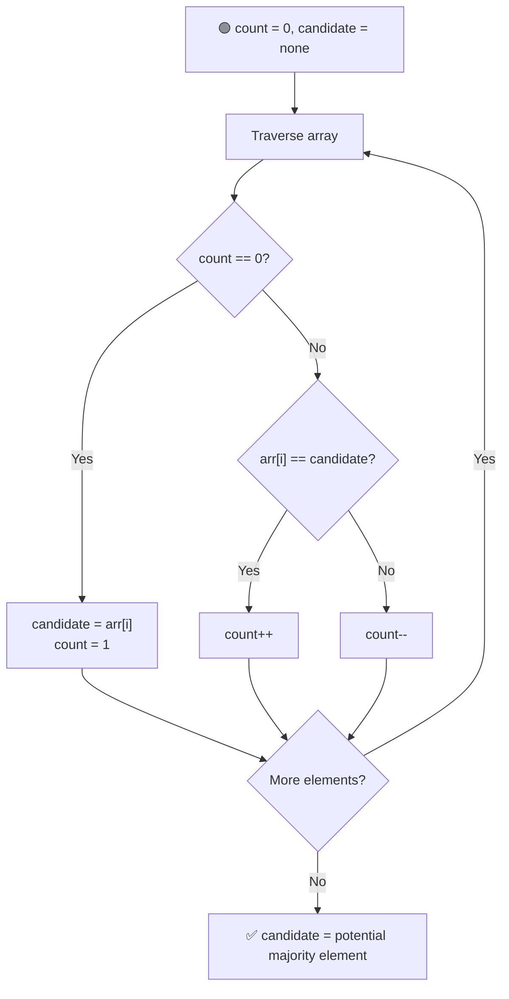

# 🗳️ Majority Element

---

## 📑 Table of Contents

- [❓ Problem Statement](#-problem-statement)
- [🧠 Brute Force Approach](#-brute-force-approach)
- [📊 Better Approach — Hashing](#-better-approach--hashing)
- [⚡ Optimal Approach — Moore's Voting Algorithm](#-optimal-approach--moores-voting-algorithm)
- [🔍 Verification Step](#-verification-step)
- [⏱️ Complexity Comparison](#️-complexity-comparison)
- [🖥️ C++ Implementation](#️-c-implementation)

---

## ❓ Problem Statement

> Given an array of size `n`, find the element that appears **more than `⌊n / 2⌋` times** — this is called the **majority element**. It is guaranteed to exist unless otherwise stated.

**Test Case 1**
```
Input:  arr = [2, 2, 1, 1, 1, 2, 2]
Output: 2
Explanation: 2 appears 4 times, which is more than 7/2 = 3
```

**Test Case 2**
```
Input:  arr = [3, 3, 4]
Output: 3
Explanation: 3 appears 2 times, which is more than 3/2 = 1
```

---

## 🧠 Brute Force Approach

**Idea:** For every element, count how many times it occurs across the entire array by scanning it again.

### Steps

1. For each index `i` in the array:
   - Set `count = 0`.
   - Loop through the whole array and increment `count` whenever `arr[j] == arr[i]`.
   - If `count > n / 2`, return `arr[i]`.

**Complexity:** `O(n²)` time (nested loop), `O(1)` space.

---

## 📊 Better Approach — Hashing

**Idea:** Store the frequency of every element in a hash map in a single pass, then scan the map to find the element whose count exceeds `n / 2`.

### Steps

1. Traverse the array and build a frequency map (`unordered_map<int, int>`), incrementing the count for each element.
2. Traverse the map and return the key whose value is greater than `n / 2`.

**Complexity:** `O(n)` time using `unordered_map` (or `O(n log n)` with `map`), `O(n)` extra space.

---

## ⚡ Optimal Approach — Moore's Voting Algorithm

**Idea:** Maintain a running `candidate` and a `count`. Think of it like a **voting/cancellation game** — every element that matches the candidate is a "vote for" it, and every element that doesn't is a "vote against" it. Since the majority element appears more than half the time, it can never be fully canceled out.



### Steps

1. Initialize `count = 0` and `candidate` as undefined.
2. Traverse the array:
   - If `count == 0`, pick the current element as the new `candidate`, and set `count = 1`.
   - Else, if the current element **matches** `candidate`, increment `count`.
   - Else, **decrement** `count` (this represents one "vote against" the current candidate).
3. By the end of the traversal, `candidate` holds the majority element — **if one exists** — because the majority element occurs more than every other element combined, so it can never be completely canceled out by decrements.

**Complexity:** `O(n)` time — single pass, `O(1)` space — only two variables used.

---

## 🔍 Verification Step

Moore's Voting Algorithm is a bit like an educated guess — it correctly finds the majority element **only if one is guaranteed to exist**. If the problem doesn't guarantee a majority element, the `candidate` from the first pass might not actually be a majority element.

To be safe: run a **second pass** over the array, counting the actual occurrences of `candidate`. If that count is greater than `n / 2`, it's confirmed as the majority element — otherwise, no majority element exists.

---

## ⏱️ Complexity Comparison

| Approach | Time | Space |
|----------|------|-------|
| Brute Force | `O(n²)` | `O(1)` |
| Hashing | `O(n)` | `O(n)` |
| Moore's Voting (Optimal) | `O(n)` | `O(1)` |

---

## 🖥️ C++ Implementation

See [`majority_element.cpp`](./majority_element.cpp)
