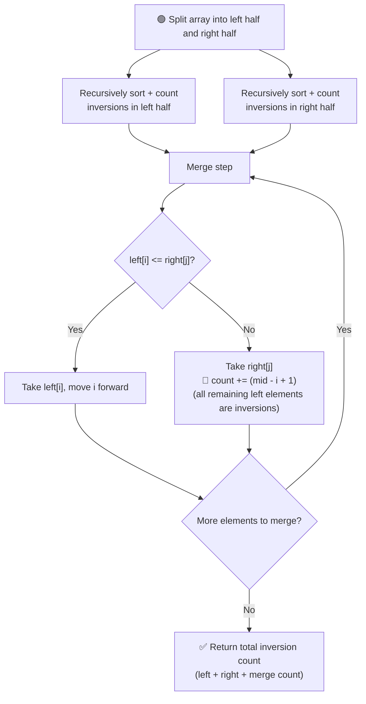

# 🔁 Count Inversions

---

## 📑 Table of Contents

- [❓ Problem Statement](#-problem-statement)
- [🧠 Brute Force Approach](#-brute-force-approach)
- [⚡ Optimal Approach — Merge Sort](#-optimal-approach--merge-sort)
- [⚠️ Important Considerations](#️-important-considerations)
- [⏱️ Complexity Comparison](#️-complexity-comparison)
- [🖥️ C++ Implementation](#️-c-implementation)

---

## ❓ Problem Statement

> An **inversion** occurs in an array when a pair of indices `(i, j)` satisfies `i < j` but `arr[i] > arr[j]`. Count the **total number** of such pairs.

**Test Case 1**
```
Input:  arr = [2, 4, 1, 3, 5]
Output: 3
Explanation: Inversions are (2,1), (4,1), (4,3)
```

**Test Case 2**
```
Input:  arr = [5, 4, 3, 2, 1]
Output: 10
Explanation: Every pair is an inversion since the array is fully descending
```

---

## 🧠 Brute Force Approach

**Idea:** Compare every element at index `i` with every later element at index `j > i`, and count the pair whenever `arr[i] > arr[j]`.

### Steps

1. For each index `i` from `0` to `n-1`:
   - For each index `j` from `i+1` to `n-1`:
     - If `arr[i] > arr[j]`, increment the inversion count.
2. Return the total count.

**Complexity:** `O(n²)` time (nested loop over all pairs), `O(1)` space.

---

## ⚡ Optimal Approach — Merge Sort

**Idea:** Piggyback the inversion count on top of **Merge Sort**. While merging two already-sorted halves, whenever an element from the **right half** is smaller than an element from the **left half**, it means that element is smaller than **every remaining element** in the left half too (since the left half is sorted) — so we can count all of them **at once**, instead of comparing one by one.



### Steps

1. Recursively split the array into halves, just like in Merge Sort.
2. Recursively count inversions in the **left half** and the **right half** separately.
3. During the **merge step**, walk through both sorted halves with two pointers `i` (left) and `j` (right):
   - If `left[i] <= right[j]`, it's not an inversion — take `left[i]` into the merged array and move `i` forward.
   - If `left[i] > right[j]`, then `right[j]` is smaller than `left[i]` **and every element after it in the left half** (since left half is sorted). So add `(mid - i + 1)` to the inversion count in **one shot**, take `right[j]` into the merged array, and move `j` forward.
4. Add up the inversions found in the left half, the right half, and the merge step to get the total.

**Complexity:** `O(n log n)` time — same efficiency as Merge Sort, `O(n)` space — for the temporary array used during merging.

---

## ⚠️ Important Considerations

- **Data Modification:** This algorithm **sorts the array in place** while counting. If the original order of the array needs to be preserved, make a **copy** before running it.
- **Avoiding Global Variables:** Instead of using a global counter, a clean implementation has each recursive call **return its own inversion count**, which is then **summed up** at each level of recursion (left count + right count + merge count).

---

## ⏱️ Complexity Comparison

| Approach | Time | Space |
|----------|------|-------|
| Brute Force | `O(n²)` | `O(1)` |
| Merge Sort (Optimal) | `O(n log n)` | `O(n)` |

---

## 🖥️ C++ Implementation

See [`count_inversions.cpp`](./count_inversions.cpp)
