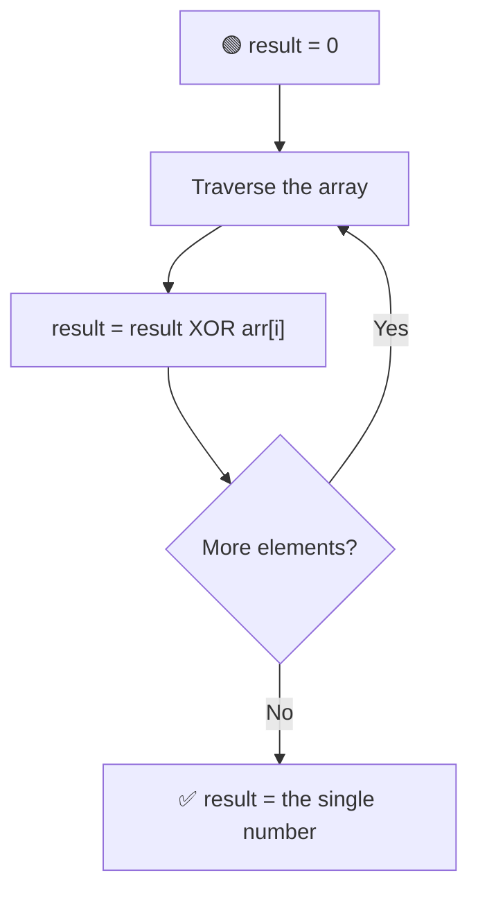

# 1️⃣ Find the Single Number

---

## 📑 Table of Contents

- [❓ Problem Statement](#-problem-statement)
- [🧠 Brute Force Approach](#-brute-force-approach)
- [📊 Better Approach — Hashing](#-better-approach--hashing)
- [⚡ Optimal Approach — XOR](#-optimal-approach--xor)
- [⏱️ Complexity Comparison](#️-complexity-comparison)
- [🖥️ C++ Implementation](#️-c-implementation)

---

## ❓ Problem Statement

> Given an array where **every element appears exactly twice**, except for **one element** that appears only **once**, find that single element.

**Test Case 1**
```
Input:  arr = [4, 1, 2, 1, 2]
Output: 4
```

**Test Case 2**
```
Input:  arr = [2, 2, 1]
Output: 1
```

---

## 🧠 Brute Force Approach

**Idea:** For every element, count how many times it appears in the whole array by scanning the array again. The one with a count of `1` is the answer.

### Steps

1. For each index `i` in the array:
   - Set `count = 0`.
   - Loop through the **entire array** and increment `count` every time `arr[j] == arr[i]`.
   - If `count == 1`, `arr[i]` is the answer.

**Complexity:** `O(n²)` time (nested loop), `O(1)` space.

---

## 📊 Better Approach — Hashing

**Idea:** Instead of re-scanning the array for every element, store the frequency of each number once, then look for the number with frequency `1`.

### Steps

1. Traverse the array and build a **frequency map** (`unordered_map<int, int>` or a frequency array if numbers are small and positive) — for every element, increment its count.
2. Traverse the map/array again and return the key whose value is `1`.

**Complexity:** `O(n)` time, `O(n)` extra space.

---

## ⚡ Optimal Approach — XOR

**Idea:** Use the bitwise **XOR** operator and its two key properties:

```
a ^ a = 0     (a number XORed with itself is 0)
a ^ 0 = a     (a number XORed with 0 stays the same)
```



### Steps

1. Initialize `result = 0`.
2. XOR every element of the array into `result`, one by one.
3. Since every **paired** number appears twice, each pair cancels itself out (`a ^ a = 0`). Whatever survives after XOR-ing everything is the **single, unpaired number**.

**Complexity:** `O(n)` time — single pass, `O(1)` space — no extra data structure needed.

---

## ⏱️ Complexity Comparison

| Approach | Time | Space |
|----------|------|-------|
| Brute Force | `O(n²)` | `O(1)` |
| Hashing | `O(n)` | `O(n)` |
| XOR (Optimal) | `O(n)` | `O(1)` |

---

## 🖥️ C++ Implementation

See [`single_number.cpp`](./single_number.cpp)
