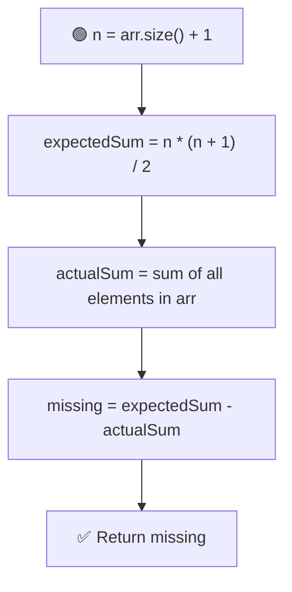

# 🔍 Find the Missing Number

---

## 📑 Table of Contents

- [❓ Problem Statement](#-problem-statement)
- [🧠 Brute Force Approach](#-brute-force-approach)
- [📊 Better Approach — Hashing](#-better-approach--hashing)
- [⚡ Optimal Approach 1 — Sum Formula](#-optimal-approach-1--sum-formula)
- [⚡ Optimal Approach 2 — XOR](#-optimal-approach-2--xor)
- [⏱️ Complexity Comparison](#️-complexity-comparison)
- [🖥️ C++ Implementation](#️-c-implementation)

---

## ❓ Problem Statement

> Given an array `arr[]` of size `n - 1` containing **distinct integers** in the range `[1, n]`, the array represents a **permutation of 1 to n with exactly one number missing**. Find that missing number.

**Test Case 1**
```
Input:  arr = [8, 2, 4, 5, 3, 7, 1]
Output: 6
Explanation: All numbers from 1 to 8 are present except 6.
```

**Test Case 2**
```
Input:  arr = [1, 2, 3, 5]
Output: 4
Explanation: Array size is 4, so the range is [1, 5]. The missing number is 4.
```

---

## 🧠 Brute Force Approach

**Idea:** For every number from `1` to `n`, linearly scan the array to check if it's present.

### Steps

1. Let `n = arr.size() + 1` (the full range).
2. For each number `i` from `1` to `n`:
   - Search for `i` in the array using a linear scan.
   - If it's not found, `i` is the missing number.

**Complexity:** `O(n²)` time — nested loop (search for every candidate), `O(1)` space.

---

## 📊 Better Approach — Hashing

**Idea:** Mark every number that's present using a hash/frequency array, then scan `1` to `n` and find the number that was never marked.

### Steps

1. Let `n = arr.size() + 1`.
2. Create a hash array `hashArr` of size `n + 1`, initialized to `0`.
3. Traverse `arr` and mark `hashArr[arr[i]] = 1` for every element.
4. Scan `hashArr` from `1` to `n` — the index where the value is still `0` is the missing number.

**Complexity:** `O(n)` time, `O(n)` extra space.

---

## ⚡ Optimal Approach 1 — Sum Formula

**Idea:** The sum of numbers `1` to `n` has a known closed-form formula. Subtract the actual sum of the array from this expected sum — the difference is the missing number.



### Steps

1. Let `n = arr.size() + 1`.
2. Compute `expectedSum = n * (n + 1) / 2` — the sum of all numbers from `1` to `n`.
3. Compute `actualSum` by summing up all elements present in `arr`.
4. The missing number is `expectedSum - actualSum`.

**Complexity:** `O(n)` time, `O(1)` extra space — single pass, no extra memory.

---

## ⚡ Optimal Approach 2 — XOR

**Idea:** XOR-ing a number with itself gives `0`, and XOR-ing with `0` leaves a number unchanged. If we XOR **all numbers from 1 to n** together with **all elements of the array**, every present number cancels itself out, leaving only the missing number.

### Steps

1. Let `n = arr.size() + 1`.
2. Compute `xor1` = XOR of all numbers from `1` to `n`.
3. Compute `xor2` = XOR of all elements in `arr`.
4. The missing number is `xor1 ^ xor2` (every matching pair cancels out, leaving the one number that had no pair).

**Complexity:** `O(n)` time, `O(1)` extra space — and avoids any risk of integer overflow that the sum formula could have on very large `n`.

---

## ⏱️ Complexity Comparison

| Approach | Time | Space |
|----------|------|-------|
| Brute Force | `O(n²)` | `O(1)` |
| Hashing | `O(n)` | `O(n)` |
| Sum Formula (Optimal) | `O(n)` | `O(1)` |
| XOR (Optimal) | `O(n)` | `O(1)` |

---

## 🖥️ C++ Implementation

See [`missing_number.cpp`](./missing_number.cpp)
