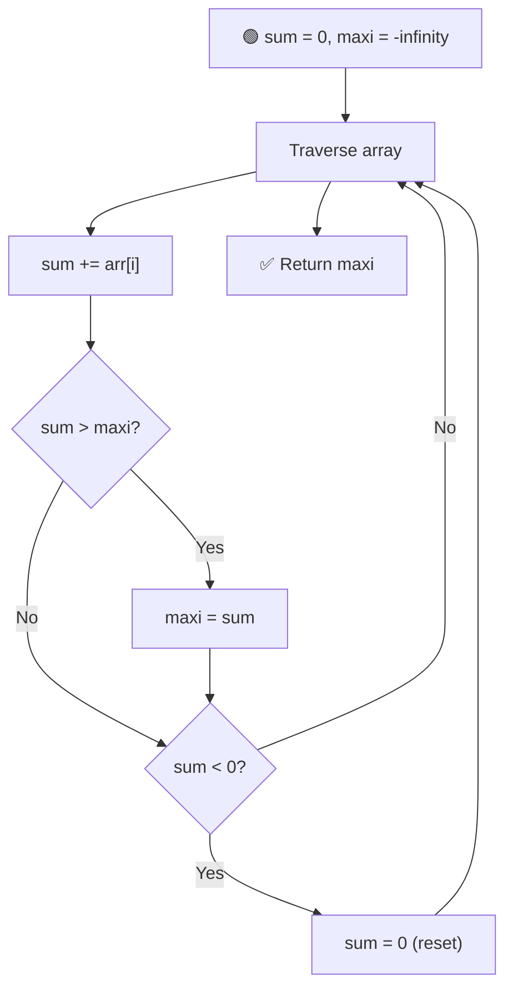

# 📈 Maximum Subarray Sum

---

## 📑 Table of Contents

- [❓ Problem Statement](#-problem-statement)
- [🧠 Brute Force Approach](#-brute-force-approach)
- [📊 Better Approach](#-better-approach)
- [⚡ Optimal Approach — Kadane's Algorithm](#-optimal-approach--kadanes-algorithm)
- [⚠️ Edge Case — All Negative Numbers](#️-edge-case--all-negative-numbers)
- [🖨️ Printing the Subarray](#️-printing-the-subarray)
- [⏱️ Complexity Comparison](#️-complexity-comparison)
- [🖥️ C++ Implementation](#️-c-implementation)

---

## ❓ Problem Statement

> Given an array of integers, find the **contiguous subarray** (containing at least one element) that has the **largest possible sum**, and return that sum.

**Test Case 1**
```
Input:  arr = [-2, 1, -3, 4, -1, 2, 1, -5, 4]
Output: 6
Explanation: The subarray [4, -1, 2, 1] has the largest sum = 6
```

**Test Case 2**
```
Input:  arr = [-1, -2, -3, -4]
Output: 0 (or -1, depending on problem constraints — see Edge Case section)
```

---

## 🧠 Brute Force Approach

**Idea:** Try **every possible subarray**, compute its sum, and keep track of the maximum.

### Steps

1. Use three nested loops:
   - Loop `i` for the starting index of the subarray.
   - Loop `j` for the ending index of the subarray.
   - An inner loop `k` to sum up elements from `i` to `j`.
2. Track the maximum sum found across all subarrays.

**Complexity:** `O(n³)` time, `O(1)` space.

---

## 📊 Better Approach

**Idea:** Avoid the third nested loop by calculating the subarray sum **incrementally** as the ending index expands, instead of re-summing from scratch every time.

### Steps

1. Loop `i` for the starting index.
2. Loop `j` for the ending index, starting from `i`.
3. Maintain a running `sum` that adds `arr[j]` at each step (instead of recomputing the sum with a separate loop).
4. Update the maximum sum whenever the running `sum` exceeds it.

**Complexity:** `O(n²)` time, `O(1)` space.

---

## ⚡ Optimal Approach — Kadane's Algorithm

**Idea:** Keep a running `sum` while scanning the array once. If the running sum ever drops **below zero**, reset it to zero — because carrying a negative sum forward can only hurt any future subarray sum.



### Steps

1. Initialize `sum = 0` and `maxi = INT_MIN` (or negative infinity).
2. Traverse the array, adding each element to `sum`.
3. After adding, update `maxi = max(maxi, sum)`.
4. If `sum` becomes **negative**, reset `sum = 0` — a negative running sum can never help a future subarray, so it's better to start fresh from the next element.
5. Return `maxi` as the answer.

**Complexity:** `O(n)` time — single pass, `O(1)` space.

---

## ⚠️ Edge Case — All Negative Numbers

If every element in the array is negative, Kadane's Algorithm as described would naturally return the **largest (least negative) single element**, since `maxi` tracks the best sum seen at every step.

However, if the problem defines the "empty subarray" as valid (sum = `0`) when no positive-sum subarray exists, the answer should be adjusted to return **`0`** instead in that specific case. Which behavior to use depends on how the problem statement defines things — always check whether an empty subarray is allowed.

---

## 🖨️ Printing the Subarray

**Idea:** Extend Kadane's Algorithm to also track **which indices** produced the maximum sum, not just the sum itself.

### Steps

1. Maintain a `start` index, updated whenever `sum` resets to `0` (marking the start of a fresh subarray).
2. Whenever a **new maximum** is found (`sum > maxi`), record:
   - `maxi = sum`
   - `ansStart = start`
   - `ansEnd = current index`
2. At the end, the subarray from `ansStart` to `ansEnd` is the maximum sum subarray, ready to be printed or extracted.

---

## ⏱️ Complexity Comparison

| Approach | Time | Space |
|----------|------|-------|
| Brute Force | `O(n³)` | `O(1)` |
| Better | `O(n²)` | `O(1)` |
| Kadane's (Optimal) | `O(n)` | `O(1)` |

---

## 🖥️ C++ Implementation

See [`max_subarray_sum.cpp`](./max_subarray_sum.cpp)
