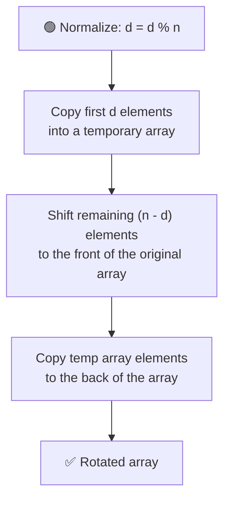
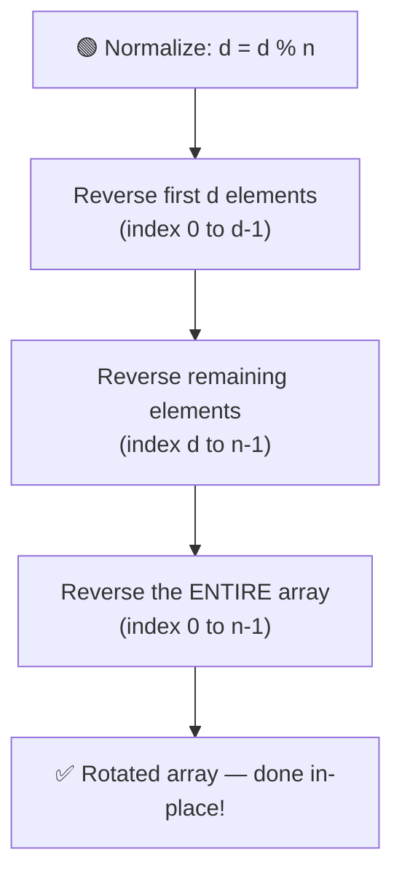

# 🔄 Left Rotate an Array by D Places

---

## 📑 Table of Contents

- [❓ Problem Statement](#-problem-statement)
- [🧠 Brute Force Approach](#-brute-force-approach)
- [⚡ Optimal Approach — Three Reversals](#-optimal-approach--three-reversals)
- [⏱️ Complexity Comparison](#️-complexity-comparison)
- [🖥️ C++ Implementation](#️-c-implementation)

---

## ❓ Problem Statement

> Given an array of `n` elements, **left rotate** it by `d` places — meaning the first `d` elements move to the **end** of the array, and everything else shifts left to fill the gap.

**Test Case 1**
```
Input: arr = [1, 2, 3, 4, 5, 6, 7], d = 2
Output: [3, 4, 5, 6, 7, 1, 2]
```

**Test Case 2**
```
Input: arr = [10, 20, 30, 40, 50], d = 7
Output: [30, 40, 50, 10, 20]
```
*(Note: `d = 7` on a 5-element array is normalized to `d = 7 % 5 = 2`, since rotating by the full array size returns it to the original state.)*

---

## 🧠 Brute Force Approach

**Idea:** Physically move the first `d` elements out of the way using a temporary array, then shift the rest of the array forward, and finally place the saved elements at the back.



### Steps

1. **Normalize `d`:** Rotating an array of size `n` by `n` places brings it back to the original array. So the *effective* rotation is `d = d % n`.
2. **Temporary Storage:** Copy the first `d` elements into a temporary array.
3. **Shift:** Move the remaining `n - d` elements from index `d` onward to the front of the original array.
4. **Restore:** Copy the `d` elements from the temporary array to the back (last `d` positions) of the original array.

**Complexity:** `O(n)` time, `O(d)` extra space (for the temporary array).

---

## ⚡ Optimal Approach — Three Reversals

**Idea:** Avoid any extra array entirely by using the classic **"reverse the parts, then reverse the whole"** trick.



### Steps

1. **Normalize `d`:** Same as before — `d = d % n`.
2. **Reverse first segment:** Reverse the sub-array from index `0` to `d - 1`.
3. **Reverse second segment:** Reverse the sub-array from index `d` to `n - 1`.
4. **Reverse the whole array:** Reverse the entire array from index `0` to `n - 1`. This final reversal flips both segments back into correct order **while** placing them in their rotated positions.

**Why it works:** Reversing each part individually and then reversing the whole thing effectively "swaps" the two blocks (first `d` elements and remaining `n-d` elements) while preserving each block's internal order — exactly what a left rotation needs.

**Complexity:** `O(n)` time, `O(1)` extra space — done entirely **in-place**.

---

## ⏱️ Complexity Comparison

| Approach | Time | Space |
|----------|------|-------|
| Brute Force | `O(n)` | `O(d)` |
| Optimal (3 Reversals) | `O(n)` | `O(1)` |

---

## 🖥️ C++ Implementation

See [`left_rotate.cpp`](./left_rotate.cpp)
