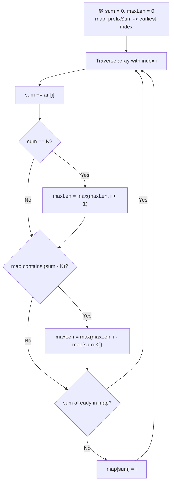
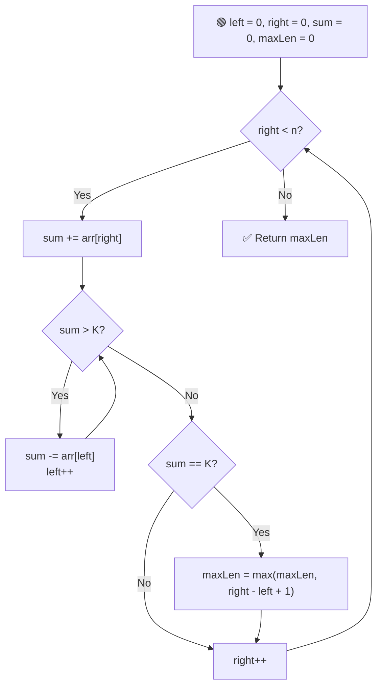

# 📏 Longest Subarray with Sum K

---

## 📑 Table of Contents

- [❓ Problem Statement](#-problem-statement)
- [🧠 Brute Force Approach](#-brute-force-approach)
- [📊 Better Approach — Hashing](#-better-approach--hashing)
- [⚡ Optimal Approach — Two Pointers](#-optimal-approach--two-pointers)
- [⏱️ Complexity Comparison](#️-complexity-comparison)
- [🖥️ C++ Implementation](#️-c-implementation)

---

## ❓ Problem Statement

> Given an array of integers and a target sum `K`, find the **length of the longest contiguous subarray** whose elements sum up to exactly `K`.

A **subarray** is defined as a contiguous part of the array.

**Test Case 1**
```
Input:  arr = [10, 5, 2, 7, 1, 9], K = 15
Output: 4
Explanation: The subarray [5, 2, 7, 1] sums to 15 and has length 4
```

**Test Case 2**
```
Input:  arr = [-1, 1, 1], K = 1
Output: 3
Explanation: The subarray [-1, 1, 1] sums to 1 and has length 3
```

---

## 🧠 Brute Force Approach

**Idea:** Generate every possible subarray, compute its sum, and track the maximum length among the ones that sum to `K`.

### Steps

1. Loop `i` for the starting index of the subarray.
2. Loop `j` for the ending index of the subarray, starting from `i`.
3. Maintain a running `sum`, adding `arr[j]` at each step **incrementally** (avoiding a third nested loop).
4. Whenever `sum == K`, update the maximum length with `j - i + 1`.

**Complexity:** `O(n²)` time (optimized from `O(n³)` by summing incrementally), `O(1)` space.

---

## 📊 Better Approach — Hashing

**Idea:** Use **prefix sums** with a hash map. If the prefix sum up to index `j` is `sum`, and `sum - K` was seen at some earlier index, then the subarray between that earlier index and `j` sums to exactly `K`. This is "reverse mathematics" — instead of checking every starting point, we ask "what starting prefix would make this subarray equal K?"



### Steps

1. Maintain a running `sum` and a hash map storing `prefixSum -> earliest index at which it occurred`.
2. Traverse the array, adding each element to `sum`.
3. If `sum == K`, the subarray from index `0` to the current index sums to `K` — update `maxLen`.
4. Check if `sum - K` exists in the map. If it does, a subarray between that earlier index and the current index sums to `K` — update `maxLen` accordingly.
5. Store the **first occurrence** of each prefix sum in the map (don't overwrite it later), since we want the **longest** possible subarray, which means the **earliest** starting point.

**Complexity:** `O(n)` time using `unordered_map` (or `O(n log n)` with `map`), `O(n)` space for the hash map.

---

## ⚡ Optimal Approach — Two Pointers

**Idea:** This approach only works when the array contains **non-negative integers** (positives and zeros) — this guarantees that expanding the window always increases the sum, and shrinking it always decreases the sum, which is what makes the sliding window logic valid.



### Steps

1. Maintain two pointers, `left` and `right`, both starting at `0`, and a running `sum`.
2. Expand the window by moving `right` forward, adding `arr[right]` to `sum`.
3. While `sum > K`, shrink the window from the left — subtract `arr[left]` from `sum` and move `left` forward.
4. Whenever `sum == K`, update `maxLen` with the current window size `right - left + 1`.
5. Continue until `right` reaches the end of the array.

**Complexity:** `O(n)` time — each pointer moves forward at most `n` times total, `O(1)` space — no extra data structure needed.

---

## ⏱️ Complexity Comparison

| Approach | Time | Space | Works for negative numbers? |
|----------|------|-------|------------------------------|
| Brute Force | `O(n²)` | `O(1)` | ✅ Yes |
| Hashing | `O(n)` | `O(n)` | ✅ Yes |
| Two Pointers (Optimal) | `O(n)` | `O(1)` | ❌ No (positives & zeros only) |

---

## 🖥️ C++ Implementation

See [`longest_subarray_sum_k.cpp`](./longest_subarray_sum_k.cpp)
