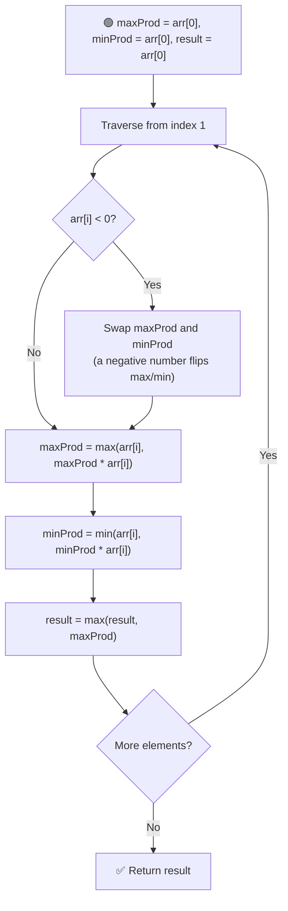
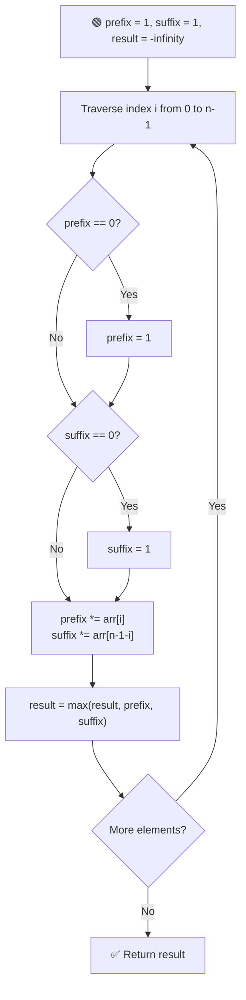

# ✖️ Maximum Product Subarray

---

## 📑 Table of Contents

- [❓ Problem Statement](#-problem-statement)
- [🧠 Brute Force Approach](#-brute-force-approach)
- [⚡ Optimal Approach 1 — Track Max & Min Product](#-optimal-approach-1--track-max--min-product)
- [⚡ Optimal Approach 2 — Prefix & Suffix Product](#-optimal-approach-2--prefix--suffix-product)
- [⏱️ Complexity Comparison](#️-complexity-comparison)
- [🖥️ C++ Implementation](#️-c-implementation)

---

## ❓ Problem Statement

> Given an array that contains both **negative and positive integers** (and possibly zeros), find the **maximum product** among all contiguous subarrays.

**Test Case 1**
```
Input:  nums = [1, 2, 3, 4, 5, 0]
Output: 120
Explanation: 1 × 2 × 3 × 4 × 5 = 120 gives the maximum product.
```

**Test Case 2**
```
Input:  nums = [1, 2, -3, 0, -4, -5]
Output: 20
Explanation: (-4) × (-5) = 20 gives the maximum product.
```

---

## 🧠 Brute Force Approach

**Idea:** Generate every possible subarray, compute its product, and track the maximum.

### Steps

1. Loop `i` for the starting index of the subarray.
2. Loop `j` for the ending index, starting from `i`.
3. Maintain a running `product`, multiplying in `arr[j]` at each step (incrementally, avoiding a third nested loop).
4. Update the maximum product whenever the running `product` exceeds it.

**Complexity:** `O(n²)` time, `O(1)` space.

---

## ⚡ Optimal Approach 1 — Track Max & Min Product

**Idea:** Unlike sums, products behave strangely with **negative numbers** — a very small (negative) product can flip into the **largest** product if multiplied by another negative number. So at every index, we must track **both** the maximum and minimum product ending there, because the current minimum could become the next maximum.



### Steps

1. Initialize `maxProd = minProd = result = arr[0]`.
2. Traverse the array from index `1`:
   - If `arr[i]` is **negative**, swap `maxProd` and `minProd` — since multiplying by a negative number turns the largest product into the smallest, and vice versa.
   - Update `maxProd = max(arr[i], maxProd * arr[i])` — either extend the previous best product, or start fresh from the current element.
   - Update `minProd = min(arr[i], minProd * arr[i])` similarly.
   - Update `result = max(result, maxProd)`.
3. Return `result`.

**Complexity:** `O(n)` time — single pass, `O(1)` space.

---

## ⚡ Optimal Approach 2 — Prefix & Suffix Product

**Idea:** The maximum product subarray always lies **between two zeros** (or the array boundaries). Within any such zero-free segment, the maximum product subarray is either a **prefix** of that segment or a **suffix** of it — because if there's an even number of negative numbers, the whole segment is optimal, and if there's an odd number, dropping the elements before the first negative or after the last negative gives the best result. Scanning the array once **left-to-right** (prefix product) and once **right-to-left** (suffix product), while resetting to `1` whenever a `0` is hit, captures all these cases.



### Steps

1. Initialize `prefix = 1`, `suffix = 1`, and `result = -infinity`.
2. Traverse the array with index `i` from `0` to `n-1`:
   - If `prefix` has become `0` (hit a zero earlier), reset it to `1` — start a fresh segment.
   - If `suffix` has become `0`, reset it to `1` as well.
   - Multiply `prefix` by `arr[i]` (moving left to right).
   - Multiply `suffix` by `arr[n-1-i]` (moving right to left, same index loop).
   - Update `result = max(result, prefix, suffix)`.
3. Return `result`.

**Complexity:** `O(n)` time — single pass computing both directions together, `O(1)` space.

---

## ⏱️ Complexity Comparison

| Approach | Time | Space |
|----------|------|-------|
| Brute Force | `O(n²)` | `O(1)` |
| Max & Min Tracking (Optimal 1) | `O(n)` | `O(1)` |
| Prefix & Suffix Product (Optimal 2) | `O(n)` | `O(1)` |

---

## 🖥️ C++ Implementation

See [`max_product_subarray.cpp`](./max_product_subarray.cpp)
