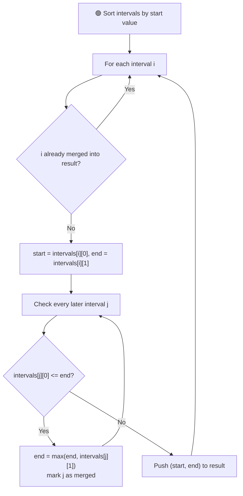
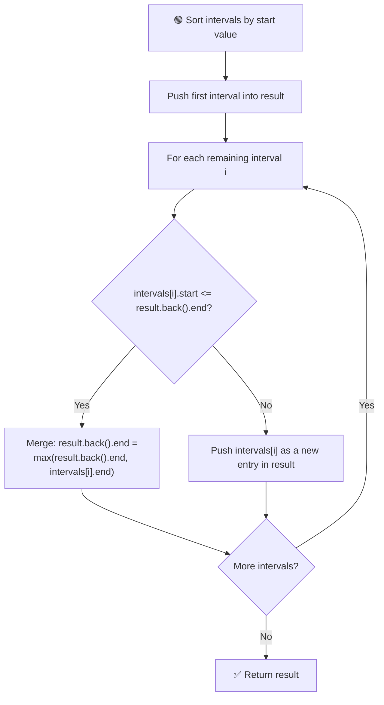

# 📏 Merge Overlapping Intervals

---

## 📑 Table of Contents

- [❓ Problem Statement](#-problem-statement)
- [🧠 Brute Force Approach](#-brute-force-approach)
- [⚡ Optimal Approach](#-optimal-approach)
- [⏱️ Complexity Comparison](#️-complexity-comparison)
- [🖥️ C++ Implementation](#️-c-implementation)

---

## ❓ Problem Statement

> Given a collection of intervals, **merge all overlapping intervals** into the minimum possible number of non-overlapping intervals.

**Test Case 1**
```
Input:  intervals = [[1,3], [2,6], [8,10], [15,18]]
Output: [[1,6], [8,10], [15,18]]
Explanation: [1,3] and [2,6] overlap, so they merge into [1,6]
```

**Test Case 2**
```
Input:  intervals = [[1,4], [4,5]]
Output: [[1,5]]
Explanation: [1,4] and [4,5] touch at 4, so they're considered overlapping and merge into [1,5]
```

---

## 🧠 Brute Force Approach

**Idea:** First sort the intervals by their **starting point**, so overlapping intervals end up next to each other. Then walk through the sorted list and check whether the current interval overlaps with the **previous merged interval**, expanding its boundary whenever it does.



### Steps

1. **Sort** the intervals by their starting value.
2. For every interval not yet merged, take its `start` and `end`, then compare it against **every later interval** to check for overlap — expanding `end` whenever an overlap is found and marking those intervals as merged.
3. Push the final `(start, end)` into the result list.

**Complexity:** `O(n log n)` for sorting, plus roughly `O(n²)` for the merge passes (since each interval may be re-checked against later ones), `O(n)` space for the result and the "merged" tracking.

---

## ⚡ Optimal Approach

**Idea:** After sorting, do a **single pass**. Maintain a `result` list, and for each new interval, only compare it against the **last interval already placed** in `result` — since the list is sorted, that's the only interval it could possibly overlap with.



### Steps

1. **Sort** the intervals by their starting value.
2. Push the **first interval** directly into the `result` list.
3. For every subsequent interval:
   - If its `start` is **less than or equal to** the `end` of the **last interval in `result`**, they overlap — merge them by updating that last interval's `end` to `max(result.back().end, current.end)`.
   - Otherwise, there's no overlap — push the current interval as a **new entry** into `result`.
4. Return `result`.

**Complexity:** `O(n log n)` — dominated by the sort, since the merge pass itself is a single `O(n)` scan. `O(n)` space to store the result.

---

## ⏱️ Complexity Comparison

| Approach | Time | Space |
|----------|------|-------|
| Brute Force | `O(n log n) + O(n²)` | `O(n)` |
| Optimal (Single Pass) | `O(n log n)` | `O(n)` |

---

## 🖥️ C++ Implementation

See [`merge_intervals.cpp`](./merge_intervals.cpp)
