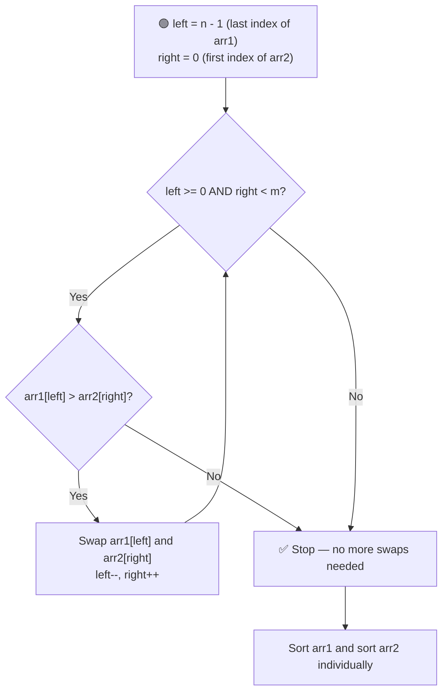
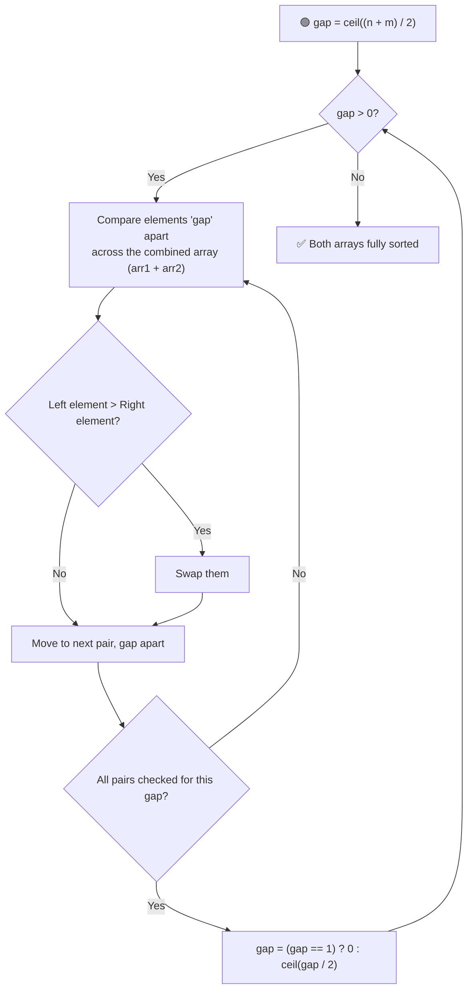

# 🔀 Merge Two Sorted Arrays Without Extra Space

---

## 📑 Table of Contents

- [❓ Problem Statement](#-problem-statement)
- [🧠 Brute Force Approach](#-brute-force-approach)
- [⚡ Optimal Solution 1 — Two-Pointer Approach](#-optimal-solution-1--two-pointer-approach)
- [⚡ Optimal Solution 2 — Gap Method (Shell Sort Based)](#-optimal-solution-2--gap-method-shell-sort-based)
- [⏱️ Complexity Comparison](#️-complexity-comparison)
- [🖥️ C++ Implementation](#️-c-implementation)

---

## ❓ Problem Statement

> Given two **sorted arrays**, merge them into a single sorted sequence **in place** — without using an extra array for storage.

**Test Case 1**
```
Input:  arr1 = [1, 4, 8, 10], arr2 = [2, 3, 9]
Output: arr1 = [1, 2, 3, 4], arr2 = [8, 9, 10]
```

**Test Case 2**
```
Input:  arr1 = [1, 3, 5, 7], arr2 = [0, 2, 6, 8, 9]
Output: arr1 = [0, 1, 2, 3, 5], arr2 = [6, 7, 8, 9]
```

---

## 🧠 Brute Force Approach

**Idea:** Copy all elements from both arrays into a third temporary array, sort it, and then copy the values back into `arr1` and `arr2`.

### Steps

1. Create a temporary array of size `n + m`.
2. Copy all elements of `arr1` and `arr2` into it.
3. Sort the temporary array.
4. Copy the first `n` elements back into `arr1`, and the remaining `m` elements back into `arr2`.

**Complexity:** `O((n+m) log(n+m))` time (for sorting), `O(n+m)` **extra space** — this is exactly what the interviewer usually asks you to eliminate.

---

## ⚡ Optimal Solution 1 — Two-Pointer Approach

**Idea:** Use two pointers — one starting from the **end** of `arr1`, and one from the **start** of `arr2`. Compare and swap whenever the element in `arr1` is bigger than the element in `arr2`. This pushes the larger values of `arr1` into `arr2`, and pulls the smaller values of `arr2` into `arr1`. Finally, sort each array individually to fix any leftover disorder.



### Steps

1. Set `left = n - 1` (pointing to the last index of `arr1`) and `right = 0` (pointing to the first index of `arr2`).
2. While `left >= 0` and `right < m`:
   - If `arr1[left] > arr2[right]`, **swap** them, then move `left` backward and `right` forward.
   - Otherwise, stop — since both arrays were originally sorted, no more swaps are needed once this condition fails.
3. Finally, **sort `arr1`** and **sort `arr2`** individually to restore proper order within each array.

**Complexity:** `O((n+m) log n + m log m)` — dominated by the two individual sorts at the end. `O(1)` auxiliary space — everything is done in place.

---

## ⚡ Optimal Solution 2 — Gap Method (Shell Sort Based)

**Idea:** Borrowed from **Shell Sort** — instead of comparing adjacent elements, compare elements that are a certain **"gap"** distance apart, and shrink the gap after each pass (roughly halving it) until it reaches `1`. Treat `arr1` and `arr2` as one **combined virtual array** of size `n + m`, so the gap comparisons can cross between the two arrays.



### Steps

1. Treat `arr1` (size `n`) and `arr2` (size `m`) as one **conceptual combined array** of total length `n + m`, where index `i < n` maps to `arr1[i]`, and index `i >= n` maps to `arr2[i - n]`.
2. Initialize `gap = ceil((n + m) / 2)`.
3. While `gap > 0`:
   - Compare every pair of elements that are `gap` positions apart in the combined array. If the left one is greater than the right one, **swap** them (using index-mapping logic to reach into the correct actual array).
   - After completing a full pass, shrink the gap: if `gap == 1`, set `gap = 0` to end the loop; otherwise `gap = ceil(gap / 2)`.
4. Once `gap` reaches `0`, both arrays are fully sorted relative to each other — **in place**, with no extra array needed.

**Complexity:** `O((n+m) log(n+m))` time, `O(1)` auxiliary space — the most optimal solution, avoiding both extra memory **and** the two separate sort calls of Solution 1.

---

## ⏱️ Complexity Comparison

| Approach | Time | Space |
|----------|------|-------|
| Brute Force | `O((n+m) log(n+m))` | `O(n+m)` |
| Two-Pointer (Optimal 1) | `O((n+m) log n + m log m)` | `O(1)` |
| Gap Method (Optimal 2) | `O((n+m) log(n+m))` | `O(1)` |

---

## 🖥️ C++ Implementation

See [`merge_sorted_arrays.cpp`](./merge_sorted_arrays.cpp)
