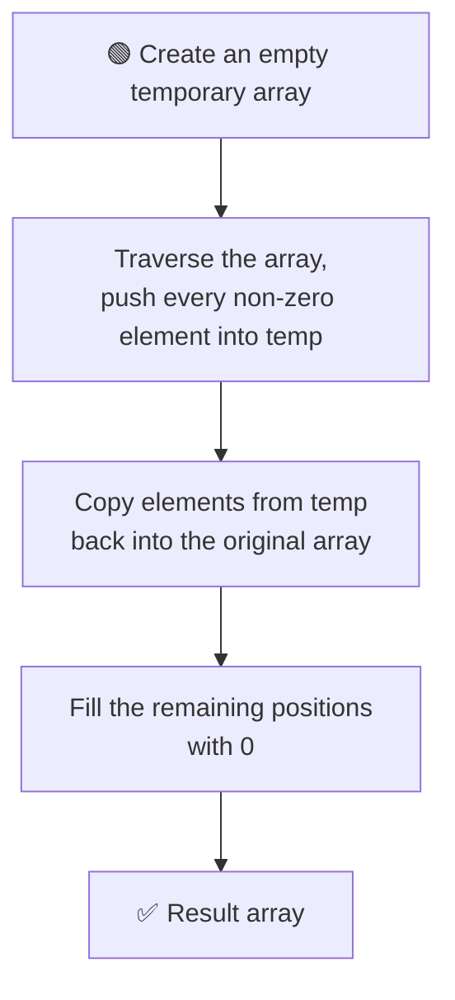
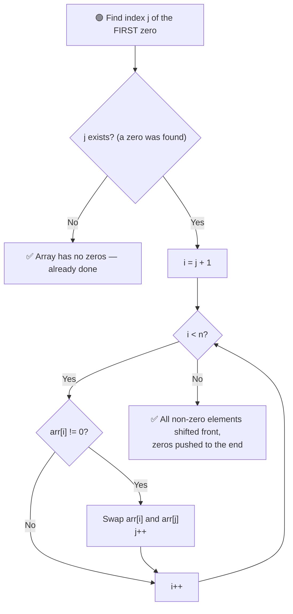

# 0️⃣ Move All Zeros to the End of the Array

---

## 📑 Table of Contents

- [❓ Problem Statement](#-problem-statement)
- [🧠 Brute Force Approach](#-brute-force-approach)
- [⚡ Optimal Approach — Two Pointers](#-optimal-approach--two-pointers)
- [⏱️ Complexity Comparison](#️-complexity-comparison)
- [🖥️ C++ Implementation](#️-c-implementation)

---

## ❓ Problem Statement

> Given an array of integers, move all the **zeros** to the **end** of the array, while moving all **non-zero** elements to the **front**, maintaining their **relative order**.

**Test Case 1**
```
Input:  [1, 0, 2, 3, 0, 4, 0, 1]
Output: [1, 2, 3, 4, 1, 0, 0, 0]
```

**Test Case 2**
```
Input:  [1, 2, 0, 1, 0, 4, 0]
Output: [1, 2, 1, 4, 0, 0, 0]
```

---

## 🧠 Brute Force Approach

**Idea:** Collect all the non-zero elements into a temporary array (preserving their order), then copy them back into the original array followed by the required number of zeros.



### Steps

1. Traverse the array and push every **non-zero** element into a temporary array, in order.
2. Copy all elements from the temporary array back into the original array, starting from index `0`.
3. Fill the rest of the original array (from where the temp elements ended, to the end) with `0`.

**Complexity:** `O(n)` time, `O(n)` extra space (for the temporary array).

---

## ⚡ Optimal Approach — Two Pointers

**Idea:** Do it **in-place** using two pointers — one (`j`) marks the position of the first zero found, and the other (`i`) scans ahead looking for non-zero elements to swap into that position.



### Steps

1. Use pointer `j` to find the index of the **first zero** in the array.
2. Use a second pointer `i`, starting from `j + 1`, to scan the rest of the array.
3. Whenever `arr[i]` is **non-zero**, **swap** it with `arr[j]`, then move `j` forward by one (since `j` now points to the next zero position).
4. Continue until `i` reaches the end of the array.
5. Every non-zero element gets shifted left in order, and every swap pushes a zero further toward the end.

**Complexity:** `O(n)` time, `O(1)` extra space — done entirely **in-place**.

---

## ⏱️ Complexity Comparison

| Approach | Time | Space |
|----------|------|-------|
| Brute Force | `O(n)` | `O(n)` |
| Optimal (Two Pointers) | `O(n)` | `O(1)` |

---

## 🖥️ C++ Implementation

See [`move_zeros.cpp`](./move_zeros.cpp)
