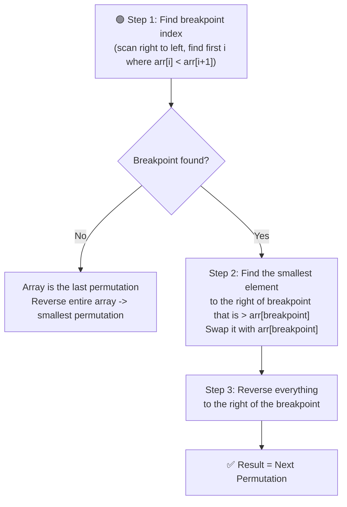

# 🔢 Next Permutation

---

## 📑 Table of Contents

- [❓ Problem Statement](#-problem-statement)
- [📖 What is a Permutation?](#-what-is-a-permutation)
- [🧠 Brute Force Approach](#-brute-force-approach)
- [⚡ Optimal Approach — 3 Steps](#-optimal-approach--3-steps)
- [⏱️ Complexity Comparison](#️-complexity-comparison)
- [🖥️ C++ Implementation](#️-c-implementation)

---

## ❓ Problem Statement

> Given an array representing a permutation of numbers, rearrange it into the **next lexicographically greater permutation**. If no such permutation exists (the array is the highest possible permutation), rearrange it into the **lowest possible order** (sorted ascending).

**Test Case 1**
```
Input:  arr = [1, 2, 3]
Output: [1, 3, 2]
```

**Test Case 2**
```
Input:  arr = [3, 2, 1]
Output: [1, 2, 3]
Explanation: [3, 2, 1] is the last (highest) permutation, so it wraps around to the smallest
```

---

## 📖 What is a Permutation?

A **permutation** is any possible arrangement of a set of elements. For a set of `n` distinct elements, there are `n!` total permutations. Arranging all of them in **dictionary (lexicographic) order** lets us define what comes "next" after any given arrangement — that's exactly what this problem asks for.

---

## 🧠 Brute Force Approach

**Idea:** Generate **all possible permutations** of the array (using recursion), sort them lexicographically, find the current permutation in that list, and return the one right after it.

### Steps

1. Recursively generate every permutation of the array.
2. Sort all these permutations lexicographically.
3. Linearly search for the current array among them.
4. Return the permutation immediately after it (or the first one, if the current one is the last).

**Complexity:** `O(n! × n)` — generating all `n!` permutations, each taking `O(n)` to construct/compare. Extremely inefficient for anything beyond small `n`.

---

## ⚡ Optimal Approach — 3 Steps

**Idea:** Instead of generating every permutation, directly compute the next one by identifying the **exact point** in the array that needs to change, using three clean steps.



### Step 1 — Find the Breakpoint

Traverse the array **from right to left**, looking for the first index `i` where `arr[i] < arr[i+1]`. This is called the **breakpoint** — it marks the rightmost position where the sequence can still be "increased" to form a larger permutation.

- If **no such index exists** (the array is entirely non-increasing from left to right, e.g. `[3,2,1]`), it means this is already the **last (largest) permutation** — simply **reverse the whole array** to get the smallest one, and we're done.

### Step 2 — Find the Next Greater Element

Once the breakpoint index `i` is found, look at the elements to its **right** (which are guaranteed to be in **decreasing order**, by definition of the breakpoint). Find the **smallest element among them that is still greater than `arr[i]`**, and **swap** it with `arr[i]`.

This ensures we increase the permutation by the **smallest possible amount**.

### Step 3 — Reverse the Remainder

After the swap, the segment to the right of the breakpoint is still in **decreasing order** (since we only swapped in a value from that segment). Reverse this entire segment to turn it into **increasing order** — this guarantees the smallest possible arrangement for the suffix, making the overall result the **immediate next permutation**.

**Complexity:** `O(n)` time — each step is a single linear pass, `O(1)` extra space — the array is modified **in-place**.

---

## ⏱️ Complexity Comparison

| Approach | Time | Space |
|----------|------|-------|
| Brute Force | `O(n! × n)` | `O(n! × n)` |
| Optimal (3-Step) | `O(n)` | `O(1)` |

---

## 🖥️ C++ Implementation

See [`next_permutation.cpp`](./next_permutation.cpp)
