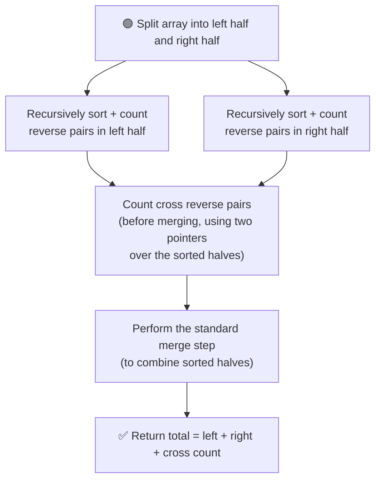

# 🔄 Reverse Pairs

---

## 📑 Table of Contents

- [❓ Problem Statement](#-problem-statement)
- [🧠 Brute Force Approach](#-brute-force-approach)
- [⚡ Optimal Approach — Merge Sort](#-optimal-approach--merge-sort)
- [⚠️ Implementation Detail](#️-implementation-detail)
- [⏱️ Complexity Comparison](#️-complexity-comparison)
- [🖥️ C++ Implementation](#️-c-implementation)

---

## ❓ Problem Statement

> Given an array, a **reverse pair** is a pair of indices `(i, j)` such that `i < j` and `arr[i] > 2 * arr[j]`. Count the **total number** of such reverse pairs.

**Test Case 1**
```
Input:  arr = [1, 3, 2, 3, 1]
Output: 2
Explanation: The pairs are (3,1) at indices (1,4) and (3,1) at indices (3,4), since 3 > 2*1
```

**Test Case 2**
```
Input:  arr = [2, 4, 3, 5, 1]
Output: 3
Explanation: Pairs are (4,1), (3,1), (5,1) — each satisfies arr[i] > 2 * arr[j]
```

---

## 🧠 Brute Force Approach

**Idea:** Compare every pair of indices `(i, j)` with `i < j`, and check whether `arr[i] > 2 * arr[j]`.

### Steps

1. For each index `i` from `0` to `n-1`:
   - For each index `j` from `i+1` to `n-1`:
     - If `arr[i] > 2 * arr[j]`, increment the reverse pair count.
2. Return the total count.

**Complexity:** `O(n²)` time (nested loop over all pairs), `O(1)` space.

---

## ⚡ Optimal Approach — Merge Sort

**Idea:** Just like the [Count Inversions](../count-inversions) problem, piggyback the counting on top of **Merge Sort**. Since both halves get **sorted recursively**, we can exploit that sorted order to count reverse pairs across the two halves **efficiently**, before performing the actual merge.



### Steps

1. Recursively split the array into halves, just like standard Merge Sort.
2. Recursively count reverse pairs in the **left half** and the **right half** separately (each half gets sorted as a side effect).
3. **Before merging**, count the **cross reverse pairs** — pairs where the left element comes from the left half and the right element comes from the right half:
   - Use two pointers `i` (over the left half) and `j` (over the right half).
   - For each `i`, advance `j` forward as long as `arr[i] > 2 * arr[j]` — since the right half is sorted, once this stops holding for some `j`, it holds for all indices before it too. Add `(j - rightStart)` to the count for that `i`.
   - This avoids re-scanning from the start of the right half for every `i`, keeping the counting step linear.
4. **After counting**, perform the standard **merge step** to combine the two sorted halves into one sorted segment (needed for correctness at higher recursion levels).
5. The total reverse pair count is the sum of: pairs in the left half + pairs in the right half + cross pairs found in step 3.

**Complexity:** `O(n log n)` time — matching Merge Sort's efficiency, `O(n)` space — for the temporary array used during merging.

---

## ⚠️ Implementation Detail

Just like Count Inversions, this algorithm **sorts the array as a side effect** of the merge sort process — meaning the **original order of the array is lost** after running it. This is an important detail to mention in an interview: if the original array needs to be preserved, pass a **copy** into the function instead of the original.

---

## ⏱️ Complexity Comparison

| Approach | Time | Space |
|----------|------|-------|
| Brute Force | `O(n²)` | `O(1)` |
| Merge Sort (Optimal) | `O(n log n)` | `O(n)` |

---

## 🖥️ C++ Implementation

See [`reverse_pairs.cpp`](./reverse_pairs.cpp)
