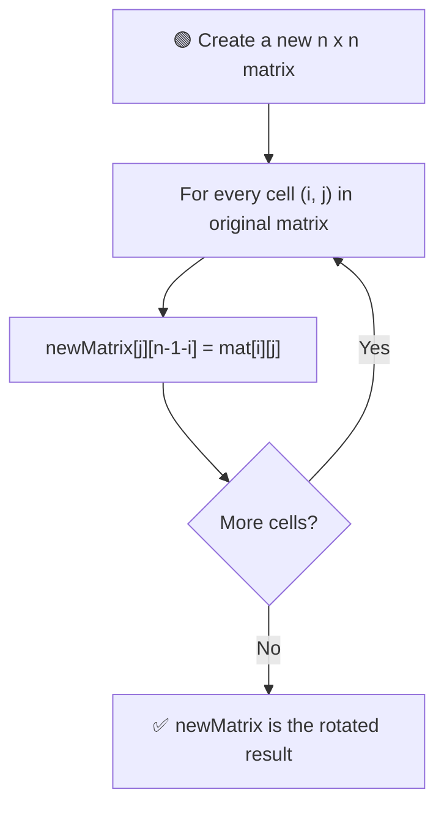
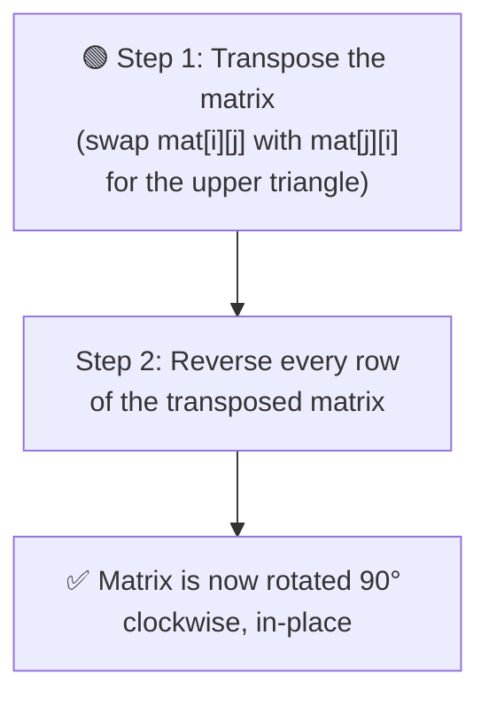

# 🔄 Rotate Matrix by 90 Degrees (Clockwise)

---

## 📑 Table of Contents

- [❓ Problem Statement](#-problem-statement)
- [🧠 Brute Force Approach](#-brute-force-approach)
- [⚡ Optimal Approach — Transpose + Reverse](#-optimal-approach--transpose--reverse)
- [⏱️ Complexity Comparison](#️-complexity-comparison)
- [🖥️ C++ Implementation](#️-c-implementation)

---

## ❓ Problem Statement

> Given an `n x n` square matrix, rotate it by **90 degrees in the clockwise direction**.

**Test Case 1**
```
Input:
1 2 3
4 5 6
7 8 9

Output:
7 4 1
8 5 2
9 6 3
```

**Test Case 2**
```
Input:
1 2
3 4

Output:
3 1
4 2
```

---

## 🧠 Brute Force Approach

**Idea:** Create a **new matrix** and directly place each element into its rotated position, based on the index transformation for a 90° clockwise rotation.



### Steps

1. Create a new `n x n` matrix.
2. For every element `mat[i][j]` in the original matrix, place it into the new matrix at position `newMatrix[j][n-1-i]` — this is the index transformation that corresponds to a 90° clockwise rotation.
3. Return the new matrix.

**Complexity:** `O(n²)` time (visiting every cell once), `O(n²)` **extra space** for the new matrix.

---

## ⚡ Optimal Approach — Transpose + Reverse

**Idea:** Achieve the same rotation **in-place**, without any extra matrix, using two simple steps: **transpose** the matrix, then **reverse each row**.



### Step 1 — Transpose the Matrix

**Transposing** turns rows into columns — the element at `mat[i][j]` moves to `mat[j][i]`. To do this in-place, only the **upper triangle** (where `j > i`) needs to be swapped with its mirror in the lower triangle:

```
for i from 0 to n-1:
    for j from i+1 to n-1:
        swap(mat[i][j], mat[j][i])
```

### Step 2 — Reverse Each Row

Once transposed, simply **reverse every individual row** of the matrix. This final step completes the clockwise rotation:

```
for each row in mat:
    reverse(row)
```

**Why this works:** Transposing flips the matrix along its main diagonal, and reversing each row then flips it horizontally — together, these two reflections combine into exactly a 90° clockwise rotation.

**Complexity:** `O(n²)` time — still visits every cell a constant number of times, `O(1)` extra space — the rotation happens entirely **in-place**.

---

## ⏱️ Complexity Comparison

| Approach | Time | Space |
|----------|------|-------|
| Brute Force | `O(n²)` | `O(n²)` |
| Transpose + Reverse (Optimal) | `O(n²)` | `O(1)` |

---

## 🖥️ C++ Implementation

See [`rotate_matrix.cpp`](./rotate_matrix.cpp)
