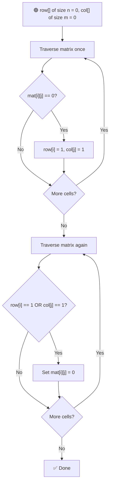
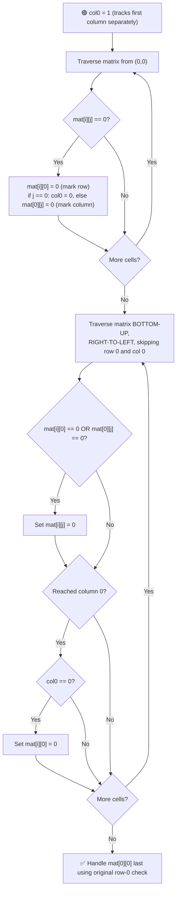

# 0️⃣ Set Matrix Zeroes

---

## 📑 Table of Contents

- [❓ Problem Statement](#-problem-statement)
- [🧠 Brute Force Approach](#-brute-force-approach)
- [📊 Better Approach — Row & Column Arrays](#-better-approach--row--column-arrays)
- [⚡ Optimal Approach — Using the Matrix Itself](#-optimal-approach--using-the-matrix-itself)
- [⏱️ Complexity Comparison](#️-complexity-comparison)
- [🖥️ C++ Implementation](#️-c-implementation)

---

## ❓ Problem Statement

> Given an `n x m` binary matrix, if an element at `mat[i][j]` is `0`, set its **entire row `i`** and **entire column `j`** to `0`. Do this for every zero found in the original matrix.

**Test Case 1**
```
Input:
1 1 1
1 0 1
1 1 1

Output:
1 0 1
0 0 0
1 0 1
```

**Test Case 2**
```
Input:
0 1 2 0
3 4 5 2
1 3 1 5

Output:
0 0 0 0
0 4 5 0
0 3 1 0
```

---

## 🧠 Brute Force Approach

**Idea:** When a `0` is found at `mat[i][j]`, mark its entire row and column using a temporary placeholder value (like `-1`), so we don't confuse "already zero" cells with "newly marked" ones while still scanning the matrix. Once done, sweep through the matrix again and turn every `-1` into `0`.

### Steps

1. Traverse the matrix. Whenever `mat[i][j] == 0` is found:
   - Mark every cell in row `i` that isn't already `0` as `-1`.
   - Mark every cell in column `j` that isn't already `0` as `-1`.
2. After the full traversal, do a final pass converting every `-1` back into `0`.

**Complexity:** `O((n×m) × (n+m))` time — for every zero found, an entire row and column get scanned and marked, `O(1)` extra space (besides the input matrix itself).

---

## 📊 Better Approach — Row & Column Arrays

**Idea:** Instead of repeatedly scanning rows/columns for every zero, use two separate tracking arrays — one for rows, one for columns — to simply **remember** which rows and columns need to be zeroed, then apply it all in a second pass.



### Steps

1. Create `row[]` of size `n` and `col[]` of size `m`, both initialized to `0`.
2. Traverse the matrix once: whenever `mat[i][j] == 0`, set `row[i] = 1` and `col[j] = 1`.
3. Traverse the matrix a second time: for every cell `(i, j)`, if `row[i] == 1` or `col[j] == 1`, set `mat[i][j] = 0`.

**Complexity:** `O(n×m)` time — just two full passes, `O(n + m)` extra space for the two tracking arrays.

---

## ⚡ Optimal Approach — Using the Matrix Itself

**Idea:** Instead of allocating new `row[]` and `col[]` arrays, reuse the matrix's own **first row** and **first column** as the tracking structures — eliminating the need for extra space entirely. The only tricky part is the cell `mat[0][0]`, which belongs to **both** the first row and first column, so a single extra variable (`col0`) is used to resolve that overlap.



### Steps

1. Initialize a variable `col0 = 1`, used to separately track whether the **first column** needs to be zeroed (since `mat[0][0]` can't represent both row-0 and col-0 flags at once).
2. Traverse the matrix from `(0, 0)` onward. Whenever `mat[i][j] == 0`:
   - Set `mat[i][0] = 0` — this marks row `i` using the first column.
   - If `j == 0`, set `col0 = 0` (can't use `mat[0][0]` for this, it's already used for row 0's flag). Otherwise, set `mat[0][j] = 0` — this marks column `j` using the first row.
3. **Traverse the matrix in reverse** — starting from the **bottom-right**, moving **up and to the left**, and skip row `0` and column `0` for now. For each cell `(i, j)`, if `mat[i][0] == 0` or `mat[0][j] == 0`, set `mat[i][j] = 0`.
   - **Why reverse order matters:** if we zeroed cells top-down, we might overwrite the tracking markers in row 0 / column 0 before finishing reading them — going bottom-up preserves the markers until they're no longer needed.
4. Finally, handle the first row and first column themselves:
   - If `mat[0][0] == 0`, zero out the **entire first row**.
   - If `col0 == 0`, zero out the **entire first column**.

**Complexity:** `O(n×m)` time — two passes over the matrix, `O(1)` extra space — only the matrix itself and a single variable (`col0`) are used.

---

## ⏱️ Complexity Comparison

| Approach | Time | Space |
|----------|------|-------|
| Brute Force | `O((n×m)×(n+m))` | `O(1)` |
| Row/Col Arrays (Better) | `O(n×m)` | `O(n+m)` |
| In-Place (Optimal) | `O(n×m)` | `O(1)` |

---

## 🖥️ C++ Implementation

See [`set_matrix_zeroes.cpp`](./set_matrix_zeroes.cpp)
