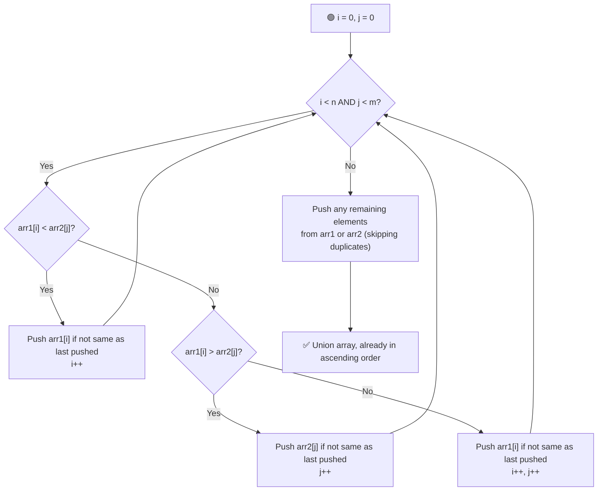

# 🔗 Union of Two Arrays

---

## 📑 Table of Contents

- [❓ Problem Statement](#-problem-statement)
- [🧠 Approach 1 — Using Map](#-approach-1--using-map)
- [🧠 Approach 2 — Using Set](#-approach-2--using-set)
- [⚡ Optimal Approach — Two Pointers](#-optimal-approach--two-pointers)
- [⏱️ Complexity Comparison](#️-complexity-comparison)
- [🖥️ C++ Implementation](#️-c-implementation)

---

## ❓ Problem Statement

> The **union** of two arrays is defined as the set of **common and distinct elements** present in both arrays combined.
>
> The elements in the resulting union must be in **ascending order**, and each value should appear **only once**.

**Test Case 1**
```
Input:  n = 5, m = 5
        arr1 = [1, 2, 3, 4, 5]
        arr2 = [2, 3, 4, 4, 5]
Output: [1, 2, 3, 4, 5]

Explanation:
Common elements: 2, 3, 4, 5
Distinct in arr1: 1
Distinct in arr2: none
Union = {1, 2, 3, 4, 5}
```

**Test Case 2**
```
Input:  n = 10, m = 7
        arr1 = [1, 2, 3, 4, 5, 6, 7, 8, 9, 10]
        arr2 = [2, 3, 4, 4, 5, 11, 12]
Output: [1, 2, 3, 4, 5, 6, 7, 8, 9, 10, 11, 12]

Explanation:
Common elements: 2, 3, 4, 5
Distinct in arr1: 1, 6, 7, 8, 9, 10
Distinct in arr2: 11, 12
Union = {1, 2, 3, 4, 5, 6, 7, 8, 9, 10, 11, 12}
```

---

## 🧠 Approach 1 — Using Map

**Idea:** Use an ordered `map<int, bool>` as a marker for "has this value been seen". Since `map` keeps its keys sorted automatically, iterating over it at the end gives the union directly in ascending order.

### Steps

1. Traverse `arr1` and mark every element as `true` in the map.
2. Traverse `arr2` and mark every element as `true` in the map as well (duplicates just overwrite the same key, so they don't matter).
3. Iterate over the map in order (it's already sorted by key) and push every key into the result array.

**Complexity:** `O((n + m) log(n + m))` time, `O(n + m)` space.

---

## 🧠 Approach 2 — Using Set

**Idea:** Very similar to the map approach, but simpler — a `set<int>` already stores only **unique** values in **sorted order**, so no boolean flag is even needed.

### Steps

1. Insert every element of `arr1` into a `set<int>`.
2. Insert every element of `arr2` into the same set.
3. Since a set automatically removes duplicates and stays sorted, just copy its contents into the result array.

**Complexity:** `O((n + m) log(n + m))` time, `O(n + m)` space.

---

## ⚡ Optimal Approach — Two Pointers

**Idea:** Since both `arr1` and `arr2` are already **sorted**, we can merge them like the merge step of Merge Sort — walking through both arrays with two pointers and always picking the smaller current element, while skipping duplicates.



### Steps

1. Start two pointers `i = 0` (for `arr1`) and `j = 0` (for `arr2`).
2. While both pointers are in range:
   - If `arr1[i] < arr2[j]`: push `arr1[i]` (only if it's different from the last element pushed), then `i++`.
   - If `arr1[i] > arr2[j]`: push `arr2[j]` (only if different from the last pushed), then `j++`.
   - If they're **equal**: push the value once (only if different from the last pushed), then move **both** pointers forward.
3. Once one array is exhausted, push the remaining elements of the other array — still skipping duplicates against the last pushed value.

**Why check "last pushed value"?** Since both arrays can have internal duplicates (like the `4, 4` in the examples), comparing only against the last element added to the result is enough to guarantee no duplicates appear in the final union — because both arrays are sorted.

**Complexity:** `O(n + m)` time — no sorting needed since the inputs are already sorted. `O(n + m)` space only for the output array (no extra map/set).

---

## ⏱️ Complexity Comparison

| Approach | Time | Space |
|----------|------|-------|
| Using Map | `O((n+m) log(n+m))` | `O(n+m)` |
| Using Set | `O((n+m) log(n+m))` | `O(n+m)` |
| Two Pointers (Optimal) | `O(n+m)` | `O(n+m)` output only |

---

## 🖥️ C++ Implementation

See [`union_arrays.cpp`](./union_arrays.cpp)
