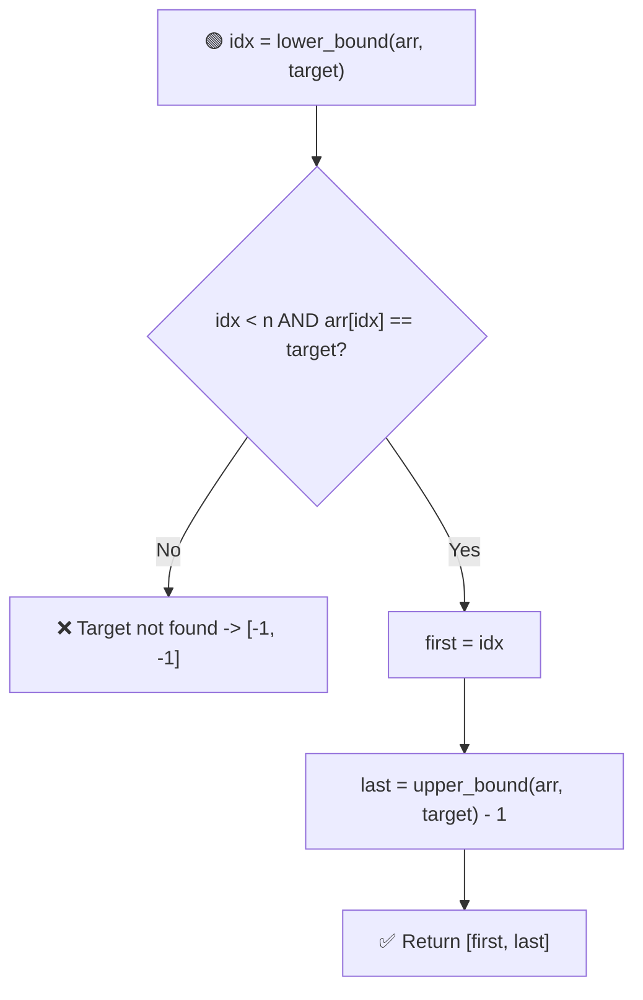
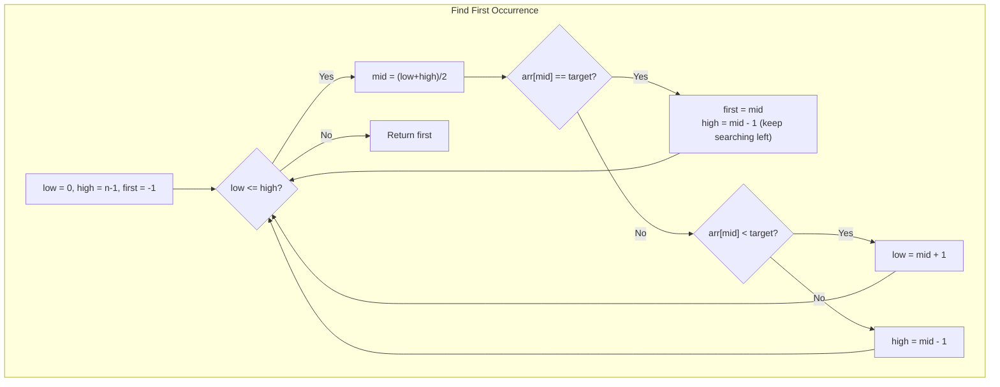

# 🔎 First & Last Occurrence + Count of an Element (Binary Search)

---

## 📑 Table of Contents

- [❓ Problem Statement](#-problem-statement)
- [🧠 Brute Force Approach](#-brute-force-approach)
- [📊 Optimized Approach — Lower Bound & Upper Bound](#-optimized-approach--lower-bound--upper-bound)
- [⚡ Pure Binary Search Approach](#-pure-binary-search-approach)
- [🔢 Counting Occurrences of a Number](#-counting-occurrences-of-a-number)
- [⏱️ Complexity Comparison](#️-complexity-comparison)
- [🖥️ C++ Implementation](#️-c-implementation)

---

## ❓ Problem Statement

> Given a **sorted array** and a target value, find the **first** and **last** index at which the target occurs. Also, find the **total count** of occurrences of that target in the array. If the target doesn't exist, return `[-1, -1]`.

**Test Case 1**
```
Input:  arr = [5, 7, 7, 8, 8, 10], target = 8
Output: First = 3, Last = 4, Count = 2
```

**Test Case 2**
```
Input:  arr = [5, 7, 7, 8, 8, 10], target = 6
Output: First = -1, Last = -1, Count = 0
```

---

## 🧠 Brute Force Approach

**Idea:** Do a simple **linear scan** through the array, recording the first and last index where the target is found.

### Steps

1. Traverse the array from left to right.
2. The first time `arr[i] == target` is encountered, record it as the **first occurrence**.
3. Keep updating the **last occurrence** every time `arr[i] == target` is found again.
4. If the target is never found, return `[-1, -1]`.

**Complexity:** `O(n)` time, `O(1)` space.

---

## 📊 Optimized Approach — Lower Bound & Upper Bound

**Idea:** Since the array is **sorted**, use binary search variants:
- **Lower Bound** — the index of the **first element ≥ target**.
- **Upper Bound** — the index of the **first element > target**.

If the element at the lower bound index actually equals the target, then:
- `first occurrence = lowerBound(target)`
- `last occurrence = upperBound(target) - 1`



### Steps

1. Compute `lowerBound(target)` using binary search — the first index where `arr[idx] >= target`.
2. If that index is out of bounds, or `arr[idx] != target`, the target **doesn't exist** — return `[-1, -1]`.
3. Otherwise, `first = lowerBound(target)`.
4. Compute `last = upperBound(target) - 1`, where `upperBound(target)` is the first index where `arr[idx] > target`.

**Complexity:** `O(log n)` time — two binary searches, `O(1)` space.

---

## ⚡ Pure Binary Search Approach

**Idea:** Rather than relying on generic lower/upper bound utilities, write **two dedicated binary searches from scratch** — one biased toward finding the **leftmost** match, and one biased toward the **rightmost** match. This is often preferred in interviews to demonstrate a solid grasp of binary search internals.



### Finding the First Occurrence

1. Standard binary search with `low = 0`, `high = n - 1`.
2. Whenever `arr[mid] == target`, record `mid` as a candidate answer, but **keep searching the left half** (`high = mid - 1`) to see if an even earlier occurrence exists.
3. If `arr[mid] < target`, search right (`low = mid + 1`); if `arr[mid] > target`, search left (`high = mid - 1`).
4. The last recorded candidate is the **first occurrence**.

### Finding the Last Occurrence

Same idea, but mirrored — whenever `arr[mid] == target`, record it and **keep searching the right half** (`low = mid + 1`) to look for a later occurrence.

**Complexity:** `O(log n)` time for each search — `O(log n)` total, `O(1)` space.

---

## 🔢 Counting Occurrences of a Number

**Idea:** Since the array is sorted, once the **first** and **last** occurrence indices are known, the count of occurrences is simply:

```
count = last - first + 1
```

No additional scanning is needed — this formula works directly off the two binary search results.

---

## ⏱️ Complexity Comparison

| Approach | Time | Space |
|----------|------|-------|
| Brute Force (Linear Scan) | `O(n)` | `O(1)` |
| Lower/Upper Bound | `O(log n)` | `O(1)` |
| Pure Binary Search | `O(log n)` | `O(1)` |

---

## 🖥️ C++ Implementation

See [`first_last_occurrence.cpp`](./first_last_occurrence.cpp)
