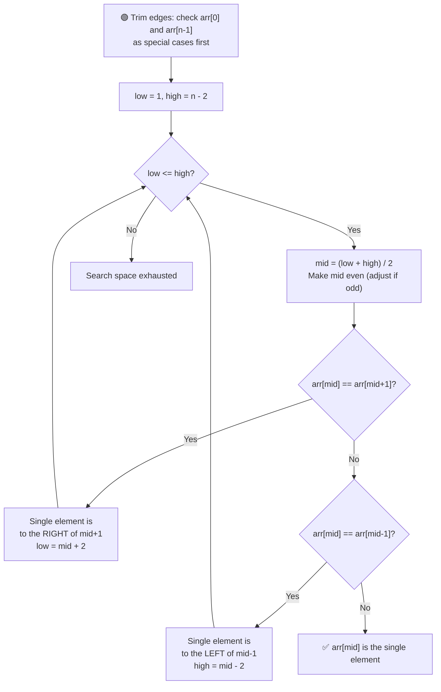

# 🔍 Single Element in a Sorted Array

---

## 📑 Table of Contents

- [❓ Problem Statement](#-problem-statement)
- [🧠 Brute Force Approach](#-brute-force-approach)
- [⚡ Optimal Approach — Binary Search](#-optimal-approach--binary-search)
- [⏱️ Complexity Comparison](#️-complexity-comparison)
- [🖥️ C++ Implementation](#️-c-implementation)

---

## ❓ Problem Statement

> Given a **sorted array** where every element appears **exactly twice**, except for **one element** that appears only **once**, find that single element.

**Test Case 1**
```
Input:  arr = [1, 1, 2, 3, 3, 4, 4, 8, 8]
Output: 2
```

**Test Case 2**
```
Input:  arr = [3, 3, 7, 7, 10, 11, 11]
Output: 10
```

---

## 🧠 Brute Force Approach

**Idea:** Walk through the array and compare each element with its **neighbors**. Since the array is made up of pairs except for one element, the element whose neighbors don't match it is the answer.

### Steps

1. Handle the **first** and **last** elements as edge cases — the first element is the answer if it doesn't equal `arr[1]`, and the last element is the answer if it doesn't equal `arr[n-2]`.
2. For every other index `i` (from `1` to `n-2`), check whether `arr[i] != arr[i-1]` and `arr[i] != arr[i+1]`. If both hold, `arr[i]` is the unique element.

**Complexity:** `O(n)` time — a full linear scan, `O(1)` space. Works correctly, but doesn't take advantage of the fact that the array is **sorted**, so it can't beat linear time.

---

## ⚡ Optimal Approach — Binary Search

**Idea:** Because the array is sorted and pairs are adjacent, every pair naturally starts at an **even index** and ends at an **odd index** — **until** we cross the single element, after which this pattern flips. Binary search can exploit this shift to eliminate half the array at every step.



### Steps

1. **Handle edge cases first:** If `arr[0] != arr[1]`, the first element is the answer. If `arr[n-1] != arr[n-2]`, the last element is the answer. This lets the main search safely stay within `[1, n-2]`, avoiding out-of-bounds checks inside the loop.
2. Set `low = 1` and `high = n - 2`.
3. While `low <= high`:
   - Compute `mid = (low + high) / 2`. **Force `mid` to be even** (if it's odd, decrement it by 1) — this keeps the comparison logic consistent, since pairs are expected to start at even indices before the single element.
   - If `arr[mid] == arr[mid + 1]`, the pairing pattern is still "intact" up to `mid` — meaning the single element must be **somewhere to the right**. Move `low = mid + 2`.
   - Else if `arr[mid] == arr[mid - 1]`, the pattern has already "shifted" by this point — meaning the single element is **somewhere to the left**. Move `high = mid - 2`.
   - Otherwise, `arr[mid]` matches **neither** neighbor — it's the **single element itself**.

**Why the even/odd rule works:** Before the single element, every pair `(arr[2k], arr[2k+1])` lines up so the first of the pair sits at an **even index**. Once we pass the single element, this alignment shifts by one — pairs now start at **odd indices**. Checking whether `arr[mid] == arr[mid+1]` at an even `mid` tells us which side of that "shift point" we're currently on, letting us discard half the array each time.

**Complexity:** `O(log n)` time — binary search halves the search space each iteration, `O(1)` space.

---

## ⏱️ Complexity Comparison

| Approach | Time | Space |
|----------|------|-------|
| Brute Force (Linear Scan) | `O(n)` | `O(1)` |
| Binary Search (Optimal) | `O(log n)` | `O(1)` |

---

## 🖥️ C++ Implementation

See [`single_element_sorted.cpp`](./single_element_sorted.cpp)
