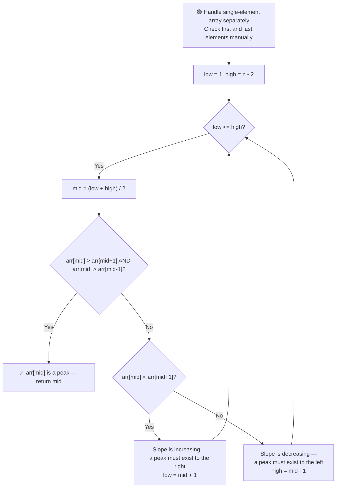

# ⛰️ Find Peak Element

---

## 📑 Table of Contents

- [❓ Problem Statement](#-problem-statement)
- [🧠 Brute Force Approach](#-brute-force-approach)
- [⚡ Optimal Approach — Binary Search](#-optimal-approach--binary-search)
- [⚠️ Handling Edge Cases](#️-handling-edge-cases)
- [🏔️ Multiple Peaks](#️-multiple-peaks)
- [⏱️ Complexity Comparison](#️-complexity-comparison)
- [🖥️ C++ Implementation](#️-c-implementation)

---

## ❓ Problem Statement

> A **peak element** is an element that is **strictly greater than its neighbors**. Given an array, find the **index of any one peak** element.
>
> Elements outside the array boundaries are treated as **negative infinity**, which guarantees that **at least one peak always exists**.

**Test Case 1**
```
Input:  arr = [1, 2, 3, 1]
Output: 2   (arr[2] = 3 is a peak, since 3 > 2 and 3 > 1)
```

**Test Case 2**
```
Input:  arr = [1, 2, 1, 3, 5, 6, 4]
Output: 1 or 5   (both arr[1] = 2 and arr[5] = 6 are valid peaks)
```

---

## 🧠 Brute Force Approach

**Idea:** Do a simple **linear scan** through the array, checking every element against its immediate neighbors.

### Steps

1. For each index `i` from `0` to `n-1`:
   - Treat out-of-bounds neighbors as `-infinity`.
   - If `arr[i] > arr[i-1]` (or `i == 0`) **and** `arr[i] > arr[i+1]` (or `i == n-1`), then `arr[i]` is a peak — return `i`.

**Complexity:** `O(n)` time — a full linear scan in the worst case, `O(1)` space.

---

## ⚡ Optimal Approach — Binary Search

**Idea:** Think of the array as a sequence of **increasing and decreasing slopes**. At the middle index, check which direction the array is "sloping" — and since a peak is guaranteed to exist, we can always discard the half that's sloping **away** from a peak.



### Steps

1. **Edge cases first** (see below) — handle single-element arrays, and manually check `arr[0]` and `arr[n-1]` before starting binary search.
2. Set `low = 1` and `high = n - 2` (search only the "interior" of the array, since the boundaries are already handled).
3. While `low <= high`:
   - Compute `mid = (low + high) / 2`.
   - If `arr[mid] > arr[mid-1]` **and** `arr[mid] > arr[mid+1]`, `arr[mid]` is a peak — return `mid`.
   - Else if `arr[mid] < arr[mid+1]`, the array is **increasing** at this point — a peak must exist somewhere to the right (since values keep rising until they eventually fall, or hit the boundary). Move `low = mid + 1`.
   - Else (`arr[mid] < arr[mid-1]`), the array is **decreasing** — a peak must exist somewhere to the left. Move `high = mid - 1`.

**Why this always works:** Because out-of-bounds values are treated as `-infinity`, the array is guaranteed to have at least one peak. Whichever direction the slope points at `mid`, moving that direction is guaranteed to eventually lead to a peak — so it's always safe to discard the other half.

**Complexity:** `O(log n)` time — binary search halves the search space each step, `O(1)` space.

---

## ⚠️ Handling Edge Cases

To avoid messy out-of-bounds index checks inside the main loop, handle these cases **before** starting binary search:

1. **Single-element array:** If `n == 1`, that single element is trivially a peak (both its "neighbors" are `-infinity`) — return index `0` immediately.
2. **First and last elements:** Check `arr[0]` and `arr[n-1]` manually before the loop:
   - If `arr[0] > arr[1]`, index `0` is a peak.
   - If `arr[n-1] > arr[n-2]`, index `n-1` is a peak.
3. **Restrict the search bounds:** Once the boundaries are handled separately, set `low = 1` and `high = n - 2` — this keeps every `mid` computed inside the loop safely within `[1, n-2]`, so `mid-1` and `mid+1` never go out of bounds.

---

## 🏔️ Multiple Peaks

If an array has **multiple peaks**, the binary search approach is still valid — it doesn't guarantee finding a *specific* peak, but it's guaranteed to find **some** valid peak. Whenever `arr[mid]` isn't a peak, the slope direction tells us which side to discard, and since **at least one peak must exist in the remaining portion**, correctness is preserved regardless of how many total peaks the array has.

---

## ⏱️ Complexity Comparison

| Approach | Time | Space |
|----------|------|-------|
| Brute Force (Linear Scan) | `O(n)` | `O(1)` |
| Binary Search (Optimal) | `O(log n)` | `O(1)` |

---

## 🖥️ C++ Implementation

See [`find_peak_element.cpp`](./find_peak_element.cpp)
