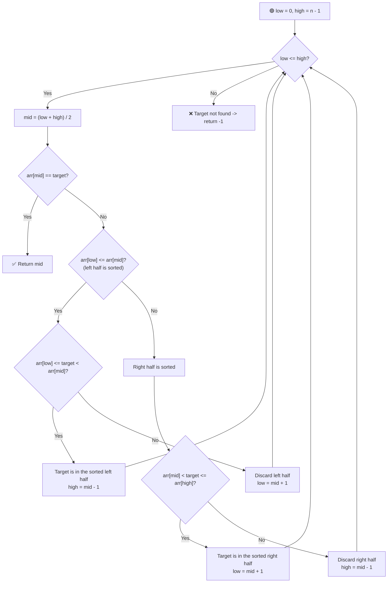

# 🔄 Search in a Rotated Sorted Array

---

## 📑 Table of Contents

- [❓ Problem Statement](#-problem-statement)
- [🧠 Brute Force Approach — Linear Search](#-brute-force-approach--linear-search)
- [⚡ Optimal Approach — Modified Binary Search](#-optimal-approach--modified-binary-search)
- [⏱️ Complexity Comparison](#️-complexity-comparison)
- [🖥️ C++ Implementation](#️-c-implementation)

---

## ❓ Problem Statement

> Given an array that was originally **sorted** and then **rotated** at some unknown pivot point, find the **index** of a given target element. Return `-1` if it doesn't exist.

**Test Case 1**
```
Input:  arr = [4, 5, 6, 7, 0, 1, 2], target = 0
Output: 4
```

**Test Case 2**
```
Input:  arr = [4, 5, 6, 7, 0, 1, 2], target = 3
Output: -1
```

---

## 🧠 Brute Force Approach — Linear Search

**Idea:** Since rotation destroys the simple sorted structure, the most obvious approach is to just scan the whole array looking for the target.

### Steps

1. Traverse the array from index `0` to `n-1`.
2. If `arr[i] == target`, return `i`.
3. If the loop finishes without a match, return `-1`.

**Complexity:** `O(n)` time, `O(1)` space.

---

## ⚡ Optimal Approach — Modified Binary Search

**Idea:** Even though the array is rotated, at **any** midpoint, **at least one half** (left or right of `mid`) is guaranteed to still be **sorted**. This lets us apply binary search logic — just with an extra check to figure out *which* half is sorted before deciding where the target could be.



### Steps

1. Initialize `low = 0`, `high = n - 1`.
2. While `low <= high`:
   - Compute `mid = (low + high) / 2`.
   - If `arr[mid] == target`, return `mid` immediately.
   - **Check which half is sorted:**
     - **If `arr[low] <= arr[mid]`** — the **left half** (`low` to `mid`) is sorted.
       - If `arr[low] <= target < arr[mid]`, the target must lie within this sorted left half — search there: `high = mid - 1`.
       - Otherwise, the target can't be in the left half — discard it: `low = mid + 1`.
     - **Else** — the **right half** (`mid` to `high`) must be sorted instead.
       - If `arr[mid] < target <= arr[high]`, the target must lie within this sorted right half — search there: `low = mid + 1`.
       - Otherwise, discard the right half: `high = mid - 1`.
3. If the loop ends without finding the target, return `-1`.

**Why this works:** A rotated sorted array always has the property that splitting it at any index leaves **one contiguous sorted segment** on one side. By first identifying which side is sorted, we can reliably check (using simple range comparison) whether the target could be hiding there — and safely discard the other half if not.

**Complexity:** `O(log n)` time — binary search halves the search space at each step, `O(1)` space.

---

## ⏱️ Complexity Comparison

| Approach | Time | Space |
|----------|------|-------|
| Linear Search | `O(n)` | `O(1)` |
| Modified Binary Search (Optimal) | `O(log n)` | `O(1)` |

---

## 🖥️ C++ Implementation

See [`search_rotated_array.cpp`](./search_rotated_array.cpp)
