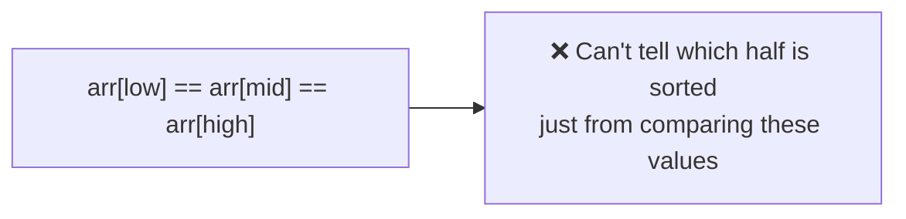
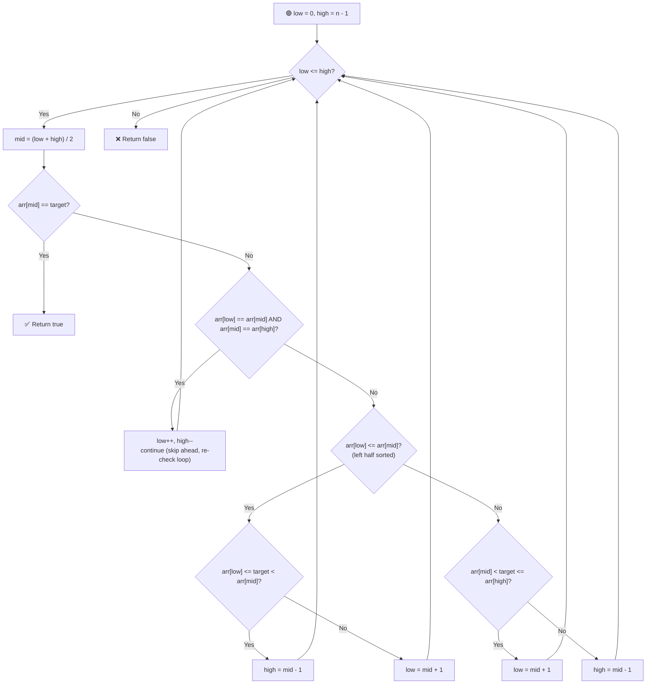

# 🔄 Search in a Rotated Sorted Array II (With Duplicates)

---

## 📑 Table of Contents

- [❓ Problem Statement](#-problem-statement)
- [🤔 Why This Differs from the Unique-Element Version](#-why-this-differs-from-the-unique-element-version)
- [⚡ The Solution — Shrinking the Search Space](#-the-solution--shrinking-the-search-space)
- [⏱️ Complexity](#️-complexity)
- [🖥️ C++ Implementation](#️-c-implementation)

---

## ❓ Problem Statement

> Given a **rotated sorted array that may contain duplicates**, determine whether a given `target` exists in the array. Return `true` or `false`.

**Test Case 1**
```
Input:  arr = [2, 5, 6, 0, 0, 1, 2], target = 0
Output: true
```

**Test Case 2**
```
Input:  arr = [2, 5, 6, 0, 0, 1, 2], target = 3
Output: false
```

---

## 🤔 Why This Differs from the Unique-Element Version

In the version **without duplicates**, we could always tell which half (`low` to `mid`, or `mid` to `high`) was sorted by comparing `arr[low]` with `arr[mid]`.

With **duplicates**, this comparison can break down. Consider a case where `arr[low]`, `arr[mid]`, and `arr[high]` are **all the same value** (e.g., three consecutive `3`s) — in this situation, it becomes **impossible to determine** which half is actually the sorted one just by comparing these three values, since the usual `arr[low] <= arr[mid]` check gives no useful information anymore.



---

## ⚡ The Solution — Shrinking the Search Space

**Idea:** When we hit this ambiguous case, we can't make a smart decision — so instead, just **shrink the search space slightly** and try again. Since we know `arr[low]` and `arr[high]` are both equal to `arr[mid]`, it's safe to move both boundaries inward by one step without losing the target (if it exists elsewhere).



### Steps

1. Initialize `low = 0`, `high = n - 1`.
2. While `low <= high`:
   - Compute `mid = (low + high) / 2`.
   - If `arr[mid] == target`, return `true`.
   - **Ambiguous case:** if `arr[low] == arr[mid]` **and** `arr[mid] == arr[high]`, we can't determine which side is sorted — so **shrink the search space**: increment `low`, decrement `high`, and `continue` to re-check the loop with the smaller range.
   - Otherwise, apply the **same logic as the unique-elements version**:
     - If `arr[low] <= arr[mid]`, the left half is sorted — check if `target` falls within `[arr[low], arr[mid])`, and search that side accordingly.
     - Else, the right half is sorted — check if `target` falls within `(arr[mid], arr[high]]`, and search that side accordingly.
3. If the loop ends without finding the target, return `false`.

---

## ⏱️ Complexity

- **Average case:** `O(log n)` — same as the standard rotated binary search, since the ambiguous case is rare in most inputs.
- **Worst case:** `O(n/2) ≈ O(n)` — if the array has **many duplicate values** (e.g., an array full of the same number with one different element), the algorithm may repeatedly hit the ambiguous case and shrink the search space by just one element at a time from both ends, degrading toward a linear scan.
- **Space:** `O(1)` — no extra data structures used.

---

## 🖥️ C++ Implementation

See [`search_rotated_duplicates.cpp`](./search_rotated_duplicates.cpp)
