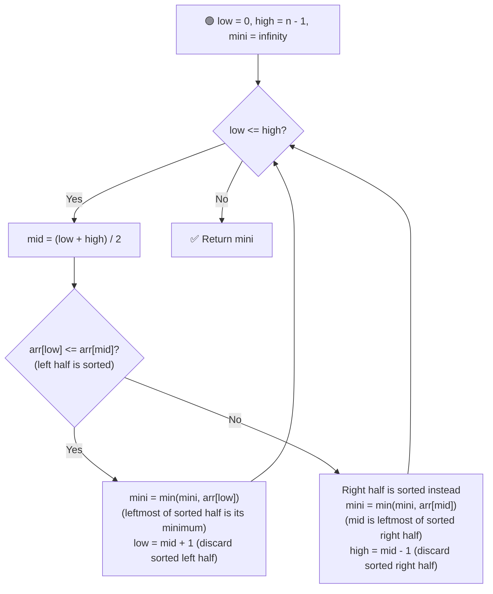
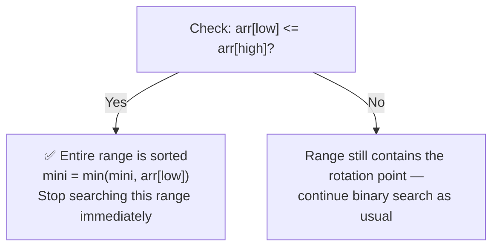

# 📉 Find Minimum in a Rotated Sorted Array

---

## 📑 Table of Contents

- [❓ Problem Statement](#-problem-statement)
- [🧠 Brute Force Approach](#-brute-force-approach)
- [⚡ Optimal Approach — Binary Search](#-optimal-approach--binary-search)
- [🚀 Optimization — Early Exit on Sorted Range](#-optimization--early-exit-on-sorted-range)
- [⏱️ Complexity Comparison](#️-complexity-comparison)
- [🖥️ C++ Implementation](#️-c-implementation)

---

## ❓ Problem Statement

> Given an array that was originally **sorted** and then **rotated** at some unknown pivot point, find the **minimum element** in the array.

**Test Case 1**
```
Input:  arr = [4, 5, 6, 7, 0, 1, 2]
Output: 0
```

**Test Case 2**
```
Input:  arr = [11, 13, 15, 17]
Output: 11
```

---

## 🧠 Brute Force Approach

**Idea:** Just scan the entire array and track the smallest value seen.

### Steps

1. Initialize `mini = infinity`.
2. Traverse the array, updating `mini = min(mini, arr[i])` at every index.
3. Return `mini`.

**Complexity:** `O(n)` time, `O(1)` space. Correct, but doesn't exploit the fact that the array is **mostly sorted**, which is what makes binary search possible.

---

## ⚡ Optimal Approach — Binary Search

**Idea:** At any midpoint, **one half** of the current search range is guaranteed to be **sorted** (just like in "Search in Rotated Sorted Array"). Whenever a half is sorted, its **leftmost element** is automatically its minimum — so we can record that value as a candidate answer, and then safely discard that sorted half, continuing the search only in the other (still-rotated) half.



### Steps

1. Initialize `low = 0`, `high = n - 1`, and `mini = infinity`.
2. While `low <= high`:
   - Compute `mid = (low + high) / 2`.
   - **If `arr[low] <= arr[mid]`** — the **left half** (`low` to `mid`) is sorted.
     - Its minimum is simply `arr[low]` (the leftmost value) — update `mini = min(mini, arr[low])`.
     - Since we already know the minimum of this half, discard it: `low = mid + 1`.
   - **Else** — the **right half** (`mid` to `high`) must be sorted instead.
     - Its minimum is `arr[mid]` (the leftmost value of this sorted segment) — update `mini = min(mini, arr[mid])`.
     - Discard this half: `high = mid - 1`.
3. Once `low > high`, return `mini` — the smallest value found across all the sorted segments we recorded.

**Complexity:** `O(log n)` time — binary search halves the range each step, `O(1)` space.

---

## 🚀 Optimization — Early Exit on Sorted Range

**Idea:** If at any point the **entire current search range** `[low, high]` is already sorted (i.e., `arr[low] <= arr[high]`), there's no need to keep binary searching — the **leftmost element of that range** is immediately known to be the minimum, so we can stop right away.



### Why this works

In a fully sorted range, there's no "rotation point" left to search for — the minimum is trivially the first element. Checking this condition at the start of each iteration (or recursive call) lets the algorithm **terminate early** instead of continuing to subdivide a range that's already resolved.

---

## ⏱️ Complexity Comparison

| Approach | Time | Space |
|----------|------|-------|
| Brute Force (Linear Scan) | `O(n)` | `O(1)` |
| Binary Search (Optimal) | `O(log n)` | `O(1)` |

---

## 🖥️ C++ Implementation

See [`find_min_rotated.cpp`](./find_min_rotated.cpp)
