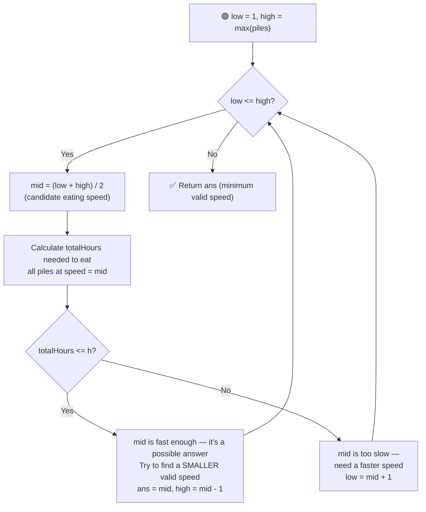

# 🍌 Koko Eating Bananas

---

## 📑 Table of Contents

- [❓ Problem Statement](#-problem-statement)
- [🧠 Brute Force Approach](#-brute-force-approach)
- [⚡ Optimal Approach — Binary Search on Answer](#-optimal-approach--binary-search-on-answer)
- [⏱️ Complexity Comparison](#️-complexity-comparison)
- [🖥️ C++ Implementation](#️-c-implementation)

---

## ❓ Problem Statement

> Koko has `n` piles of bananas, and `h` hours to eat all of them. She eats at a fixed speed of `k` bananas per hour, and can only eat from **one pile at a time**. If a pile has fewer than `k` bananas, she finishes it in that hour and moves on (she doesn't carry leftover speed to the next pile). Find the **minimum integer `k`** such that she can eat all the bananas within `h` hours.

**Test Case 1**
```
Input:  piles = [3, 6, 7, 11], h = 8
Output: 4
```

**Test Case 2**
```
Input:  piles = [30, 11, 23, 4, 20], h = 5
Output: 30
```

---

## 🧠 Brute Force Approach

**Idea:** Try every possible eating speed `k`, starting from `1`, and check whether it lets Koko finish within `h` hours. Return the first `k` that works.

### Steps

1. For each candidate speed `k` from `1` to `max(piles)`:
   - Calculate the total hours needed: for every pile, hours needed = `ceil(pile / k)`, summed across all piles.
   - If the total hours is `<= h`, return `k` as the answer.

**Complexity:** `O(max(piles) × n)` — for every candidate speed, sum hours across all `n` piles. This is slow enough to cause a **Time Limit Exceeded** on large inputs.

---

## ⚡ Optimal Approach — Binary Search on Answer

**Idea:** The key insight is that the **answer space is monotonic** — if a speed `k` is *fast enough* to finish within `h` hours, then **any speed greater than `k`** is also fast enough (eating faster never hurts). This "yes, yes, yes... no, no, no" pattern (as `k` decreases) is exactly what makes **binary search on the answer** applicable, even though we're not searching within a sorted array.



### Steps

1. Set the search range: `low = 1` (slowest possible speed) and `high = max(piles)` (eating an entire pile in one hour is always enough — there's never a reason to eat faster than the largest pile).
2. While `low <= high`:
   - Compute `mid = (low + high) / 2` — this is the candidate eating speed being tested.
   - Calculate the **total hours** required to finish all piles at speed `mid`: for each pile, add `ceil(pile / mid)`.
   - **If `totalHours <= h`:** speed `mid` is fast enough. Record it as a possible answer, and try to find an even **smaller** valid speed by searching the left half: `high = mid - 1`.
   - **Else:** speed `mid` is too slow — she wouldn't finish in time. Search for a faster speed: `low = mid + 1`.
3. Return the smallest speed found that satisfies the time constraint.

**Complexity:** `O(n log(max(piles)))` — binary search over the possible speeds (`O(log(max(piles)))` iterations), and each iteration does an `O(n)` pass to calculate total hours.

---

## ⏱️ Complexity Comparison

| Approach | Time | Space |
|----------|------|-------|
| Brute Force | `O(max(piles) × n)` | `O(1)` |
| Binary Search on Answer (Optimal) | `O(n log(max(piles)))` | `O(1)` |

---

## 🖥️ C++ Implementation

See [`koko_eating_bananas.cpp`](./koko_eating_bananas.cpp)
