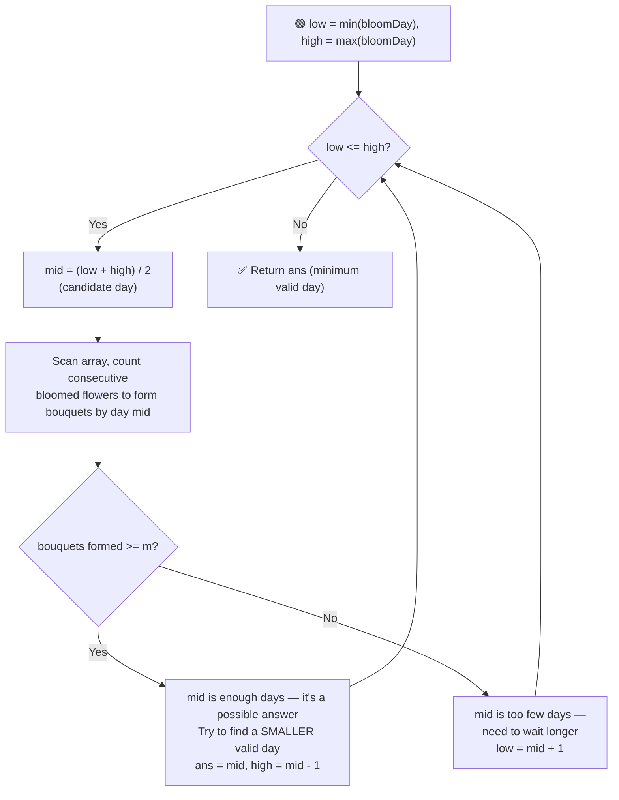

# 🌸 Minimum Days to Make M Bouquets

---

## 📑 Table of Contents

- [❓ Problem Statement](#-problem-statement)
- [🧠 Brute Force Approach](#-brute-force-approach)
- [⚡ Optimal Approach — Binary Search on Answer](#-optimal-approach--binary-search-on-answer)
- [⏱️ Complexity Comparison](#️-complexity-comparison)
- [🖥️ C++ Implementation](#️-c-implementation)

---

## ❓ Problem Statement

> You are given an integer array `bloomDay` where `bloomDay[i]` denotes the day on which the `i`-th flower will bloom. You need exactly `m` bouquets, and each bouquet must be made using `k` **adjacent** bloomed flowers from the garden. A flower, once bloomed, stays bloomed forever and can only be used in **one** bouquet. Find the **minimum number of days** you need to wait so that you can make `m` bouquets. If it is not possible to make `m` bouquets at all, return `-1`.

**Test Case 1**
```
Input:  bloomDay = [7, 7, 7, 7, 12, 7, 7], m = 2, k = 3
Output: 12
```

**Test Case 2**
```
Input:  bloomDay = [1, 10, 3, 10, 2], m = 3, k = 1
Output: 3
```

**Test Case 3 (Impossible)**
```
Input:  bloomDay = [1, 10, 3, 10, 2], m = 3, k = 2
Output: -1
```

---

## 🧠 Brute Force Approach

**Idea:** Try every possible day `d`, starting from `min(bloomDay)` up to `max(bloomDay)`, and check whether `m` bouquets can be made on that day. Return the first `d` that works.

### Steps

1. First check feasibility: if `m * k > n` (total flowers required exceeds flowers available), return `-1` immediately.
2. For each candidate day `d` from `min(bloomDay)` to `max(bloomDay)`:
   - Count how many bouquets can be formed on day `d` by scanning the array and counting consecutive flowers with `bloomDay[i] <= d`.
   - Every time the count of consecutive bloomed flowers reaches `k`, one bouquet is formed and the counter resets.
   - If the total bouquets formed is `>= m`, return `d` as the answer.

**Complexity:** `O((maxDay - minDay) × n)` — for every candidate day, a full `O(n)` scan is done. This is slow enough to cause a **Time Limit Exceeded** on large inputs.

---

## ⚡ Optimal Approach — Binary Search on Answer

**Idea:** The key insight is that the **answer space is monotonic** — if `m` bouquets can be made by day `d`, then they can also be made by **any day greater than `d`** (more days only means more flowers have bloomed, never fewer). This "no, no, no... yes, yes, yes" pattern (as `d` increases) is exactly what makes **binary search on the answer** applicable, even though we're not searching within a sorted array.



### Steps

1. First check feasibility: if `m * k > n`, return `-1` immediately — there simply aren't enough flowers in total.
2. Set the search range: `low = min(bloomDay)` (earliest any flower could bloom) and `high = max(bloomDay)` (day by which every flower is guaranteed bloomed).
3. While `low <= high`:
   - Compute `mid = (low + high) / 2` — this is the candidate day being tested.
   - Walk through the array, tracking a running count of **consecutive** flowers with `bloomDay[i] <= mid`. Whenever this running count hits `k`, increment the bouquet count and reset the running count to `0`. If a flower with `bloomDay[i] > mid` is encountered, reset the running count to `0` (breaks adjacency).
   - **If `bouquets >= m`:** day `mid` is enough. Record it as a possible answer, and try to find an even **smaller** valid day by searching the left half: `high = mid - 1`.
   - **Else:** day `mid` isn't enough — not enough bouquets could be formed. Search for a later day: `low = mid + 1`.
4. Return the smallest day found that satisfies the bouquet requirement.

**Complexity:** `O(n log(maxDay - minDay))` — binary search over the possible days (`O(log(maxDay - minDay))` iterations), and each iteration does an `O(n)` pass to count bouquets.

---

## ⏱️ Complexity Comparison

| Approach | Time | Space |
|----------|------|-------|
| Brute Force | `O((maxDay - minDay) × n)` | `O(1)` |
| Binary Search on Answer (Optimal) | `O(n log(maxDay - minDay))` | `O(1)` |

---

## 🖥️ C++ Implementation

See [`minimum_days_to_make_m_bouquets.cpp`](./minimum_days_to_make_m_bouquets.cpp)
