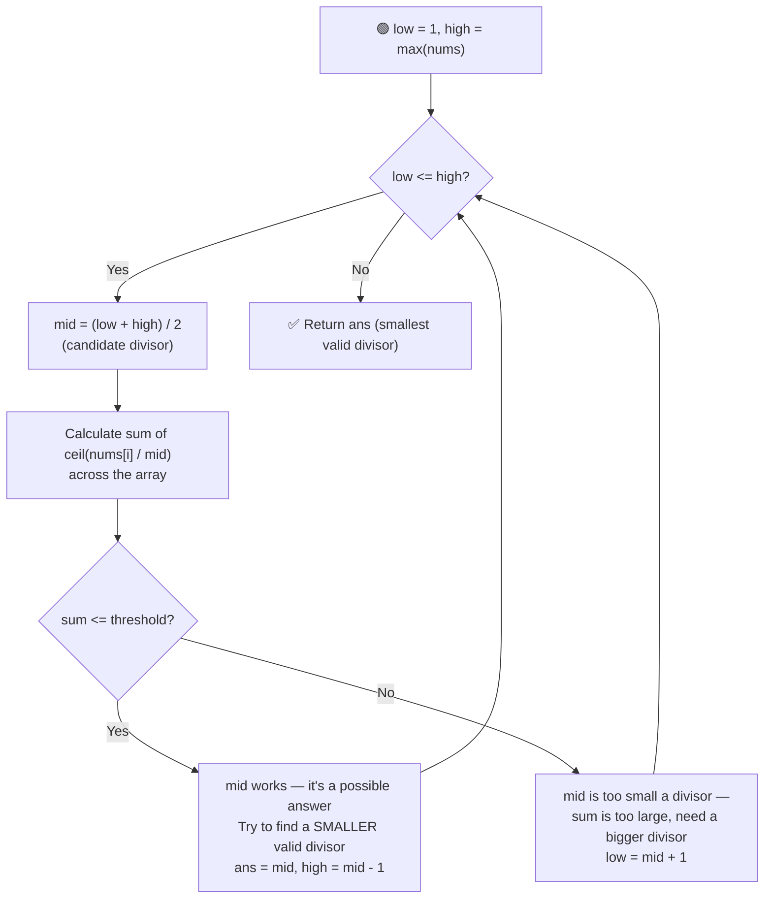

# ➗ Smallest Divisor Given a Threshold

---

## 📑 Table of Contents

- [❓ Problem Statement](#-problem-statement)
- [🧠 Brute Force Approach](#-brute-force-approach)
- [⚡ Optimal Approach — Binary Search on Answer](#-optimal-approach--binary-search-on-answer)
- [⏱️ Complexity Comparison](#️-complexity-comparison)
- [🖥️ C++ Implementation](#️-c-implementation)

---

## ❓ Problem Statement

> You are given an integer array `nums` and an integer `threshold`. You need to find the **smallest positive integer divisor** such that when every element of the array is divided by it and the result is **rounded up to the nearest integer (ceiling)**, the sum of all these quotients is **less than or equal to** `threshold`.

**Test Case 1**
```
Input:  nums = [1, 2, 5, 9], threshold = 6
Output: 5
```

**Test Case 2**
```
Input:  nums = [44, 22, 33, 11, 1], threshold = 5
Output: 44
```

---

## 🧠 Brute Force Approach

**Idea:** Try every possible divisor `d`, starting from `1` up to `max(nums)`, and check whether the sum of `ceil(nums[i] / d)` across the array is `<= threshold`. Return the first `d` that works.

### Steps

1. For each candidate divisor `d` from `1` to `max(nums)`:
   - Calculate the total sum: for every element, quotient = `ceil(nums[i] / d)`, summed across all elements.
   - If the total sum is `<= threshold`, return `d` as the answer.

**Complexity:** `O(max(nums) × n)` — for every candidate divisor, sum quotients across all `n` elements. This is slow enough to cause a **Time Limit Exceeded** on large inputs.

---

## ⚡ Optimal Approach — Binary Search on Answer

**Idea:** The key insight is that the **answer space is monotonic** — if a divisor `d` gives a sum `<= threshold`, then **any divisor larger than `d`** will also give a sum `<= threshold` (dividing by a bigger number only shrinks or keeps quotients the same, never grows them). This "no, no, no... yes, yes, yes" pattern (as `d` increases) is exactly what makes **binary search on the answer** applicable, even though we're not searching within a sorted array.



### Steps

1. Set the search range: `low = 1` (smallest possible divisor) and `high = max(nums)` (dividing by the largest element makes every quotient at most `1`, so the sum can never exceed `n` — this is always a safe upper bound as long as `threshold >= n`, which is guaranteed for a valid input since the array size never exceeds the threshold in the valid problem constraints).
2. While `low <= high`:
   - Compute `mid = (low + high) / 2` — this is the candidate divisor being tested.
   - Calculate the **total sum** of `ceil(nums[i] / mid)` across the array. To compute the ceiling correctly with integer types, use the formula `(nums[i] + mid - 1) / mid` (or cast to `double` and use `ceil()`).
   - **If `sum <= threshold`:** divisor `mid` works. Record it as a possible answer, and try to find an even **smaller** valid divisor by searching the left half: `high = mid - 1`.
   - **Else:** divisor `mid` is too small — the sum is too large. Search for a bigger divisor: `low = mid + 1`.
3. Return the smallest divisor found that satisfies the threshold constraint.

**Complexity:** `O(n log(max(nums)))` — binary search over the possible divisors (`O(log(max(nums)))` iterations), and each iteration does an `O(n)` pass to calculate the sum.

---

## ⏱️ Complexity Comparison

| Approach | Time | Space |
|----------|------|-------|
| Brute Force | `O(max(nums) × n)` | `O(1)` |
| Binary Search on Answer (Optimal) | `O(n log(max(nums)))` | `O(1)` |

---

## 🖥️ C++ Implementation

See [`smallest_divisor_given_threshold.cpp`](./smallest_divisor_given_threshold.cpp)
