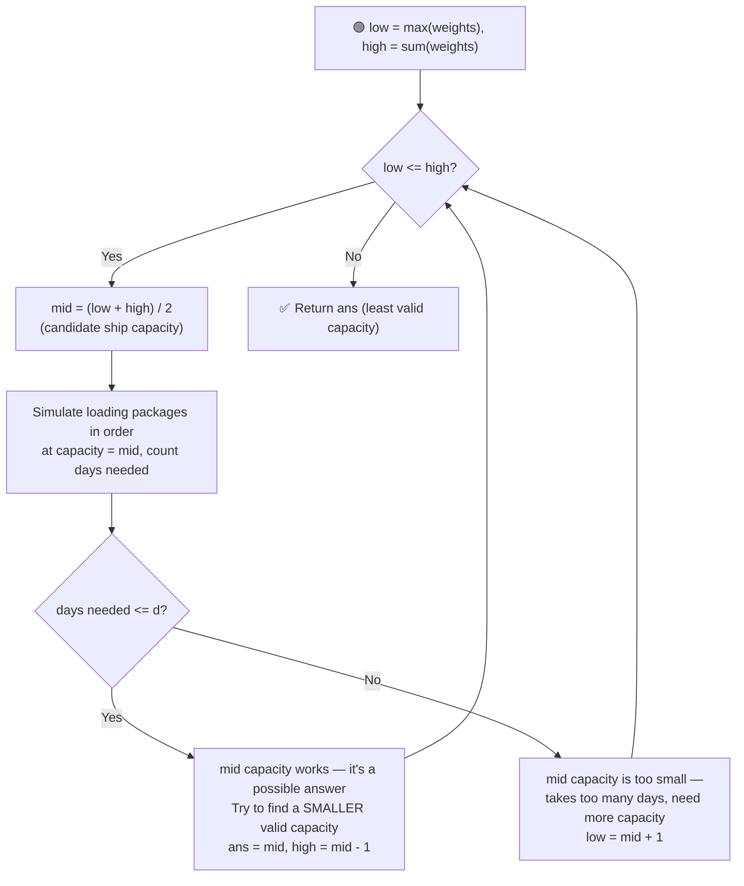

# 🚢 Capacity To Ship Packages Within D Days

---

## 📑 Table of Contents

- [❓ Problem Statement](#-problem-statement)
- [🧠 Brute Force Approach](#-brute-force-approach)
- [⚡ Optimal Approach — Binary Search on Answer](#-optimal-approach--binary-search-on-answer)
- [⏱️ Complexity Comparison](#️-complexity-comparison)
- [🖥️ C++ Implementation](#️-c-implementation)

---

## ❓ Problem Statement

> You are given an array `weights` where `weights[i]` is the weight of the `i`-th package, and these packages must be shipped from one port to another within `d` days. Every day, the ship loads packages **in the given order** (you cannot reorder them), one after another, as long as the total weight loaded that day does not exceed the ship's capacity. Find the **least weight capacity** of the ship that will result in all packages being shipped within `d` days.

**Test Case 1**
```
Input:  weights = [1, 2, 3, 4, 5, 6, 7, 8, 9, 10], d = 5
Output: 15
```

**Test Case 2**
```
Input:  weights = [3, 2, 2, 4, 1, 4], d = 3
Output: 6
```

---

## 🧠 Brute Force Approach

**Idea:** Try every possible capacity `cap`, starting from `max(weights)` up to `sum(weights)`, and check how many days it takes to ship everything at that capacity. Return the first `cap` that fits within `d` days.

### Steps

1. For each candidate capacity `cap` from `max(weights)` to `sum(weights)`:
   - Simulate loading: keep adding package weights to the current day's load; if the next package would exceed `cap`, start a new day.
   - Count the total number of days required.
   - If the days required is `<= d`, return `cap` as the answer.

**Complexity:** `O(sum(weights) × n)` — for every candidate capacity, a full `O(n)` simulation pass is done. This is slow enough to cause a **Time Limit Exceeded** on large inputs.

---

## ⚡ Optimal Approach — Binary Search on Answer

**Idea:** The key insight is that the **answer space is monotonic** — if a capacity `cap` can ship all packages within `d` days, then **any capacity larger than `cap`** can also do it within `d` days (more capacity per day only means fewer or equal days needed, never more). This "no, no, no... yes, yes, yes" pattern (as `cap` increases) is exactly what makes **binary search on the answer** applicable, even though we're not searching within a sorted array.



### Steps

1. Set the search range: `low = max(weights)` (the ship must be able to carry the single heaviest package, so capacity can never be smaller than this) and `high = sum(weights)` (a capacity equal to the total weight always ships everything in a single day).
2. While `low <= high`:
   - Compute `mid = (low + high) / 2` — this is the candidate capacity being tested.
   - Use a helper function to simulate the shipping process: walk through `weights` in order, accumulating a running load for the current day. If adding the next package would exceed `mid`, increment the day count and start a fresh load with that package. Add one final day for the last partial load.
   - **If `daysNeeded <= d`:** capacity `mid` is enough. Record it as a possible answer, and try to find an even **smaller** valid capacity by searching the left half: `high = mid - 1`.
   - **Else:** capacity `mid` is too small — it takes more than `d` days. Search for a bigger capacity: `low = mid + 1`.
3. Return the smallest capacity found that ships all packages within `d` days.

**Complexity:** `O(n log(sum(weights)))` — binary search over the possible capacities (`O(log(sum(weights) - max(weights)))` iterations), and each iteration does an `O(n)` pass to simulate the shipping days.

---

## ⏱️ Complexity Comparison

| Approach | Time | Space |
|----------|------|-------|
| Brute Force | `O(sum(weights) × n)` | `O(1)` |
| Binary Search on Answer (Optimal) | `O(n log(sum(weights)))` | `O(1)` |

---

## 🖥️ C++ Implementation

See [`capacity_to_ship_packages_within_d_days.cpp`](./capacity_to_ship_packages_within_d_days.cpp)
