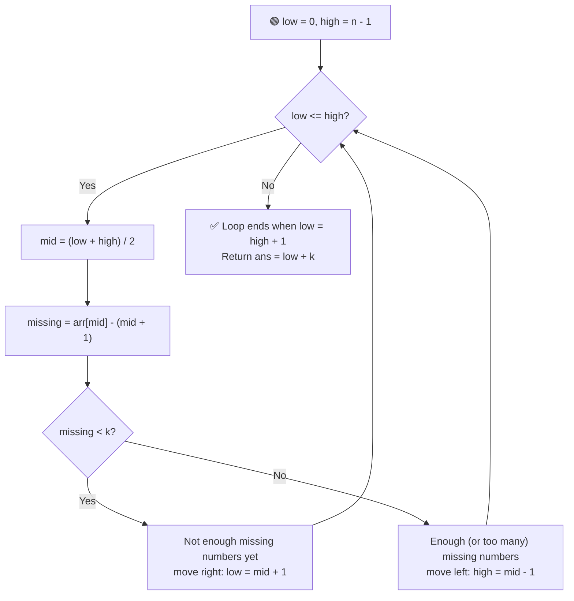

# 🔢 Kth Missing Positive Number

---

## 📑 Table of Contents

- [❓ Problem Statement](#-problem-statement)
- [🧠 Brute Force Approach](#-brute-force-approach)
- [⚡ Optimal Approach — Binary Search](#-optimal-approach--binary-search)
- [⏱️ Complexity Comparison](#️-complexity-comparison)
- [🖥️ C++ Implementation](#️-c-implementation)

---

## ❓ Problem Statement

> You are given a **strictly increasing** array `arr` of positive integers and an integer `k`. Find the `k`-th positive integer that is **missing** from `arr`, i.e., the `k`-th number from the sequence `1, 2, 3, ...` that does not appear in the array.

**Test Case 1**
```
Input:  arr = [2, 3, 4, 7, 11], k = 5
Output: 9
```

**Test Case 2**
```
Input:  arr = [1, 2, 3, 4], k = 2
Output: 6
```

---

## 🧠 Brute Force Approach

**Idea:** Walk through the natural numbers `1, 2, 3, ...` one at a time, and for each one check whether it exists in `arr`. Keep a count of how many are missing, and stop as soon as the count reaches `k`.

### Steps

1. Maintain a pointer `i` into `arr` (starting at `0`) and a counter `missingCount = 0`.
2. For each natural number `num` starting from `1`:
   - If `i < n` and `arr[i] == num`, this number is **not** missing — advance `i` and move to the next `num`.
   - Otherwise, `num` is missing — increment `missingCount`.
   - If `missingCount == k`, return `num`.

**Complexity:** `O(n + k)` in a single linear pass — but since we're not exploiting the sorted structure of the array, this is considered the brute force here; conceptually it degrades to `O(arr[n-1])` in the worst case if walking number-by-number without the pointer optimization, and doesn't scale as well as exploiting sortedness with binary search for very large `k`.

---

## ⚡ Optimal Approach — Binary Search

**Idea:** Since `arr` is sorted and strictly increasing, we can directly compute **how many numbers are missing up to any index** without scanning. For index `i` (0-indexed), the count of missing numbers up to and including `arr[i]` is:

```
missing(i) = arr[i] - (i + 1)
```

This is because in a "no numbers missing" world, `arr[i]` would equal `i + 1`; any extra gap between them is exactly the count of missing numbers so far. This `missing(i)` value is **monotonically non-decreasing** as `i` increases, which is what makes **binary search** applicable — we binary search for the smallest index where `missing(i) >= k`.



### Steps

1. Set the search range: `low = 0`, `high = n - 1`.
2. While `low <= high`:
   - Compute `mid = (low + high) / 2`.
   - Compute `missing = arr[mid] - (mid + 1)` — the number of missing positive integers up to `arr[mid]`.
   - **If `missing < k`:** not enough numbers are missing yet by this point in the array — search the right half: `low = mid + 1`.
   - **Else:** this many (or more) numbers are already missing — search the left half to find the true boundary: `high = mid - 1`.
3. When the loop ends, `low` and `high` are adjacent (`low = high + 1`), straddling the boundary between "not enough missing" and "enough missing". The `k`-th missing number is derived as:
   ```
   ans = low + k    (equivalently, ans = high + 1 + k)
   ```
   Intuitively: `high` is the last index where fewer than `k` numbers are missing, so up to `arr[high]` exactly `high + 1 - missing(high)`... more simply, since exactly `missing(high) = high + 1 - (something)` numbers are missing among the first `high + 1` natural numbers accounted for by the array prefix, the remaining `k - missing(high)` missing numbers continue directly after `arr[high]`, landing at `arr[high] + (k - missing(high))`, which algebraically simplifies to `high + 1 + k`.

**Complexity:** `O(log n)` — binary search over the array indices, with an `O(1)` computation at each step (no inner loop, unlike the other binary-search-on-answer problems).

---

## ⏱️ Complexity Comparison

| Approach | Time | Space |
|----------|------|-------|
| Brute Force (linear scan) | `O(n + k)` | `O(1)` |
| Binary Search (Optimal) | `O(log n)` | `O(1)` |

---

## 🖥️ C++ Implementation

See [`kth_missing_positive_number.cpp`](./kth_missing_positive_number.cpp)
