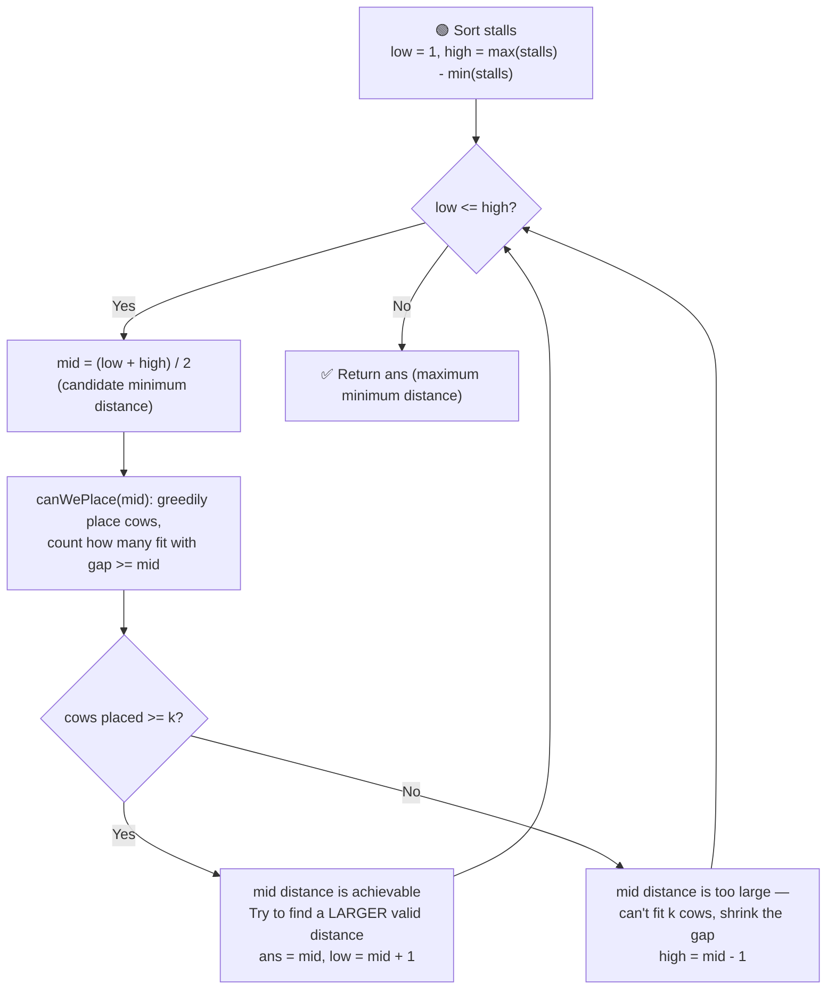

# 🐄 Aggressive Cows

---

## 📑 Table of Contents

- [❓ Problem Statement](#-problem-statement)
- [🧠 Brute Force Approach](#-brute-force-approach)
- [⚡ Optimal Approach — Binary Search on Answer](#-optimal-approach--binary-search-on-answer)
- [⏱️ Complexity Comparison](#️-complexity-comparison)
- [🖥️ C++ Implementation](#️-c-implementation)

---

## ❓ Problem Statement

> You are given an array `stalls` where `stalls[i]` is the position of the `i`-th stall, and an integer `k` denoting the number of aggressive cows. You must assign each cow to a stall such that the **minimum distance between any two cows** is **as large as possible**. Find this maximum possible minimum distance.

**Test Case 1**
```
Input:  stalls = [0, 3, 4, 7, 10, 9], k = 4
Output: 3
```

**Test Case 2**
```
Input:  stalls = [1, 2, 4, 8, 9], k = 3
Output: 3
```

---

## 🧠 Brute Force Approach

**Idea:** Sort the stalls first. Then try every possible minimum distance `d`, starting from `1` up to `max(stalls) - min(stalls)`, and check whether `k` cows can be placed such that every pair of consecutive placed cows is at least `d` apart. Keep track of the largest `d` for which this is possible.

### Steps

1. Sort the `stalls` array.
2. For each candidate distance `d` from `1` to `max(stalls) - min(stalls)`:
   - Greedily place the first cow at `stalls[0]`. For each subsequent stall, place a cow there only if its distance from the **last placed cow** is `>= d`.
   - Count how many cows were placed this way.
   - If the count is `>= k`, `d` is achievable — record it as a candidate answer and keep trying larger `d`.
3. Return the largest `d` found to be achievable.

**Complexity:** `O((max - min) × n)` — for every candidate distance, a full `O(n)` greedy placement pass is done. This is slow enough to cause a **Time Limit Exceeded** on large inputs.

---

## ⚡ Optimal Approach — Binary Search on Answer

**Idea:** After sorting, the key insight is that the **answer space is monotonic** — if a minimum distance `d` allows placing at least `k` cows, then **any smaller distance** also allows placing at least `k` cows (a smaller required gap only makes placement easier, never harder). This "yes, yes, yes... no, no, no" pattern (as `d` increases) is exactly what makes **binary search on the answer** applicable — here we search for the **largest** `d` that still works, instead of the smallest.



### Steps

1. Sort the `stalls` array so distances between consecutive stalls can be computed left to right.
2. Set the search range: `low = 1` (smallest possible gap) and `high = max(stalls) - min(stalls)` (placing just 2 cows at the two extreme ends gives this as the largest possible gap).
3. While `low <= high`:
   - Compute `mid = (low + high) / 2` — this is the candidate minimum distance being tested.
   - Run the `canWePlace(mid)` helper: place the first cow at `stalls[0]`, then scan forward, placing a cow at `stalls[i]` whenever `stalls[i] - lastPlacedPosition >= mid`, updating `lastPlacedPosition` each time. Count the total cows placed.
   - **If `cowsPlaced >= k`:** distance `mid` is achievable. Record it as a possible answer, and try to find an even **larger** valid distance by searching the right half: `low = mid + 1`.
   - **Else:** distance `mid` is too large — fewer than `k` cows can be placed. Search for a smaller distance: `high = mid - 1`.
4. Return the largest distance found that still allows placing all `k` cows.

**Complexity:** `O(n log n)` for sorting + `O(n log(max - min))` for the binary search (binary search over the possible distances, each iteration doing an `O(n)` greedy placement pass) — overall `O(n log n + n log(max - min))`.

---

## ⏱️ Complexity Comparison

| Approach | Time | Space |
|----------|------|-------|
| Brute Force | `O((max - min) × n)` | `O(1)` |
| Binary Search on Answer (Optimal) | `O(n log n + n log(max - min))` | `O(1)` |

---

## 🖥️ C++ Implementation

See [`aggressive_cows.cpp`](./aggressive_cows.cpp)
