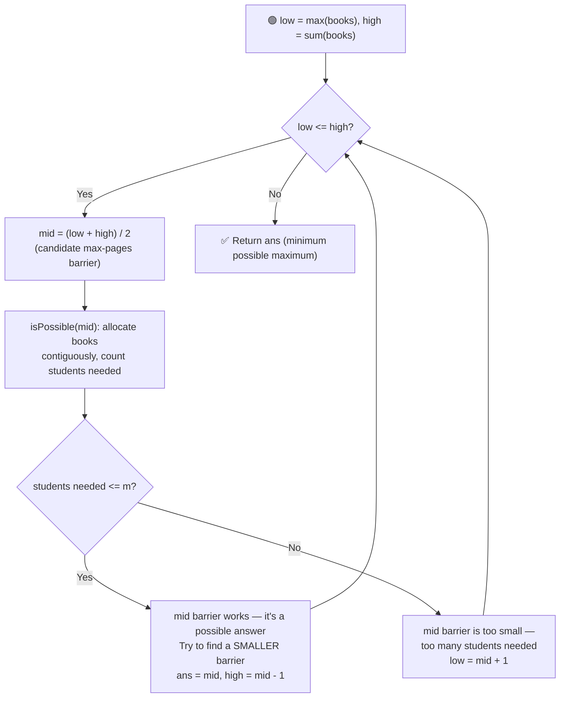

# 📚 Allocate Books

---

## 📑 Table of Contents

- [❓ Problem Statement](#-problem-statement)
- [🧠 Brute Force Approach](#-brute-force-approach)
- [⚡ Optimal Approach — Binary Search on Answer](#-optimal-approach--binary-search-on-answer)
- [⏱️ Complexity Comparison](#️-complexity-comparison)
- [🖥️ C++ Implementation](#️-c-implementation)

---

## ❓ Problem Statement

> You are given an array `books` where `books[i]` is the number of pages in the `i`-th book, and an integer `m` denoting the number of students. Allocate all books to `m` students such that:
> - Each book is allocated to exactly **one** student.
> - Each student gets **at least one** book.
> - Allocation must be done in **contiguous order** (a student cannot get books `2` and `4` while skipping book `3`).
>
> Among all valid allocations, minimize the **maximum number of pages** assigned to any single student, and return that minimized value. If `m > n` (more students than books), allocation is impossible — return `-1`.

**Test Case 1**
```
Input:  books = [12, 34, 67, 90], m = 2
Output: 113
```

**Test Case 2**
```
Input:  books = [10, 20, 30, 40], m = 2
Output: 60
```

---

## 🧠 Brute Force Approach

**Idea:** Try every possible "page barrier" `b`, starting from `max(books)` up to `sum(books)`, and check how many students are needed to allocate all books without any single student exceeding `b` pages. Return the first `b` that requires `<= m` students.

### Steps

1. If `m > n`, return `-1` immediately — there aren't enough books for every student to get at least one.
2. For each candidate barrier `b` from `max(books)` to `sum(books)`:
   - Simulate allocation: keep adding consecutive books' pages to the current student's load; if the next book would exceed `b`, start a new student.
   - Count the total number of students required.
   - If the count is `<= m`, return `b` as the answer.

**Complexity:** `O(sum(books) × n)` — for every candidate barrier, a full `O(n)` simulation pass is done. This is slow enough to cause a **Time Limit Exceeded** on large inputs.

---

## ⚡ Optimal Approach — Binary Search on Answer

**Idea:** The key insight is that the **answer space is monotonic** — if a barrier `b` can be satisfied using `<= m` students, then **any barrier larger than `b`** can also be satisfied with `<= m` students (a bigger allowance per student only reduces or keeps the same the number of students needed). This "no, no, no... yes, yes, yes" pattern (as `b` increases) is exactly what makes **binary search on the answer** applicable.



### Steps

1. If `m > n`, return `-1` immediately — allocation is impossible since every student needs at least one book.
2. Set the search range: `low = max(books)` (no student can be allocated less than the pages of the single largest book, since a book cannot be split) and `high = sum(books)` (one student could take every book).
3. While `low <= high`:
   - Compute `mid = (low + high) / 2` — this is the candidate maximum-pages barrier being tested.
   - Run the `isPossible(mid)` helper: walk through `books` in order, accumulating a running page count for the current student. If adding the next book would exceed `mid`, increment the student count and start a fresh load with that book. Add one final student for the last partial load.
   - **If `studentsNeeded <= m`:** barrier `mid` works. Record it as a possible answer, and try to find an even **smaller** valid barrier by searching the left half: `high = mid - 1`.
   - **Else:** barrier `mid` is too small — more than `m` students would be needed. Search for a larger barrier: `low = mid + 1`.
4. Return the smallest barrier found that can be allocated using at most `m` students.

**Complexity:** `O(n log(sum(books)))` — binary search over the possible barriers (`O(log(sum(books) - max(books)))` iterations), and each iteration does an `O(n)` pass to simulate the allocation.

---

## ⏱️ Complexity Comparison

| Approach | Time | Space |
|----------|------|-------|
| Brute Force | `O(sum(books) × n)` | `O(1)` |
| Binary Search on Answer (Optimal) | `O(n log(sum(books)))` | `O(1)` |

---

## 🖥️ C++ Implementation

See [`allocate_books.cpp`](./allocate_books.cpp)
