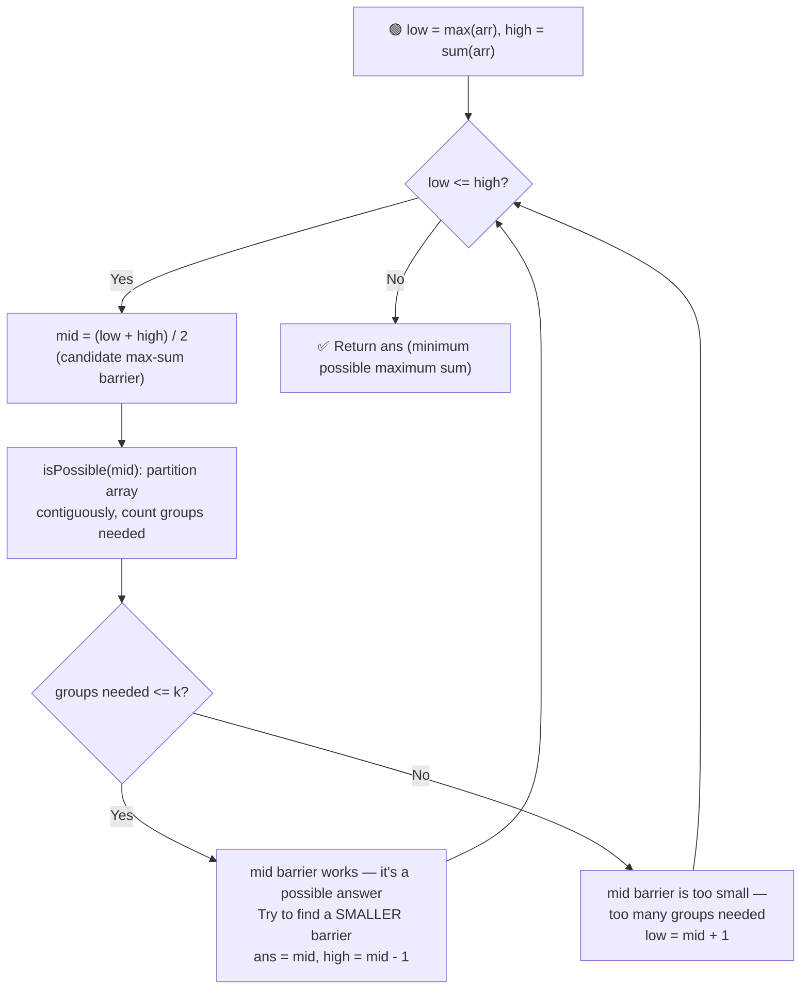

# 🎨 Painter's Partition & Split Array Largest Sum

*(a.k.a. "the Allocate Books problem wearing a different costume")*

---

## 📑 Table of Contents

- [❓ Problem Statements](#-problem-statements)
- [🔗 Why These Are the Same Problem](#-why-these-are-the-same-problem)
- [🧠 Brute Force Approach](#-brute-force-approach)
- [⚡ Optimal Approach — Binary Search on Answer](#-optimal-approach--binary-search-on-answer)
- [⏱️ Complexity Comparison](#️-complexity-comparison)
- [🖥️ C++ Implementation](#️-c-implementation)

---

## ❓ Problem Statements

### 🖌️ Painter's Partition
> You are given an array `boards` where `boards[i]` is the length of the `i`-th board, and `k` painters. Each painter paints a **contiguous** set of boards, and painting one unit of length takes one unit of time. All painters work simultaneously. Minimize the **maximum time** any single painter spends painting.

### ✂️ Split Array Largest Sum
> You are given an array `nums` and an integer `m`. Split `nums` into `m` **contiguous, non-empty** subarrays. Minimize the **largest sum** among these `m` subarrays.

### 📚 (Recap) Allocate Books
> You are given an array `books` and `m` students. Allocate books **contiguously** so every student gets at least one book. Minimize the **maximum pages** assigned to any single student.

**Test Case — Painter's Partition**
```
Input:  boards = [10, 20, 30, 40], k = 2
Output: 60
```

**Test Case — Split Array Largest Sum**
```
Input:  nums = [7, 2, 5, 10, 8], m = 2
Output: 18
```

---

## 🔗 Why These Are the Same Problem

Strip away the flavor text and all three problems ask the exact same question:

> *"Given an array of non-negative numbers, split it into `k` **contiguous** groups such that the **maximum sum of any group is minimized**."*

| Problem | Array | Number of groups (`k`) | "Weight" of an element | What's being minimized |
|---|---|---|---|---|
| Painter's Partition | `boards` | `k` painters | board length = painting time | max time any painter spends |
| Split Array Largest Sum | `nums` | `m` subarrays | element value | max subarray sum |
| Allocate Books | `books` | `m` students | page count | max pages any student reads |

Since the underlying structure is identical, **the exact same `isPossible` / binary-search-on-answer code solves all three** — only the variable names change. Recognizing this "min-max contiguous partition" pattern means you only need to memorize **one** algorithm to solve what look like three separate interview questions.

---

## 🧠 Brute Force Approach

**Idea:** Try every possible "sum barrier" `b`, starting from `max(arr)` up to `sum(arr)`, and check how many groups are needed to partition the array without any single group's sum exceeding `b`. Return the first `b` that requires `<= k` groups.

### Steps

1. For each candidate barrier `b` from `max(arr)` to `sum(arr)`:
   - Simulate partitioning: keep adding consecutive elements to the current group's sum; if the next element would exceed `b`, start a new group.
   - Count the total number of groups required.
   - If the count is `<= k`, return `b` as the answer.

**Complexity:** `O(sum(arr) × n)` — for every candidate barrier, a full `O(n)` simulation pass is done. This is slow enough to cause a **Time Limit Exceeded** on large inputs.

---

## ⚡ Optimal Approach — Binary Search on Answer

**Idea:** The **answer space is monotonic** — if a barrier `b` can be satisfied using `<= k` groups, then **any barrier larger than `b`** can also be satisfied with `<= k` groups (a bigger allowance per group only reduces or keeps the same the number of groups needed). This "no, no, no... yes, yes, yes" pattern (as `b` increases) is exactly what makes **binary search on the answer** applicable — the same logic used for Allocate Books.



### Steps

1. Set the search range: `low = max(arr)` (no group can have a sum smaller than the single largest element, since an element can't be split) and `high = sum(arr)` (one group could take every element).
2. While `low <= high`:
   - Compute `mid = (low + high) / 2` — this is the candidate maximum-sum barrier being tested.
   - Run the `isPossible(mid)` helper: walk through `arr` in order, accumulating a running sum for the current group. If adding the next element would exceed `mid`, increment the group count and start a fresh sum with that element. Add one final group for the last partial sum.
   - **If `groupsNeeded <= k`:** barrier `mid` works. Record it as a possible answer, and try to find an even **smaller** valid barrier by searching the left half: `high = mid - 1`.
   - **Else:** barrier `mid` is too small — more than `k` groups would be needed. Search for a larger barrier: `low = mid + 1`.
3. Return the smallest barrier found that can be partitioned into at most `k` groups.

**Complexity:** `O(n log(sum(arr)))` — binary search over the possible barriers (`O(log(sum(arr) - max(arr)))` iterations), and each iteration does an `O(n)` pass to simulate the partitioning.

---

## ⏱️ Complexity Comparison

| Approach | Time | Space |
|----------|------|-------|
| Brute Force | `O(sum(arr) × n)` | `O(1)` |
| Binary Search on Answer (Optimal) | `O(n log(sum(arr)))` | `O(1)` |

---

## 🖥️ C++ Implementation

See [`painters_partition_and_split_array.cpp`](./painters_partition_and_split_array.cpp) — note both `painterPartition()` and `splitArrayLargestSum()` are thin wrappers around the **same shared core function**, `minimizedLargestSum()`, proving they're really one algorithm.
