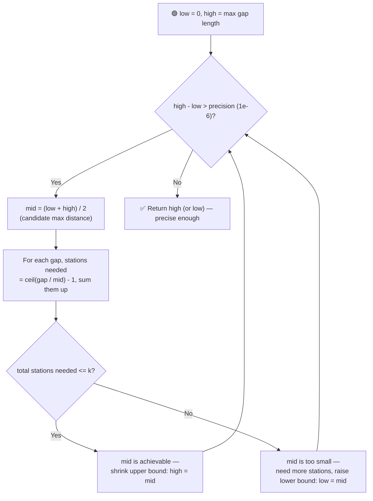

# ⛽ Minimise Maximum Distance between Gas Stations

---

## 📑 Table of Contents

- [❓ Problem Statement](#-problem-statement)
- [🧠 Approach 1: Brute Force](#-approach-1-brute-force)
- [🚀 Approach 2: Priority Queue / Max-Heap](#-approach-2-priority-queue--max-heap)
- [⚡ Approach 3: Binary Search on Answer (Optimal)](#-approach-3-binary-search-on-answer-optimal)
- [⏱️ Complexity Comparison](#️-complexity-comparison)
- [🖥️ C++ Implementation](#️-c-implementation)

---

## ❓ Problem Statement

> You are given a **sorted** array `stations` of existing gas station coordinates and an integer `k` — the number of **new** gas stations you're allowed to add anywhere (not necessarily at integer positions). After adding all `k` new stations, find the **minimum possible value** of the **maximum distance** between any two consecutive gas stations.

**Test Case 1**
```
Input:  stations = [1, 2, 3, 4, 5, 6, 7, 8, 9, 10], k = 9
Output: 0.50000
```

**Test Case 2**
```
Input:  stations = [1, 13, 17, 23], k = 5
Output: 3.00000
```

> ⚠️ Precision note: since new stations can be placed anywhere (not just integer points), the answer is a **real number**, computed to a fixed precision (typically `1e-6`). This is why the video stresses using `long double` for the calculations.

---

## 🧠 Approach 1: Brute Force

**Idea:** Repeat `k` times: find the gap (between two consecutive stations) that currently has the **largest length**, and place one new station in the middle of it, effectively halving that gap's contribution. After `k` placements, the largest remaining gap is the answer.

### Steps

1. Compute the array of gaps between consecutive stations, and an array `parts[i] = 1` tracking how many pieces gap `i` has been divided into so far (a gap divided into `p` equal pieces has each piece of length `gap[i] / p`).
2. Repeat `k` times:
   - Linearly scan all gaps to find the index with the current maximum `gap[i] / parts[i]`.
   - Increment `parts[i]` at that index (adding one more station there).
3. After all `k` placements, the answer is `max(gap[i] / parts[i])` over all gaps.

**Complexity:** `O(k × n)` — for each of the `k` stations placed, a full `O(n)` linear scan finds the worst gap. Too slow when `k` and `n` are large.

---

## 🚀 Approach 2: Priority Queue / Max-Heap

**Idea:** Avoid the repeated linear scan by keeping all current piece lengths in a **max-heap**. The top of the heap always gives the gap that most urgently needs another station, in `O(log n)` instead of `O(n)`.

### Steps

1. Compute the gaps array. Push `(gap[i] / 1, i)` for every gap into a max-heap, keyed by current piece length.
2. Repeat `k` times:
   - Pop the top element `(currentPieceLen, i)` — this is the gap contributing the current overall maximum.
   - Increment `parts[i]`, compute the new piece length `gap[i] / parts[i]`, and push it back onto the heap.
3. After `k` iterations, the top of the heap holds the answer (the largest remaining piece length).

**Complexity:** `O(k log n)` — each of the `k` operations does an `O(log n)` heap pop and push, a significant improvement over the brute force's `O(k × n)`.

---

## ⚡ Approach 3: Binary Search on Answer (Optimal)

**Idea:** Just like the integer "binary search on answer" problems, the feasibility of a candidate maximum distance `d` is **monotonic**: if `d` is achievable using `<= k` new stations, then **any larger `d`** is also achievable with `<= k` stations (a looser distance requirement never needs *more* stations). Since the answer is a real number here, the binary search runs over `double`/`long double` values instead of integers, looping until the search range shrinks below a chosen precision (e.g. `1e-6`), rather than using a `low <= high` integer condition.



### Steps

1. Compute the array of gaps between consecutive stations.
2. Set the search range: `low = 0` and `high = max(gaps)` (the largest existing gap is always a safe achievable upper bound since we could always avoid placing any station there without exceeding it).
3. While `high - low > precision` (e.g. `1e-6`):
   - Compute `mid = (low + high) / 2` — this is the candidate maximum distance being tested.
   - For each gap `g`, compute the number of new stations needed to keep every sub-piece `<= mid`: this is `ceil(g / mid) - 1`. To avoid floating-point `ceil` pitfalls, use the trick: `cnt = (int)(g / mid); if (cnt * mid == g) cnt--;`. Sum this count across all gaps.
   - **If `totalStationsNeeded <= k`:** distance `mid` is achievable. Tighten the upper bound: `high = mid`.
   - **Else:** distance `mid` is too small — more than `k` stations would be needed. Tighten the lower bound: `low = mid`.
4. Return `high` (or `low`) as the answer, accurate to the chosen precision.

**Complexity:** `O(n × log((max gap) / precision))` — the number of binary search iterations is fixed by how many times the range must be halved to reach the desired precision (independent of `k`), and each iteration does an `O(n)` pass over the gaps. In practice this is often approximated as `O(n × constant)`, since the number of iterations to reach `1e-6` precision is a small fixed number (~20–40 iterations).

---

## ⏱️ Complexity Comparison

| Approach | Time | Space |
|----------|------|-------|
| Brute Force | `O(k × n)` | `O(n)` |
| Priority Queue / Max-Heap | `O(k log n)` | `O(n)` |
| Binary Search on Answer (Optimal) | `O(n log((max gap) / precision))` | `O(n)` |

---

## 🖥️ C++ Implementation

See [`minimise_max_distance_gas_stations.cpp`](./minimise_max_distance_gas_stations.cpp)
