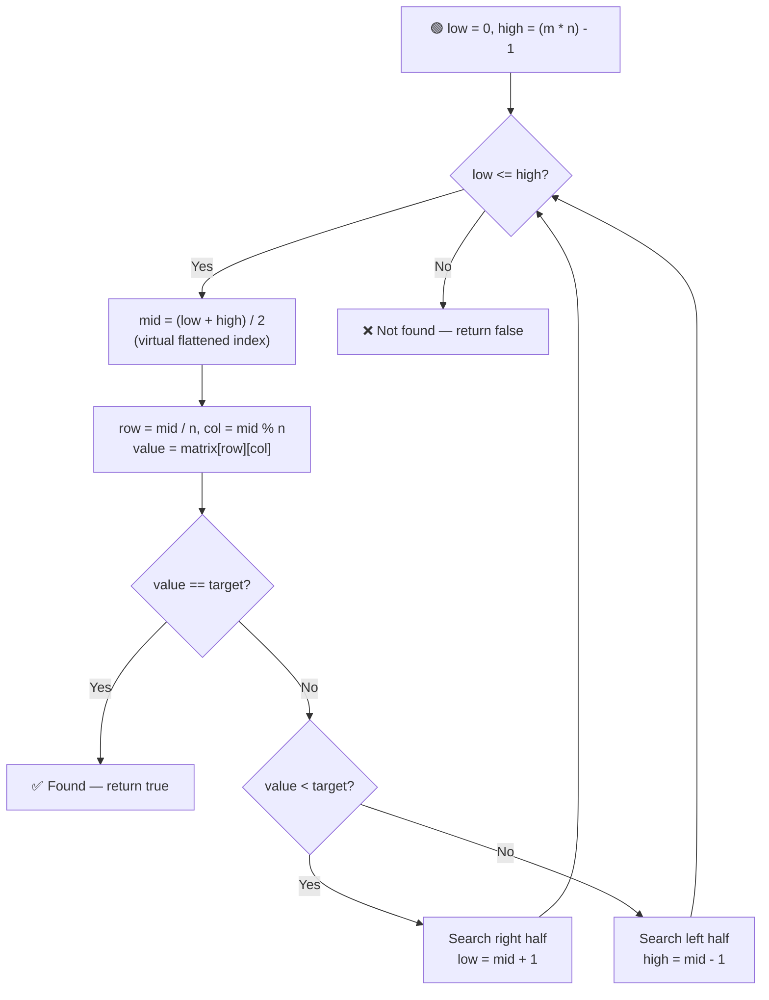

# 🔍 Search in a 2D Matrix

---

## 📑 Table of Contents

- [❓ Problem Statement](#-problem-statement)
- [🧠 Approach 1: Brute Force](#-approach-1-brute-force)
- [🔧 Approach 2: Better — Binary Search Each Row](#-approach-2-better--binary-search-each-row)
- [⚡ Approach 3: Optimal — Binary Search on Flattened Matrix](#-approach-3-optimal--binary-search-on-flattened-matrix)
- [⏱️ Complexity Comparison](#️-complexity-comparison)
- [🖥️ C++ Implementation](#️-c-implementation)

---

## ❓ Problem Statement

> You are given an `m x n` matrix in which each row is sorted in increasing order, and the **first integer of each row is greater than the last integer of the previous row** (i.e., the matrix behaves like one big sorted array laid out row by row). Given a `target` value, determine whether it exists in the matrix.

**Test Case 1**
```
Input:  matrix = [[1, 3, 5, 7], [10, 11, 16, 20], [23, 30, 34, 60]], target = 3
Output: true
```

**Test Case 2**
```
Input:  matrix = [[1, 3, 5, 7], [10, 11, 16, 20], [23, 30, 34, 60]], target = 13
Output: false
```

---

## 🧠 Approach 1: Brute Force

**Idea:** Scan every cell of the matrix one by one, checking whether it equals `target`.

### Steps

1. Loop over every row `i` from `0` to `m - 1`.
2. Loop over every column `j` from `0` to `n - 1`.
3. If `matrix[i][j] == target`, return `true`.
4. If the loops finish without a match, return `false`.

**Complexity:** `O(M × N)` — every cell may need to be visited, completely ignoring the fact that the matrix is sorted.

---

## 🔧 Approach 2: Better — Binary Search Each Row

**Idea:** Since **each row individually is sorted**, we don't need to linearly scan a row — we can binary search within it. Do this for every row.

### Steps

1. For each row `i` from `0` to `m - 1`:
   - Run a standard binary search on `matrix[i]` for `target`.
   - If found, return `true`.
2. If no row contains `target`, return `false`.

**Complexity:** `O(M × log N)` — for each of the `M` rows, a binary search takes `O(log N)`. A clear improvement over the brute force, but still redoes a fresh search for every row even though rows are related (later rows start where earlier rows end).

---

## ⚡ Approach 3: Optimal — Binary Search on Flattened Matrix

**Idea:** Because the last element of every row is smaller than the first element of the next row, the entire `m x n` matrix behaves exactly like **one sorted 1D array of size `m * n`**, just wrapped into rows. So we can binary search over the **virtual flattened array directly**, without ever actually flattening it — by mapping a virtual index back to real `(row, col)` coordinates.



### Steps

1. Let `m` = number of rows, `n` = number of columns. Set `low = 0` and `high = (m * n) - 1` — these are indices into the *imaginary* flattened 1D array.
2. While `low <= high`:
   - Compute `mid = (low + high) / 2` — the virtual flattened index being tested.
   - Map it back to real 2D coordinates: `row = mid / n` and `col = mid % n`. Read `value = matrix[row][col]`.
   - **If `value == target`:** return `true`.
   - **If `value < target`:** the target must be further along — search the right half: `low = mid + 1`.
   - **Else:** the target must be earlier — search the left half: `high = mid - 1`.
3. If the loop ends without finding `target`, return `false`.

**Complexity:** `O(log(M × N))` — a single binary search over all `M × N` elements treated as one sorted array, using only index arithmetic (`/` and `%`) to translate between the virtual 1D index and real 2D coordinates — no extra space needed.

---

## ⏱️ Complexity Comparison

| Approach | Time | Space |
|----------|------|-------|
| Brute Force | `O(M × N)` | `O(1)` |
| Better — Binary Search Each Row | `O(M × log N)` | `O(1)` |
| Optimal — Binary Search on Flattened Matrix | `O(log(M × N))` | `O(1)` |

---

## 🖥️ C++ Implementation

See [`search_in_2d_matrix.cpp`](./search_in_2d_matrix.cpp)
