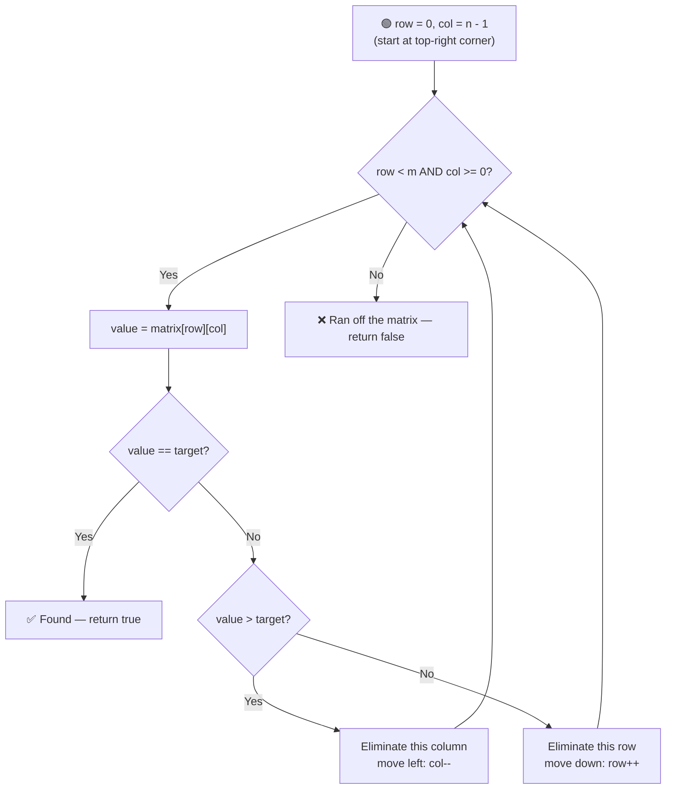

# 🔎 Search a 2D Matrix II (Row & Column Sorted)

---

## 📑 Table of Contents

- [❓ Problem Statement](#-problem-statement)
- [🧠 Approach 1: Brute Force](#-approach-1-brute-force)
- [🔧 Approach 2: Binary Search Each Row](#-approach-2-binary-search-each-row)
- [⚡ Approach 3: Optimal — Top-Right Elimination](#-approach-3-optimal--top-right-elimination)
- [⏱️ Complexity Comparison](#️-complexity-comparison)
- [🖥️ C++ Implementation](#️-c-implementation)

---

## ❓ Problem Statement

> You are given an `m x n` matrix where **every row is sorted in increasing order left to right**, and **every column is sorted in increasing order top to bottom**. Unlike "Search in a 2D Matrix I", the matrix is **not** one giant sorted sequence — the last element of a row is not necessarily smaller than the first element of the next row. Given a `target` value, determine whether it exists in the matrix.

**Test Case 1**
```
Input:  matrix = [[1, 4, 7, 11, 15],
                   [2, 5, 8, 12, 19],
                   [3, 6, 9, 16, 22],
                   [10, 13, 14, 17, 24],
                   [18, 21, 23, 26, 30]], target = 5
Output: true
```

**Test Case 2**
```
Input:  matrix = [[1, 4, 7, 11, 15],
                   [2, 5, 8, 12, 19],
                   [3, 6, 9, 16, 22],
                   [10, 13, 14, 17, 24],
                   [18, 21, 23, 26, 30]], target = 20
Output: false
```

---

## 🧠 Approach 1: Brute Force

**Idea:** Scan every cell of the matrix one by one, checking whether it equals `target`. This ignores the sorted structure entirely.

### Steps

1. Loop over every row `i` from `0` to `m - 1`.
2. Loop over every column `j` from `0` to `n - 1`.
3. If `matrix[i][j] == target`, return `true`.
4. If the loops finish without a match, return `false`.

**Complexity:** `O(M × N)` — every cell may need to be visited.

---

## 🔧 Approach 2: Binary Search Each Row

**Idea:** Since **each row individually is sorted**, binary search within each row instead of scanning it linearly.

### Steps

1. For each row `i` from `0` to `m - 1`:
   - Run a standard binary search on `matrix[i]` for `target`.
   - If found, return `true`.
2. If no row contains `target`, return `false`.

**Complexity:** `O(M × log N)` — for each of the `M` rows, a binary search takes `O(log N)`. Note: unlike "Search in a 2D Matrix I", we **cannot** treat this matrix as one flattened sorted array (rows aren't globally ordered relative to each other), so this row-by-row binary search — not a single `O(log(M×N))` search — is as far as pure binary search alone can take us here.

---

## ⚡ Approach 3: Optimal — Top-Right Elimination

**Idea:** Start at the **top-right corner** of the matrix. This corner is special: it's the **largest** element in its row and the **smallest** element in its column. That gives us a clean decision rule at every step:
- If the current element **equals** `target` → found it.
- If the current element is **greater than** `target` → the entire **column** it's in can be eliminated (every element below it in that column is even larger), so move **left**.
- If the current element is **less than** `target` → the entire **row** it's in can be eliminated (every element to its left in that row is even smaller), so move **down**.

Each comparison eliminates one full row or one full column, so the search space shrinks by one dimension every step — at most `m + n` steps total.



### Steps

1. Start at `row = 0`, `col = n - 1` (the top-right corner).
2. While `row` is within `[0, m - 1]` and `col` is within `[0, n - 1]`:
   - Let `value = matrix[row][col]`.
   - **If `value == target`:** return `true`.
   - **If `value > target`:** move left — `col--` (eliminates the current column, since everything below `value` in this column is larger still).
   - **Else (`value < target`):** move down — `row++` (eliminates the current row, since everything to the left of `value` in this row is smaller still).
3. If `row` or `col` moves out of bounds without a match, return `false`.

**Complexity:** `O(M + N)` — in the worst case, the pointer takes one full traversal from the top-right corner to the bottom-left corner, moving left or down at most `m + n` times total, with no extra space needed.

---

## ⏱️ Complexity Comparison

| Approach | Time | Space |
|----------|------|-------|
| Brute Force | `O(M × N)` | `O(1)` |
| Binary Search Each Row | `O(M × log N)` | `O(1)` |
| Optimal — Top-Right Elimination | `O(M + N)` | `O(1)` |

---

## 🖥️ C++ Implementation

See [`search_2d_matrix_ii.cpp`](./search_2d_matrix_ii.cpp)
