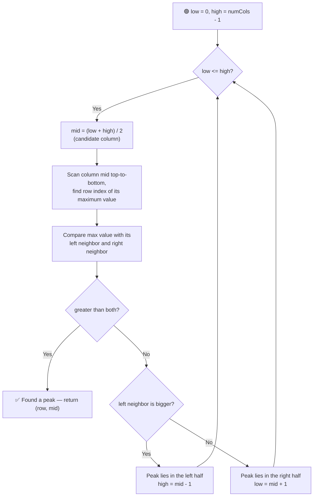

# ⛰️ Find a Peak Element II (2D Matrix)

---

## 📑 Table of Contents

- [❓ Problem Statement](#-problem-statement)
- [🧠 Brute Force Approach](#-brute-force-approach)
- [⚡ Optimal Approach — Binary Search on Columns](#-optimal-approach--binary-search-on-columns)
- [⏱️ Complexity Comparison](#️-complexity-comparison)
- [🖥️ C++ Implementation](#️-c-implementation)

---

## ❓ Problem Statement

> You are given an `m x n` matrix of **distinct** integers. A **peak element** is one that is **strictly greater** than all of its existing neighbors — top, bottom, left, and right. (Any neighbor that would fall outside the matrix boundary is treated as `-∞`.) Find the position `(row, col)` of **any one** peak element in the matrix.

**Test Case 1**
```
Input:  matrix = [[10, 20, 15],
                   [21, 30, 14],
                   [7,  16, 32]]
Output: (1, 1) → value 30
```
*(Note: `(2, 2)` with value `32` is also a valid peak — any correct peak is accepted.)*

**Test Case 2**
```
Input:  matrix = [[1, 4],
                   [3, 2]]
Output: (1, 0) → value 3
```
*(Note: `(0, 1)` with value `4` is also a valid peak — different valid algorithms/traversal orders may land on different but equally correct peaks.)*

---

## 🧠 Brute Force Approach

**Idea:** Check every single cell of the matrix and compare it against all of its (up to 4) neighbors. If a cell beats every neighbor it has, it's a peak.

### Steps

1. Loop over every cell `(i, j)` in the matrix.
2. For each cell, compare `matrix[i][j]` against `matrix[i-1][j]` (top), `matrix[i+1][j]` (bottom), `matrix[i][j-1]` (left), and `matrix[i][j+1]` (right) — treating any out-of-bounds neighbor as `-∞`.
3. If `matrix[i][j]` is greater than all existing neighbors, return `(i, j)`.

**Complexity:** `O(M × N)` — every cell is checked against its neighbors. Simply finding the single largest element in the matrix is also `O(M × N)` and, while it *is* a valid peak, computing it this way doesn't exploit any structure to do better.

---

## ⚡ Optimal Approach — Binary Search on Columns

**Idea:** Instead of searching over rows and columns together, binary search **only over the columns**. For a candidate middle column, find the row containing that column's **maximum** element — this row/column pair is a strong candidate, because within its own column it already beats its top and bottom neighbors. Then we only need to compare it against its **left and right** neighbors:
- If it beats both → it's a genuine peak (top/bottom already guaranteed by being the column max).
- If the left neighbor is bigger → a peak must exist somewhere in the left half of columns, so search there.
- If the right neighbor is bigger → a peak must exist somewhere in the right half of columns, so search there.

This works because moving toward the larger neighbor keeps "climbing uphill," and since the matrix is finite, this climb must terminate at a peak.



### Steps

1. Set the search range over columns: `low = 0`, `high = n - 1`.
2. While `low <= high`:
   - Compute `mid = (low + high) / 2` — the candidate column being tested.
   - Scan down column `mid` to find the row index `maxRow` holding the maximum value in that column (this takes `O(m)`).
   - Compare `matrix[maxRow][mid]` with its left neighbor `matrix[maxRow][mid-1]` and right neighbor `matrix[maxRow][mid+1]` (treating out-of-bounds as `-∞`).
   - **If it's greater than both:** this is a valid peak (it already beats top/bottom since it's the column max) — return `(maxRow, mid)`.
   - **If the left neighbor is greater:** a peak must exist to the left — search there: `high = mid - 1`.
   - **Else (right neighbor is greater):** a peak must exist to the right — search there: `low = mid + 1`.
3. The loop is guaranteed to find a peak before `low` and `high` cross.

**Complexity:** `O(M × log N)` — binary search over the `N` columns (`O(log N)` iterations), and each iteration does an `O(M)` scan to find that column's maximum element.

---

## ⏱️ Complexity Comparison

| Approach | Time | Space |
|----------|------|-------|
| Brute Force | `O(M × N)` | `O(1)` |
| Binary Search on Columns (Optimal) | `O(M × log N)` | `O(1)` |

---

## 🖥️ C++ Implementation

See [`find_peak_element_2d.cpp`](./find_peak_element_2d.cpp)
