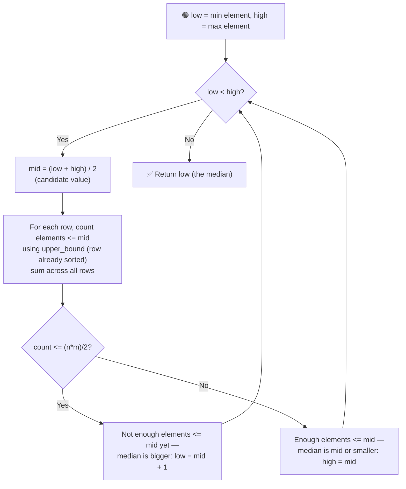

# 📊 Median of a Row-Wise Sorted Matrix

---

## 📑 Table of Contents

- [❓ Problem Statement](#-problem-statement)
- [🧠 Brute Force Approach](#-brute-force-approach)
- [⚡ Optimal Approach — Binary Search on Value Range](#-optimal-approach--binary-search-on-value-range)
- [⏱️ Complexity Comparison](#️-complexity-comparison)
- [🖥️ C++ Implementation](#️-c-implementation)

---

## ❓ Problem Statement

> You are given an `n x m` matrix where **each row is individually sorted** in increasing order, and both `n` and `m` are **odd**, so the total number of elements `n * m` is odd. Find the **median** of all the elements in the matrix — the value that would sit exactly in the middle if every element were placed into one big sorted array.

**Test Case 1**
```
Input:  matrix = [[1, 3, 5],
                   [2, 6, 9],
                   [3, 6, 9]]
Output: 5
```

**Test Case 2**
```
Input:  matrix = [[1, 3, 4],
                   [2, 5, 6],
                   [3, 7, 8]]
Output: 4
```

---

## 🧠 Brute Force Approach

**Idea:** Copy every element of the matrix into a single 1D array, sort that array, and pick the middle element directly.

### Steps

1. Flatten the `n x m` matrix into a 1D array of `n * m` elements.
2. Sort the 1D array.
3. Since `n * m` is odd, return the element at index `(n * m) / 2` (0-indexed middle element).

**Complexity:** `O(n·m · log(n·m))` — dominated by sorting all `n * m` elements. This throws away the fact that each row is *already* sorted, which is what the optimal approach exploits.

---

## ⚡ Optimal Approach — Binary Search on Value Range

**Idea:** Rather than sorting, **binary search directly on the range of possible matrix values** — from the smallest element in the matrix to the largest. For any candidate value `v`, we can efficiently count how many matrix elements are `<= v` by running a binary search (`upper_bound`) on **each row individually** (since rows are already sorted), summing the counts across all rows in `O(n log m)`. The median is the **smallest value `v`** for which this count exceeds exactly half the total elements — i.e., `v` is the first value at which the "count of elements `<= v`" crosses over the midpoint of the array.



### Steps

1. Set the search range: `low = min element across the matrix`, `high = max element across the matrix` (typically found by checking the first and last elements of each sorted row).
2. While `low < high`:
   - Compute `mid = (low + high) / 2` — this is the candidate value being tested.
   - For each row, use `upper_bound` to count how many elements in that row are `<= mid` (this is `O(log m)` per row since the row is sorted, so `O(n log m)` total). Sum these counts to get `totalCount`.
   - **If `totalCount <= (n * m) / 2`:** not enough elements are `<= mid` yet for `mid` to be the median (or beyond) — the median must be larger: `low = mid + 1`.
   - **Else:** at least half the elements are already `<= mid` — the median is `mid` or something smaller: `high = mid`.
3. When the loop ends, `low == high` is the median — the smallest value at which the running count first exceeds `(n * m) / 2`.

**Complexity:** `O(n log m · log(max - min))` — binary search over the value range (`O(log(max - min))` iterations), and each iteration does an `O(n log m)` pass (binary search on every row) to count elements `<= mid`.

---

## ⏱️ Complexity Comparison

| Approach | Time | Space |
|----------|------|-------|
| Brute Force | `O(n·m · log(n·m))` | `O(n·m)` |
| Binary Search on Value Range (Optimal) | `O(n log m · log(max - min))` | `O(1)` |

---

## 🖥️ C++ Implementation

See [`median_row_wise_sorted_matrix.cpp`](./median_row_wise_sorted_matrix.cpp)
