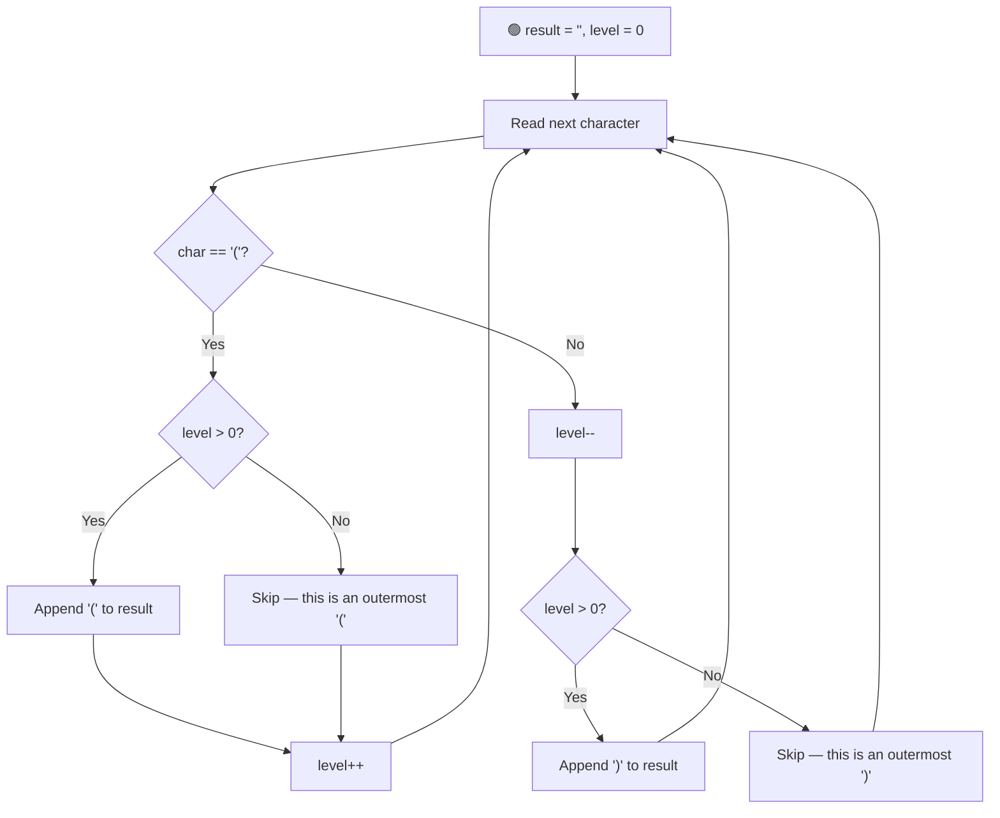

# 🔗 Remove Outermost Parentheses

---

## 📑 Table of Contents

- [❓ Problem Statement](#-problem-statement)
- [🧠 Approach 1: Stack-Based Simulation](#-approach-1-stack-based-simulation)
- [⚡ Approach 2: Optimal — Level Counter](#-approach-2-optimal--level-counter)
- [⏱️ Complexity Comparison](#️-complexity-comparison)
- [🖥️ C++ Implementation](#️-c-implementation)

---

## ❓ Problem Statement

> A **valid parentheses string** is defined by these rules:
> - It is the empty string `""`.
> - If `A` is a valid parentheses string, then so is `"(" + A + ")"`.
> - If `A` and `B` are valid parentheses strings, then `A + B` is also valid.
>
> A **primitive** valid parentheses string is a non-empty valid string that **cannot** be split into two or more non-empty valid parentheses strings — i.e., it's a single balanced "unit" like `"()"`, `"(())"`, or `"(()())"`.
>
> Given a valid parentheses string `s`, remove the **outermost** pair of parentheses from **every** primitive component of `s`, and return the resulting string.

**Test Case 1**
```
Input:  s = "((()))"
Output: "(())"
```
*(The entire input is a single primitive; stripping its outer layer gives `"(())"`.)*

**Test Case 2**
```
Input:  s = "()(()())(())"
Output: "()()()"
```
*(Primitive decomposition: `"()"` + `"(()())"` + `"(())"` → strip each outer layer: `""` + `"()()"` + `"()"` → concatenated: `"()()()"`.)*

---

## 🧠 Approach 1: Stack-Based Simulation

**Idea:** Use a stack to simulate matching parentheses, exactly like a standard "valid parentheses" check. The key insight: a character belongs to an **outermost** pair exactly when the stack is empty right before pushing `'('`, or becomes empty right after popping for `')'`. Skip appending those specific characters; append everything else.

### Steps

1. Initialize an empty stack and an empty `result` string.
2. Traverse `s` character by character:
   - If the character is `'('`:
     - If the stack is **not** empty, this `'('` is *not* an outermost bracket — append it to `result`.
     - Push `'('` onto the stack.
   - If the character is `')'`:
     - Pop from the stack.
     - If the stack is **not** empty *after* popping, this `')'` is *not* an outermost bracket — append it to `result`.
3. Return `result`.

**Complexity:** `O(n)` time (single pass) and `O(n)` space in the worst case, since the stack can grow up to the maximum nesting depth of the string.

---

## ⚡ Approach 2: Optimal — Level Counter

**Idea:** We don't actually need a real stack — we only ever care about its **size**, not its contents (since every element pushed is identical, `'('`). So replace the stack with a simple integer `level` counter that tracks nesting depth. A character is part of an outermost pair exactly when `level` is `0` before an opening bracket, or becomes `0` after a closing bracket — so we only skip appending in those specific moments.



### Steps

1. Initialize `result = ""` and `level = 0`.
2. Traverse `s` character by character:
   - If the character is `'('`:
     - If `level > 0`, this is an **inner** bracket — append `'('` to `result`.
     - Increment `level`.
   - If the character is `')'`:
     - Decrement `level`.
     - If `level > 0` (after decrementing), this is an **inner** bracket — append `')'` to `result`.
3. Return `result`.

**Why this works:** `level` reaching `0` right before an opening bracket, or reaching `0` right after a closing bracket, is precisely the signature of an **outermost** parenthesis of a primitive component — so those exact characters are the only ones skipped.

**Complexity:** `O(n)` time (single pass) and `O(1)` space — no data structure needed, just a running counter and the output string itself.

---

## ⏱️ Complexity Comparison

| Approach | Time | Space |
|----------|------|-------|
| Stack-Based Simulation | `O(n)` | `O(n)` |
| Level Counter (Optimal) | `O(n)` | `O(1)` |

---

## 🖥️ C++ Implementation

See [`remove_outermost_parentheses.cpp`](./remove_outermost_parentheses.cpp)
