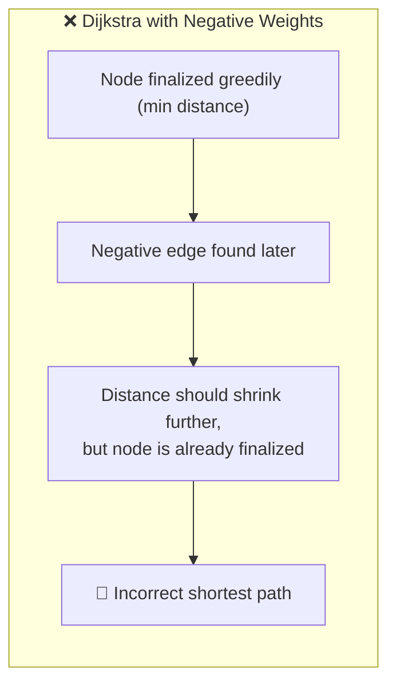
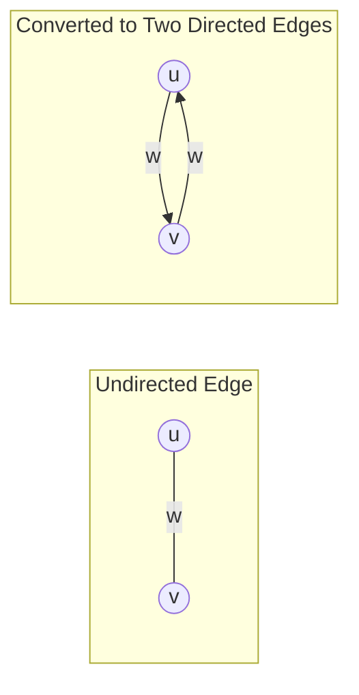
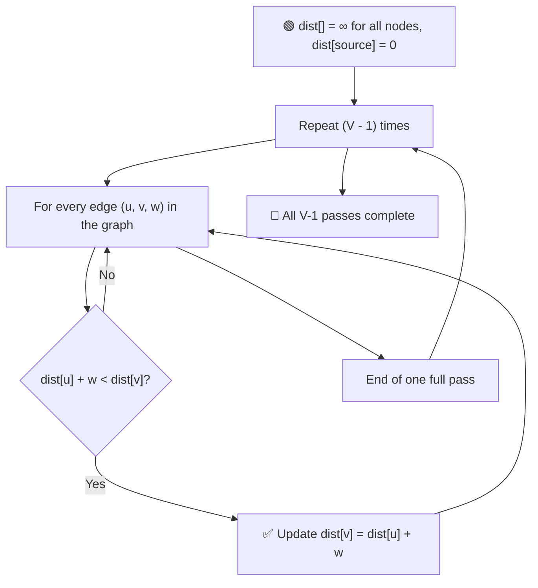
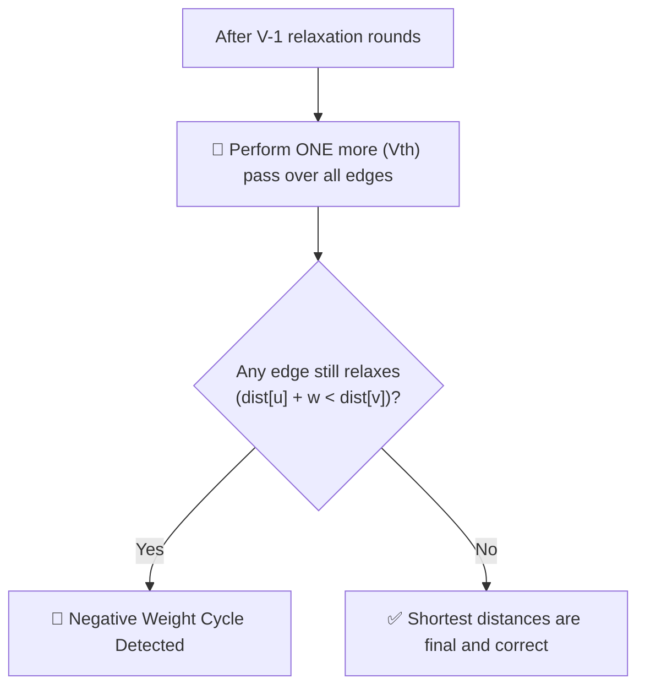

# 🔗 Bellman-Ford Algorithm

### Single Source Shortest Path (Handles Negative Weights)

---

## 📑 Table of Contents

- [⚡ Why Not Just Use Dijkstra?](#-why-not-just-use-dijkstra)
- [🎯 Applicability](#-applicability)
- [🧠 Core Mechanism — Relaxation](#-core-mechanism--relaxation)
- [🔍 Negative Cycle Detection](#-negative-cycle-detection)
- [⏱️ Time Complexity](#️-time-complexity)
- [🖥️ C++ Implementation](#️-c-implementation)

---

## ⚡ Why Not Just Use Dijkstra?

**Dijkstra's Algorithm** greedily finalizes a node's distance the moment it's popped from the priority queue, assuming it can **never** get a shorter path later. This assumption **breaks** the moment a **negative edge weight** exists — a later negative edge could still shrink an already "finalized" distance.

**Bellman-Ford** fixes this by **not trusting any greedy choice** — instead, it **relaxes every edge, again and again**, giving negative weights enough "rounds" to propagate their effect throughout the graph. As a bonus, it can also **detect negative cycles** (where the total weight around a cycle is negative — meaning "shortest path" is undefined, since you could loop forever to keep reducing distance).

---

## 🎯 Applicability

- 📌 Designed for **directed graphs**.
- 📌 For an **undirected graph**, convert each edge `(u, v, w)` into **two directed edges**: `u → v` (weight `w`) and `v → u` (weight `w`).

---

## 🧠 Core Mechanism — Relaxation

The algorithm relaxes **all `E` edges**, repeated for **`V − 1` iterations** (where `V` = number of vertices).

> **Relaxation of edge `(u, v, w)`:** if `dist[u] + w < dist[v]`, then update `dist[v] = dist[u] + w`.

**Why `V − 1` rounds?** The shortest path between any two nodes in a graph with `V` vertices can have **at most `V − 1` edges** (a simple path can't revisit a node). So after `V − 1` full passes over every edge, every shortest path is guaranteed to be found — no matter how "spread out" the negative weights are.

---

## 🔍 Negative Cycle Detection

After completing the `V − 1` relaxation rounds, perform **one extra (the `V`-th) pass** over all edges:

- 🔁 If **any** edge `(u, v, w)` can **still** be relaxed (`dist[u] + w < dist[v]`), that means a distance is **still shrinking** even after every legitimate shortest path should've been found.
- This can only happen if there's a **negative weight cycle** reachable from the source — so the algorithm reports it and shortest distances are **not well-defined**.

---

## ⏱️ Time Complexity

| Step | Cost |
|------|------|
| 🔁 Relax all edges, `V − 1` times | `O(V × E)` |
| 🔎 Final pass for negative cycle check | `O(E)` |
| 🏁 **Total** | **`O(V × E)`** |

> Slower than Dijkstra's `O(E log V)`, but **robust** enough to correctly handle negative edge weights and detect negative cycles.

---

## 🖥️ C++ Implementation

See [`bellman_ford.cpp`](./bellman_ford.cpp)
