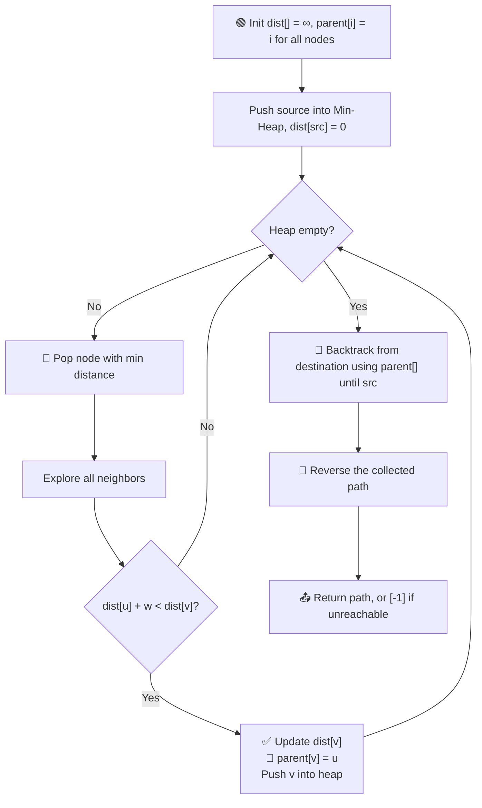
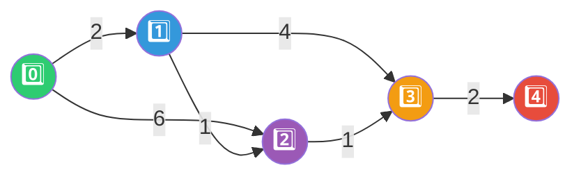

# 🗺️ Shortest Path in a Weighted Undirected Graph

### 🏷️ Pattern: **Dijkstra's Algorithm + Parent Array (Path Reconstruction)**

---

## 📑 Table of Contents

- [❓ Problem Statement](#-problem-statement)
- [🧠 Logic / Approach](#-logic--approach)
- [🖥️ C++ Implementation](#️-c-implementation)

---

## ❓ Problem Statement

> Given a **weighted undirected graph** with `V` nodes and `E` edges, and a **source** and **destination** node, find the **shortest path** (the actual sequence of nodes, not just the distance) between them.
>
> - If the destination is **unreachable** from the source, return a list containing only **`-1`**.

**Example**

```
Input:
V = 5, E = 6
Edges (u, v, weight):
0 - 1 (2)
0 - 2 (6)
1 - 2 (1)
1 - 3 (4)
2 - 3 (1)
3 - 4 (2)
Source = 0, Destination = 4

Output: [0, 1, 2, 3, 4]
```

---

## 🧠 Logic / Approach

This is **standard Dijkstra**, upgraded with one extra data structure — a **`parent` array** — so that instead of only knowing *how far* each node is, we also know *how we got there*.



### Step-by-Step

1. **Initialization**
   - `dist[]` → set every node's distance to **infinity**, except `dist[src] = 0`.
   - `parent[]` → each node initially **points to itself** (`parent[i] = i`), meaning "no predecessor found yet."

2. **Min-Heap Exploration**
   - Push `(0, src)` into the priority queue.
   - Repeatedly pop the node with the **smallest current distance** — this greedy pick guarantees that node's distance is now final.

3. **Relaxation + Parent Tracking**
   - For every neighbor `v` of the popped node `u`:
     - If `dist[u] + weight(u, v) < dist[v]`:
       - Update `dist[v] = dist[u] + weight(u, v)`
       - **Set `parent[v] = u`** 📍 (this is the key addition over plain Dijkstra)
       - Push `(dist[v], v)` into the heap

4. **Path Reconstruction (Backtracking)**
   - Once all distances are finalized, start at the **destination** node.
   - Repeatedly jump to `parent[node]` until you reach a node that is its **own parent** (the source) or until `dist[dest] == ∞` (unreachable).
   - This builds the path **in reverse** (destination → source).
   - **Reverse** the collected list to get the path in the correct order (source → destination).

5. **Unreachable Case**
   - If `dist[destination]` is still **infinity** after the algorithm finishes, return **`[-1]`**.



**Parent chain built:** `parent[1]=0, parent[2]=1, parent[3]=2, parent[4]=3`
**Backtrack from 4:** `4 → 3 → 2 → 1 → 0`
**Reversed path:** `0 → 1 → 2 → 3 → 4` ✅

---

## ⏱️ Complexity

| Metric | Complexity |
|--------|------------|
| ⏳ Time | `O(E log V)` — same as Dijkstra, plus `O(V)` for backtracking |
| 💾 Space | `O(V + E)` — adjacency list + dist/parent arrays + heap |

---

## 🖥️ C++ Implementation

See [`shortest_path.cpp`](./shortest_path.cpp)
