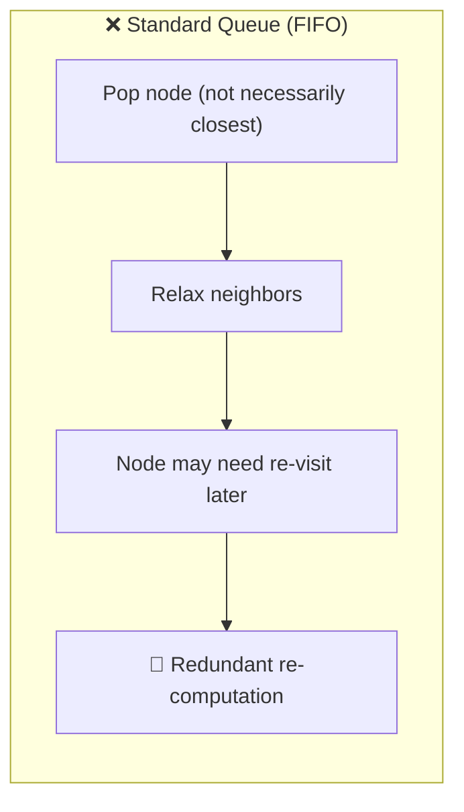
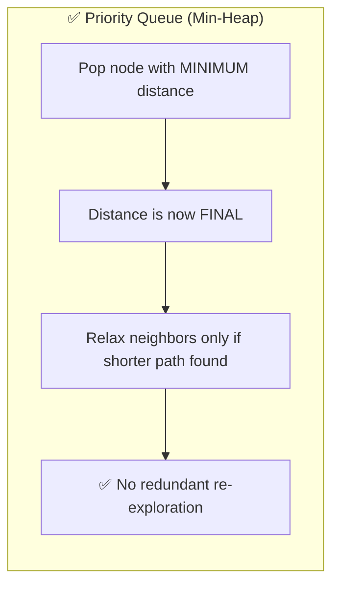
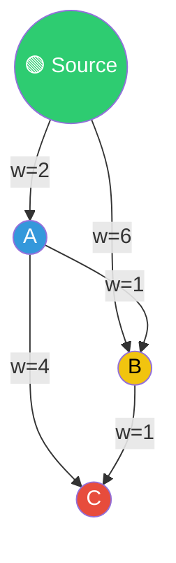

# 🚀 Dijkstra's Algorithm — Part 3

### Why Priority Queue? · Intuition · Time Complexity Derivation

---

## 📑 Table of Contents

- [🎯 Why Priority Queue over a Standard Queue?](#-why-priority-queue-over-a-standard-queue)
- [💡 Intuition](#-intuition)
- [⏱️ Time Complexity Derivation](#️-time-complexity-derivation)
- [🖥️ C++ Implementation](#️-c-implementation)

---

## 🎯 Why Priority Queue over a Standard Queue?

A **standard queue (Q)** processes nodes in **FIFO order** — whichever node was inserted first gets popped first, regardless of its actual distance from the source. This causes a critical problem:

> 🔁 A node may get processed **before** its true shortest distance is known, and later — when a shorter path to it is found — it has to be **re-processed and re-pushed**, wasting operations on paths that are already known to be sub-optimal.



With a **priority queue (PQ)**, the node with the **minimum current distance** is always popped first. This turns Dijkstra into a **greedy algorithm**:



**🔑 Key Point:** Since the PQ always extracts the closest unvisited node first, once a node is popped, its shortest distance is **guaranteed final** — it never needs to be popped again with a smaller value. This eliminates the redundant path exploration and unnecessary recalculations seen with a plain queue.

---

## 💡 Intuition

Dijkstra's Algorithm is essentially a **greedy traversal**:

- At every step, it picks the **closest unexplored node** (via the min-heap).
- It **marks/finalizes** the shortest distance to that node.
- It then relaxes (updates) the distances of its neighbors.
- It **avoids wasting time** re-evaluating nodes/paths that are already known to be sub-optimal, because the greedy min-choice guarantees correctness once a node is finalized.



Greedy order here: **S → A (dist 2) → B (dist 3, via A) → C (dist 4, via B)** — each node is finalized in increasing order of distance, and none is ever re-expanded unnecessarily.

---

## ⏱️ Time Complexity Derivation

**Given:**
- `V` = number of vertices
- `E` = number of edges

**Step 1 — Extract-Min operations**
Every vertex is popped from the priority queue exactly once (once finalized, it's done):

```
V × O(log heap_size)
```

**Step 2 — Relaxation / Insert operations**
Every edge can potentially trigger a relaxation, which pushes a new (updated) entry into the heap:

```
E × O(log heap_size)
```

**Step 3 — Worst-case heap size**
In the worst case (a dense graph), the heap can accumulate up to **≈ E** entries (since a node can be pushed multiple times as shorter paths are discovered), so:

```
heap_size ≈ E   ⇒   log(heap_size) ≈ log E
```

**Step 4 — Combine**

```
Total = V·log E  +  E·log E
      ≈ (V + E)·log E
```

**Step 5 — Simplify using E vs V relationship**
For a connected graph, `E ≥ V − 1`, so the `E` term dominates, and since `E ≤ V²`, we have `log E ≤ 2·log V`. This lets us re-express the bound purely in terms of `V`:

```
O((V + E) log E)   ≈   O(E log V)
```

### ✅ Final Result

```
┌───────────────────────────────┐
│   Time Complexity = O(E log V) │
└───────────────────────────────┘
```

| Step | Operation | Cost |
|------|-----------|------|
| 🟢 Extract-Min | Done once per vertex | `V × log V` |
| 🔵 Relax + Insert | Done up to once per edge | `E × log V` |
| 🏁 **Total** | Sum of both | **`O(E log V)`** |

---

## 🖥️ C++ Implementation

See [`dijkstra.cpp`](./dijkstra.cpp)
