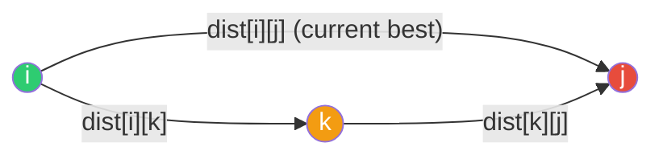
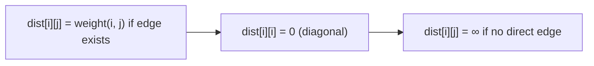
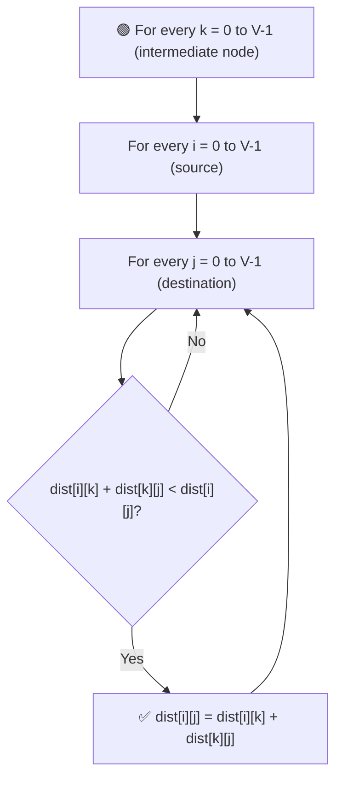
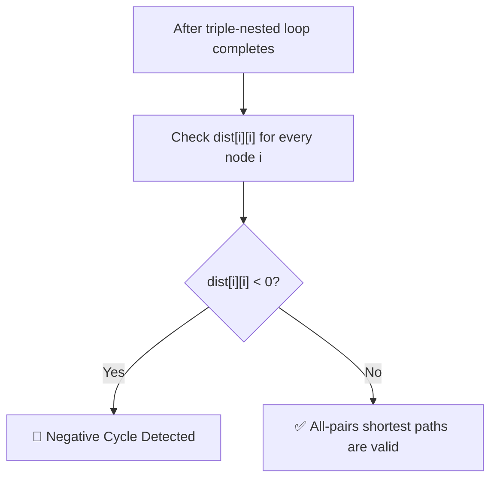

# 🌐 Floyd-Warshall Algorithm

### Multi-Source (All-Pairs) Shortest Path

---

## 📑 Table of Contents

- [🎯 What Problem Does It Solve?](#-what-problem-does-it-solve)
- [🧠 Algorithm Intuition](#-algorithm-intuition)
- [🛠️ Practical Steps](#️-practical-steps)
- [🔍 Negative Cycle Detection](#-negative-cycle-detection)
- [⚖️ Comparison to Dijkstra](#️-comparison-to-dijkstra)
- [⏱️ Time Complexity](#️-time-complexity)
- [🖥️ C++ Implementation](#️-c-implementation)

---

## 🎯 What Problem Does It Solve?

Unlike Dijkstra's or Bellman-Ford (which find shortest paths from **one source**), **Floyd-Warshall** is a **multi-source** algorithm — it computes the shortest distance between **every pair of vertices** in the graph, all at once.

---

## 🧠 Algorithm Intuition

The core idea: for every pair `(i, j)`, repeatedly ask — **"Is it shorter to go from `i` to `j` through some intermediate node `k`, instead of the current direct estimate?"**

```
dist[i][j] = min( dist[i][j],  dist[i][k] + dist[k][j] )
```



We do this for **every possible intermediate node `k`**, one at a time, allowing the path to "unlock" new, shorter routes as more nodes become eligible as intermediates.

---

## 🛠️ Practical Steps

### 1️⃣ Initialize the Cost Matrix



- `dist[i][i] = 0` for every node (distance to itself).
- `dist[i][j] = weight(i, j)` if a direct edge exists.
- `dist[i][j] = ∞` (or a large constant) if there's no direct edge.

### 2️⃣ Triple-Nested Loop — `K, I, J`



> ⚠️ **Order matters!** The loop for `k` (intermediate node) must be the **outermost** loop. This ensures that when we check paths through `k`, all shorter paths using intermediates `0 ... k-1` are already accounted for.

### 3️⃣ Check the Diagonal for Negative Cycles

After the triple loop finishes, scan `dist[i][i]` for every node `i`.

---

## 🔍 Negative Cycle Detection

Normally, `dist[i][i]` should stay **`0`** — the shortest "path" from a node to itself is to not move at all. But if the graph has a **negative weight cycle**, that cycle can be looped through to keep reducing the distance.



---

## ⚖️ Comparison to Dijkstra

| Aspect | Dijkstra | Floyd-Warshall |
|--------|----------|-----------------|
| 🎯 Scope | Single-source | **All-pairs** |
| ➖ Negative weights | ❌ Fails | ✅ Handles them |
| 🔁 Negative cycle detection | ❌ Not supported | ✅ Detects via diagonal |
| 🐢 Speed on sparse graphs | ⚡ Faster (`E log V`) | 🐌 Slower (`V³`) |

---

## ⏱️ Time Complexity

| Step | Cost |
|------|------|
| 🔁 Triple-nested loop (`K`, `I`, `J`) | `O(V³)` |
| 💾 Space (distance matrix) | `O(V²)` |

---

## 🖥️ C++ Implementation

See [`floyd_warshall.cpp`](./floyd_warshall.cpp)
