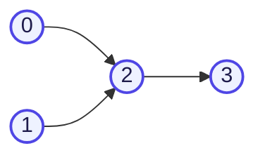
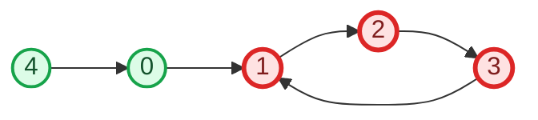

# Cycle Detection in a Directed Graph (using DFS)

## ❓ Question

Given a **Directed Graph**, determine whether it contains a **cycle**.

> A cycle exists if, starting from some node, following directed edges can bring you back to the same node.

---

## 🚫 Why Simple DFS (the undirected-graph trick) Fails Here

In an **undirected graph**, cycle detection with DFS is simple: if you reach an already-visited node that **isn't your immediate parent**, it's a cycle.

In a **directed graph**, this logic breaks. Reaching an already-visited node does **not** necessarily mean a cycle — because in directed graphs, multiple different paths can legally **merge** into the same node without forming a loop.

### 🎨 Example — merge, not a cycle



Here, node `2` is reached from **both** `0` and `1`. If we only tracked a single `visited[]` array, DFS starting from `0` would visit `2`, then later DFS from `1` would try to visit `2` again and — using the naive undirected-style check — wrongly flag it as a cycle. But there's clearly **no cycle** here; paths are just merging.

✅ **Conclusion**: directed graphs need a way to distinguish *"visited earlier, unrelated path"* from *"visited earlier, and still on my current path"*. That's where the dual-array approach comes in.

---

## 💡 The Solution — Dual Array Approach

We maintain **two boolean arrays**:

| Array | Purpose | 🎨 Color meaning below |
|-------|---------|--------------------------|
| `visited[]` | Marks a node as visited **anywhere** in the whole traversal (avoids redundant re-exploration) | 🟦 Blue = visited overall |
| `pathVisited[]` (a.k.a. `dfsVisited[]`) | Marks a node as part of the **current active recursion path** (the current chain of calls) | 🟥 Red = currently on active DFS path |

### 🔑 The cycle rule

> A **cycle exists** if, while exploring neighbors of a node, we reach a neighbor that is `visited == true` **AND** `pathVisited == true` at the same time.
>
> - `visited=true, pathVisited=false` → fine, it's a completed, unrelated branch (a merge, not a cycle).
> - `visited=true, pathVisited=true` → **cycle!** we've looped back onto our own current path.

When we finish exploring all neighbors of a node and are about to return from its recursive call, we **unmark** it: `pathVisited[node] = false` — because it's no longer part of the *active* path once we backtrack.

---

## 🎨 Diagram — A Graph WITH a Cycle



🔴 **Red nodes (1, 2, 3)** form a cycle: `1 → 2 → 3 → 1`.
🟢 **Green nodes (0, 4)** are outside the cycle and pose no issue.

This is the exact graph used in the accompanying `cycle_detection_directed_dfs.cpp` file.

---

## 🧭 Algorithm Steps

1. Create two arrays `visited[]` and `pathVisited[]`, both initialized to `0`/`false`, size `V`.
2. For every unvisited node `i` from `0` to `V-1`, call `dfsCheck(i)`.
3. Inside `dfsCheck(node)`:
   - Mark `visited[node] = true` and `pathVisited[node] = true`.
   - For every neighbor of `node`:
     - If neighbor is **not visited**, recursively call `dfsCheck(neighbor)`. If that call returns `true` (cycle found deeper), propagate `true` immediately.
     - Else if neighbor **is visited AND is in `pathVisited`**, a cycle is found → return `true`.
   - After processing all neighbors (no cycle found through this node), **unmark** `pathVisited[node] = false` before returning `false` (backtracking).
4. If any call to `dfsCheck` returns `true`, the graph has a cycle. If the outer loop finishes with no cycle found, the graph is acyclic.

---

## 🧾 Pseudocode

```
function dfsCheck(node, adj, visited, pathVisited):
    visited[node] = true
    pathVisited[node] = true

    for neighbor in adj[node]:
        if not visited[neighbor]:
            if dfsCheck(neighbor, adj, visited, pathVisited):
                return true
        else if pathVisited[neighbor]:
            return true

    pathVisited[node] = false      // backtrack: leaving this path
    return false

function isCyclic(V, adj):
    visited = array of size V, all false
    pathVisited = array of size V, all false
    for node from 0 to V-1:
        if not visited[node]:
            if dfsCheck(node, adj, visited, pathVisited):
                return true
    return false
```

---

## 🔍 Dry Run

Graph: `0->1, 1->2, 2->3, 3->1, 4->0`

Start loop from node `0`:

| Step | Call | visited[] | pathVisited[] | Action |
|------|------|-----------|-----------------|--------|
| 1 | `dfsCheck(0)` | {0} | {0} | visit 0, go to neighbor 1 |
| 2 | `dfsCheck(1)` | {0,1} | {0,1} | visit 1, go to neighbor 2 |
| 3 | `dfsCheck(2)` | {0,1,2} | {0,1,2} | visit 2, go to neighbor 3 |
| 4 | `dfsCheck(3)` | {0,1,2,3} | {0,1,2,3} | visit 3, go to neighbor 1 |
| 5 | check neighbor `1` of node 3 | — | — | `visited[1]=true` **and** `pathVisited[1]=true` → 🔴 **CYCLE FOUND** |

Return `true` all the way up — `isCyclic` returns `true`. ✅ Matches the expected output (`0→1→2→3→1` is a cycle).

### Now, what if node 4 pointed to 0 but there was **no** back-edge (e.g., remove `3->1`)?

| Step | Call | pathVisited after finishing | Note |
|------|------|-------------------------------|------|
| `dfsCheck(3)` finishes (no outgoing edges left) | — | `pathVisited[3] = false` (backtracked) | 3 leaves the active path |
| `dfsCheck(2)` finishes | — | `pathVisited[2] = false` | 2 leaves the active path |
| `dfsCheck(1)` finishes | — | `pathVisited[1] = false` | 1 leaves the active path |
| `dfsCheck(0)` finishes | — | `pathVisited[0] = false` | 0 leaves the active path |
| `dfsCheck(4)` called → neighbor `0` | `visited[0]=true` but `pathVisited[0]=false` | ✅ No cycle — it's just a merge, not a loop |

This confirms exactly why `pathVisited[]` (not just `visited[]`) is essential — it distinguishes *"already explored, done with it"* from *"still actively on this path."*

---

## ⏱ Complexity Analysis

| Complexity | Value | Reason |
|------------|-------|--------|
| Time | `O(V + E)` | Every vertex and edge is visited exactly once during the DFS traversal. |
| Space | `O(V)` | For `visited[]` array, `pathVisited[]` array, and the recursion stack (worst case depth `V`). |

---

## ⚠️ Edge Cases

- **Self-loop** (`u -> u`): Immediately detected — when exploring `u`'s neighbors, `u` itself is both `visited` and `pathVisited` (since it was just marked at the start of its own call).
- **Disconnected graph**: The outer loop ensures every unvisited node starts a fresh `dfsCheck`, so cycles in any component are caught.
- **Merging paths (no cycle)**: As shown above — a node visited via one branch and reached again via another branch is **not** a cycle, as long as it's not in the *current* active path (`pathVisited = false`).
- **Fully acyclic graph (DAG)**: `isCyclic` returns `false` — this check is often used as a **prerequisite validation step** before running Topological Sort, since topo sort is undefined on graphs with cycles.
- **Must backtrack `pathVisited`**: Forgetting to reset `pathVisited[node] = false` after exploring all neighbors is the most common bug — it would make the algorithm think every node is permanently "on the path," causing false cycle detections.

---

## Files

- `cycle_detection_directed_dfs.cpp` — clean C++ implementation (dual-array DFS cycle detection) with a sample `main()` on a graph that contains a cycle.
- `README.md` — this file.
